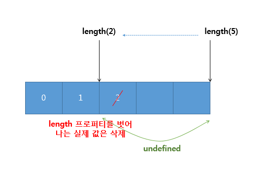
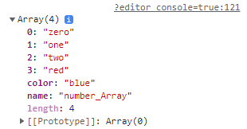
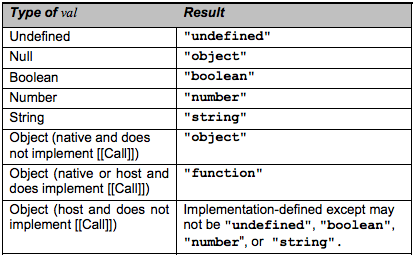

# 1. 자바스크립트 기본 개요
## 자바스크립트의 핵심 개념
### 객체
- 웹 브라우저에서 동작하는 스크립트 언어
- 거의 모든 것이 객체
- 객체에서 제외되는 것: 기본 데이터 타입 - boolean, number, string, null, undefined
- 위 기본 데이터 타입을 제외한 나머지는 모두 객체
- 다만, boolean, number, string은 객체처럼 다룰 수 있음
### 함수
- 함수도 객체로 취급
- 자바스크립트에서 함수란? 일반적인 객체보다 조금 더 많은 기능이 있는 객체
- 함수는 일급 객체 취급
### 프로토타입
- 모든 객체는 숨겨진 링크인 프로토타입을 가짐
- 이 링크는 해당 객체를 생성한 생성자의 프로토타입 객체를 참조
- 링크 표현: ECMAScript에서는 \[\[Prototype\]\]라고 표현
### 실행 컨텍스트와 클로저
- 자바스크립트는 자신만의 독특한 과정으로 실행 컨텍스트 생성, 그 안에서 실행
- 실행 컨텍스트는 자신만의 유효 범위를 가짐
- 이 과정에서 클로저 구현 가능
## 자바스크립트와 객체지향 프로그래밍
- 자바스크립트는 클래스를 지원하지 않지만, 객체지향 프로그래밍 가능
- 프로토타입 체인, 클로저 ⇒ 상속, 캡슐화, 정보 은닉 개념 소화
## 자바스크립트와 함수형 프로그래밍
- 자바스크립트는 함수형 프로그래밍 가능
- 함수형 프로그래밍: 높은 수준의 모듈화를 제공하는 효율적 프로그래밍 방법
- 일급 객체, 클로저 ⇒ 함수형 프로그래밍 가능
- 가독성 측면에서는 좋지 않음 ⇒ 과도한 클로저 사용, 함수형 프로그래밍 기법으로 구현된 코드 해석 난해
## 자바스크립트의 단점
- 유연한 언어, 뛰어난 표현력 ⇒ 디버깅 어려움
- 느슨한 타입 체크에 대한 자유 ⇒ 컴파일 타임에서 오류를 잡지 못할 시 런타임 오류 발생
- 전역 객체 존재 ⇒ 최상위 레벨의 객체들이 모두 전역 객체 안에 위치하므로, 충돌 위험성 있음
- 1999년 ECMAScript3 버전의 모호한 명세서가 원인으로 꼽힘
- 2009년 ECMAScript5 버전 승인, 지속해서 발전하고 있음
# 2. 자바스크립트 개발 환경
- 개발자 도구를 지원하는 브라우저들이 늘어나며 디버깅이 용이해짐
- 여러가지 IDE 사용 가능 (ex) Webstorm
## 웹스톰 설치 및 실행
- 생략
# 3. 자바스크립트 데이터 타입과 연산자
- 자바스크립트의 값들은 크게 기본 타입과 참조 타입으로 분류됨

![\[자바스크립트의 데이터 타입\]](images/js1-data-types.png)

## 자바스크립트 기본 타입
- 그 자체가 하나의 값을 나타냄
- 느슨한 타입 체크 언어: var라는 한 가지 키워드로만 변수 선언
- var 변수에는 어떤 타입의 데이터라도 저장 가능
```javascript
// 숫자 타입
var intNum = 10;

// 문자열 타입
var singleQuoteStr = 'single';

// 불린 타입
var boolVar = true;

// undefined 타입
var emptyVar;

// null 타입
var nullVar = null;

console.log(
	typeof intNum,
	typeof singleQuoteStr,
	typeof boolVar,
	typeof emptyVar,
	typeof nullVar,
);

// number string boolean undefined object
```
### 숫자
- C언어가 int, long, float, double 등으로 나누어지는 것과 달리, 자바스크립트는 하나의 숫자형만 존재
- 자바스크립트에서는 모든 숫자를 64비트 부동 소수점 형태로 저장 ⇒ C의 double 타입과 유사
- var 변수에 정수, 실수 구분 없이 값 저장 가능
- 타입은 number
- 모든 숫자는 정수형이 아닌 실수로 처리하므로 나눗셈 연산 주의
```javascript
var num = 5/2;
console.log(num); // 2.5
console.log(Math.floor(num)); // 2
```
### 문자열
- 작은 따옴표나 큰 따옴표로 생성
- 한 번 정의된 문자열은 변하지 않음
```javascript
var str = 'test';
console.log(str[0], str[1], str[2], str[3]); // t e s t
str[0] = 'a';
console.log(str[0]); // t
```

- 문자열은 문자 배열처럼 인덱스를 이용해 접근 가능
### 불린값
- true, false 값을 나타냄
### null과 undefined
- 값이 비어있음을 나타냄
- `undefined`: 자바스크립트 환경 내에서 기본적으로 값이 할당되지 않은 변수
- undefined 타입 변수는 변수 자체 값 또한 undefined
- 즉, undefined는 타입이자, 값을 나타냄
- `null`: 개발자가 명시적으로 값이 비어있음을 나타내는 데 사용
```javascript
var nullVar = null;

console.log(typeof nullVar); // object
console.log(typeof nullVar === null); // false
console.log(nullVar === null); // true
```

- null 값을 가지는 변수의 결과는 null이 아닌 object임
- 때문에, null 타입 변수 확인을 위해서는 일치 연산자(===)를 사용
## 자바스크립트 참조 타입(객체 타입)
- 숫자, 문자열, 불린 값, null, undefined 같은 기본 타입 제외 모든 값은 객체
- 배열, 함수, 정규 표현식 등이 객체로 표현됨
- 자바스크립트의 객체는 단순히 이름-값 형태인 key-value로 프로퍼티를 저장하는 컨테이너
- 컴퓨터 과학 분야의 해시(hash) 자료 구조와 유사
- 하나의 값 만을 가지는 기본 타입과 달리, 참조 타입 객체는 여러 개의 프로퍼티를 가질 수 있음
- 객체 프로퍼티는 기본 타입의 값을 포함하거나, 다른 객체를 가리킴
- 객체는 `프로퍼티의 함수`로 포함할 수 있음
- 자바스크립트에서 이러한 프로퍼티를 `메서드`라고 부름
### 객체 생성
- 자바의 경우: 클래스 정의 - 클래스 인스턴스 생성 과정에서 객체가 만들어짐
- 자바스크립트의 경우: 클래스라는 개념 없음 - 객체 리터럴이나 생성자 함수 등 별도 생성 방식 존재
- 자바스크립트에서 객체를 생성하는 방법
	1. 기본 제공 Object() 객체 생성자 함수 이용
		1. 자바 스크립트에서는 객체를 생성할 때, 내장 Object() 생성자 함수를 이용함
		```javascript
		var foo = new Object();

		foo.name = 'foo';
		foo.age = 30;
		foo.gender = 'male';

		console.log(typeof foo); // object
		console.log(foo); // {name: 'foo', age: 30, gender: 'male'}
		```

	2. 객체 리터럴 이용
		1. 리터럴: 표기법
		2. 객체 리터럴: 객체를 생성하는 표기법
		3. 자바스크립트는 간단한 표기법 만으로도 객체를 생성할 수 있음
		4. 중괄호(\{\})로 객체 생성, key-value 형태로 표기
		5. 프로퍼티 값으로는 어떤 표현식도 가능하며, 이 값이 함수일 경우 `메서드`라고 부름
		6. \{\}안이 비어있으면 빈 객체 생성됨
		```javascript
		var foo = {
			name: 'foo',
		  age: 30,
		  gender: 'male'
		};

		console.log(typeof foo); // object
		console.log(foo); // {name: 'foo', age: 30, gender: 'male'}
		```

	3. 생성자 함수 이용
		1. 함수를 통해서도 객체 생성 가능 ⇒ 생성자 함수
### 객체 프로퍼티 읽기/쓰기/갱신
- 객체는 새로운 값을 가진 프로퍼티를 생성하고, 그에 접근해서 값을 읽거나 갱신할 수 있음
- 객체 프로퍼티 접근 방법
	1. 대괄호(\[\]) 표기법
	2. 마침표(.) 표기법
	```javascript
	// 객체 리터럴 방식을 통한 foo 객체 생성
	var foo = {
	name: 'foo',
	  major: 'computer science'
	};

	// 객체 프로퍼티 읽기
	console.log(foo.name); // foo
	console.log(foo['name']); // foo
	console.log(foo[name]); // undefined

	// 객체 프로퍼티 갱신
	foo.major = 'electronics';
	console.log(foo.major); // electronics
	console.log(foo['major']); // electronics

	// 프로퍼티 동적 생성
	foo.age = 30;

	// 대괄호 표기법만을 사용해야 할 경우
	foo['full-name'] = 'foo bar';
	console.log(foo['full-name']); // foo bar
	console.log(foo.full-name); // NaN
	```

	- NaN: 수치 연산을 했을 때 정상적인 값을 못해 출력 되는 값
### for in 문과 객체 프로퍼티 출력
- for in: 객체에 포함된 모든 프로퍼티에 대해 루프 수행
```javascript
var foo = {
	name: 'foo',
  age: 30,
  major: 'computer science'
};

var prop;
for (prop in foo) { // for in 문이 수행되며 prop 변수에 foo 객체 프로퍼티가 하나씩 할당
	console.log(prop, foo[prop]);
	/*
	name foo
	age 30
	major computer science
	*/
}
```
### 객체 프로퍼티 삭제
- delete 연산자를 이용해 즉시 삭제 가능
- 하지만, delete는 객체의 프로퍼티만 삭제 가능, 객체 자체는 삭제 불가
```javascript
var foo = {
	name: 'foo',
  age: 30,
  major: 'computer science'
};

console.log(foo.name); // foo
delete foo.name; // name 프로퍼티 삭제됨
console.log(foo.name); // undefined

// 객체 삭제 시도
delete foo;
console.log(foo); // {age: 30, major: 'computer science'} // 객체 삭제 안 됨
```
## 참조 타입의 특성
- 참조 타입 객체의 연산은 실제 값이 아닌 참조값으로 처리됨
```javascript
// 객체 리터럴 방식으로 objA 생성
// objA 변수는 객체 자체가 아닌 생성된 객체를 가리키는 참조값을 저장하고 있음
var objA = {
	val: 40
};
var objB = objA; // objB에도 objA가 참조하는 값이 저장됨 // 즉, 둘이 동일한 객체를 가리키게 됨 

console.log(objA.val); // 40
console.log(objB.val); // 40

objB.val = 50;
console.log(objA.val); // 50
console.log(objB.val); // 50
```

- objA는 실제 객체를 참조하는 값을 저장할 뿐 실제 객체를 나타내지 않음
- 즉, objA객체는 참조 변수 objA가 가리키고 있는 객체를 나타냄(그림 표기 주의)

	![\[objA와 odjB 모두 동일한 객체를 참조하고 있음\]](images/js1-refA-refB.png)

### 객체 비교
```javascript
var a = 100;
var b = 100;

var objA = { value: 100 };
var objB = { value: 100 };
var objC = objB;

console.log(a==b); // true
console.log(objA==objB); // false
console.log(objB==objC); // true
```

- 동등 연산자(==)
	- 기본 타입: 서로의 값을 비교
	- 참조 타입: 참조 값을 비교
### 참조에 의한 함수 호출 방식
- 기본 타입과 참조 타입은 함수 호출 방식이 다름
- 기본 타입: 값에 의한 호출
	- 함수 호출: 인자로 기본 타입 값 넘김 - 호출된 함수의 매개변수로 복사 값 전달

		⇒ 함수 내부에서 매개변수를 이용해 값을 변경해도 실제 호출된 변수의 값 불변

- 참조 타입: 참조에 의한 호출
	- 함수 호출: 인자로 참조 타입 객체 전달 - 객체 프로퍼티 값이 함수의 매개변수로 복사되지 않고, 인자로 넘긴 객체 참조 값이 함수 내부로 전달됨

		⇒ 함수 내부에서 참조 값을 이용해 인자로 넘긴 실제 객체 값 변경 가능

```javascript
var a = 100;
var objA = { value:100 };

function changeArg(num, obj) { // obj: objA가 참조하는 객체 위치 값이 그대로 전달됨
	num = 200;
  obj.value = 200; // 실제 객체의 value 프로퍼티값이 changeArg() 호출 후에도 적용됨

  console.log(num); // 200
  console.log(obj); // {value: 200}
}

changeArg(a, objA);

console.log(a); // 100
console.log(objA); // {value: 200}
```

![\[call by value와 call by reference 동작 차이\]](images/js1-call-by-value-reference.png)

## 프로토타입
- 자바스크립트의 모든 객체는 자신의 부모 역할을 하는 객체와 연결됨
- 객체지 향의 상속 개념과 같이, 부모 객체의 프로퍼티를 자신의 것처럼 사용 가능
- 이러한 부모 객체를 `프로토타입 객체`라고 함
```javascript
var foo = {
	name: 'foo',
  age: 30
};

console.log(foo.toString()); // [object Object]
console.dir(foo); // > Object
```

- foo 객체에 toString() 메서드가 없음에도 에러가 발생하지 않은 이유:
	- foo 객체의 프로토타입에 toString() 메서드가 정의됨
	- foo 객체가 상속처럼 toString() 메서드 호출함
- foo 객체 출력 결과

	![\[크롬 브라우저에서의 foo 객체 출력 결과\]](images/js1-foo-object-output.png)

	- **\[\[Prototype\]\]**: foo 객체의 부모인 `프로토타입 객체`이며, 안에 toString 메서드가 정의된 것을 확인 가능
- ECMAScript 명세서에서는 자바스크립트의 모든 객체는 자신의 프로토타입을 가리키는 \[\[Prototype\]\] 라는 숨겨진 프로퍼티를 가진다고 설명함
- 즉, 위 예와 같이 객체 리터럴 방식으로 생성된 객체의 경우, `Object.prototype 객체`가 `프로토타입 객체`가 됨
- foo.toString()과 같이 자신의 프로토타입인 Object.prototype 객체에 포함된 다양한 메서드를 자신의 프로퍼티인 것처럼 상속 받아 사용 가능

	![\[foo 객체와 Object.prototype 객체의 관계\]](images/js1-foo-object-prototype.png)

- 객체 생성 시 결정된 프로토타입 객체는 임의의 다른 객체로 변경 가능
- 즉, 부모 객체 동적으로 변경 가능
- 자바스크립트에서는 이런 특징을 활용해 객체 상속 등의 기능 구현
## 배열
- C나 자바처럼 크기를 지정하지 않아도 무방
- 어떤 위치에 어느 타입의 데이터를 저장하더라도 에러 발생하지 않음
### 배열 리터럴
- 자바스크립트에서 새로운 배열을 만드는 데 사용하는 표기법
- 객체 리터럴이 중괄호(\{\})를 이용한다면, 배열 리터럴은 대괄호(\[\])를 이용
```javascript
var colorArr = [1, 2, 'red', 4, 5];
console.log(colorArr[0]); // 1
console.log(colorArr[2]); // red
```

- 객체와의 차이(리터럴):
	- 객체 - 프로퍼티 이름, 프로퍼티값 모두 표기
	- 배열 리터럴 - 각 요소의 값만을 포함
- 객체와의 차이(원소 접근): 
	- 객체 - 프로퍼티 이름으로 해당 프로퍼티에 접근
	- 배열 - 배열 내 위치 인덱스 값을 사용해 접근
### 배열의 요소 생성
```javascript
var emptyArr = [];
console.log(emptyArr[0]); // undefined

emptyArr[0] = 100;
emptyArr[3] = 'eight';
console.log(emptyArr); // [100, empty × 2, 'eight']
console.log(emptyArr.length); // 4
```

- 대괄호만을 이용해 빈 배열 생성 가능
- 배열 요소에 값을 동적으로 추가 가능 - 자바스크립트의 모든 데이터 타입 값 가능
- 배열의 크기를 현재 배열의 인덱스 중 가장 큰 값을 기준으로 정함
- 값이 할당되지 않은 인덱스 요소는 undefined 값을 기본으로 가짐
- 자바스크립트의 모든 배열은 length 프로퍼티가 있으며, 배열의 원소 개수를 알 수 있음
### 배열의 length 프로퍼티
- length 프로퍼티는 배열의 프로퍼티며, 배열의 원소 개수를 나타냄
- 빈 배열을 포함하므로, 실제 배열에 존재하는 원소 개수와 일치하지는 않음
- 배열의 가장 큰 인덱스값이 변하면, length 값 또한 자동으로 그에 맞춰 변경됨
```javascript
var arr = [];
console.log(arr.length); // 0

arr[0] = 0;
arr[1] = 1;
arr[100] = 100;
console.log(arr.length); // 101 // 실제 메모리가 length 크기처럼 할당되지는 않음
```

- 배열의 length 프로퍼티는 코드를 통해 명시적으로 값을 변경할 수도 있음
```javascript
var arr = [0,1,2];
console.log(arr.length); // 3

arr.length = 5;
console.log(arr); // [0, 1, 2, empty × 2]
// length가 가리키는 위치가 5로 변경됨

arr.length = 2;
console.log(arr); // [0, 1]
console.log(arr[2]); // undefined
// length가 2로 바뀌며 length 프로퍼티를 벗어나는 값이 삭제됨
```



### 배열 표준 메서드와 length 프로퍼티
- 자바스크립트는 배열에서 사용할 수 있는 다양한 표준 메서드 제공
- 배열 메서드는 length 프로퍼티를 기반으로 동작
- 예) push()는 배열의 현재 length 값 위치에 새로운 원소 값 추가
```javascript
var arr = ['zero', 'one', 'two'];

arr.push('three');
console.log(arr); // ['zero', 'one', 'two', 'three']

arr.length = 5;
arr.push('four');
console.log(arr); // ['zero', 'one', 'two', 'three', empty, 'four']
```
### 배열과 객체
- 배열 역시 객체임
```javascript
var colorsArray = ['orange', 'tellow', 'green'];
console.log(colorsArray[0]); // orange
console.log(colorsArray[1]); // tellow
console.log(colorsArray[2]); // green

var colorsObj = {
	'0': 'orange',
  '1': 'yellow',
  '2': 'green'
};

console.log(colorsObj[0]); // orange
console.log(colorsObj[1]); // yellow
console.log(colorsObj[2]); // green
// colorsObj['0']과 같이 문자열 형태로 표기해야 하지만, 자바스크립트 엔진이 해당 숫자를 자동으로 문자열 형태로 바꿔주기 때문에 정상 출력

console.log(typeof colorsArray); // object (array X)
console.log(typeof colorsObj); // object
// 배열과 객체 모두 object

console.log(colorsArray.length); // 3
console.log(colorsObj.length); // undefined
// length 프로퍼티 존재 여부: colorsObj는 객체이므로 length 프로퍼티가 존재하지 않음

colorsArray.push('red');
console.log(colorsArray); // ['orange', 'tellow', 'green', 'red']
colorsObj.push('red'); // TypeError: colorsObj.push is not a function
```

- 일반 객체와 차이: 배열 표준 메서드 호출 여부
	- colorsObj는 배열이 아니므로 push()와 같은 표준 배열 메서드 사용 불가

		⇒ 배열과 객체가 자신의 부모인 프로토타입 객체가 서로 다르기 때문

- 부모 프로토타입
	- 객체 리터럴: Object.prototype 객체
	- 배열: Array.prototype 객체 - push(), pop() 같은 표준 메서드를 포함

		⇒ 또한, Array.prototype 객체의 프로토타입은 Object.prototype 객체가 됨

- 객체의 프로토타입과 배열의 프로토타입 관계도

	![\[객체의 프로토타입과 배열의 프로토타입\]](images/js1-object-array-prototype.png)

	```javascript
	var emptyArray = [];
	var emptyObj = {};

	console.dir(emptyArray.__proto__); // 배열의 프로토타입 출력
	console.dir(emptyObj.__proto__); // 객체의 프로토타입 출력
	```

	![\[크롬 브라우저 실행 결과\]](images/js1-chrome-proto-1.png)

	- emptyArray.__proto__는 Array 객체를 가리킴 ⇒ Array.prototype 객체를 나타냄
	- 객체 내 push() 메서드를 비롯한 자바스크립트 표준 배열 메서드 존재
	- Array.prototype 객체 역시 부모 프로토타입을 가지고 있으며, 이것이 Object.prototype를 가리키고 있음

	![\[크롬 브라우저 실행 결과\]](images/js1-chrome-proto-2.png)

### 배열의 프로퍼티 동적 생성
- 배열 또한 자바스크립트 객체이므로, 인덱스 배열 원소 이외에도 객체처럼 동적 프로퍼티 추가 가능
```javascript
var arr = ['zero', 'one', 'two'];
console.log(arr.length); // 3

arr.color = 'blue';
arr.name = 'number_Array';
console.log(arr.length); // 3

arr[3] = 'red';
console.log(arr.length); // 4

console.dir(arr);
```

- `console.dir(arr);` 실행 결과

	

	- 배열의 length 프로퍼티는 배열 원소의 가장 큰 인덱스가 변했을 경우만 변경됨
	- 배열도 객체처럼 key-value 형태로 배열 원소 및 프로퍼티 등이 있을 수 있음
### 배열의 프로퍼티 열거
- 배열에 for in문을 이용하면 불필요한 프로퍼티가 출력될 수 있음 ⇒ for문 권장
```javascript
var arr = ['zero', 'one', 'two'];
arr.color = 'blue';
arr.name = 'number_Array';
arr[3] = 'red';

for (var prop in arr) {
	console.log(prop, arr[prop]); // 프로퍼티까지 출력
}
/*
0 zero
1 one
2 two
3 red
color blue
name number_Array
*/

for (var i=0; i<arr.length; i++) {
	console.log(i, arr[i]); // 배열 요소만 출력
}
/*
0 'zero'
1 'one'
2 'two'
3 'red'
*/
```
### 배열 요소 삭제
- 배열도 객체이므로, 배열 요소나 프로퍼티 삭제 시 delete 연산자 사용 가능
```javascript
var arr = ['zero', 'one', 'two', 'three'];

delete arr[2];
console.log(arr); // ['zero', 'one', empty, 'three']
console.log(arr.length); // 4
```

- 하지만, delete 연산자는 배열 내 원소만 비울 뿐 배열 자체를 삭제하진 못함 ⇒ splice() 배열 메서드 사용
```javascript
var arr = ['zero', 'one', 'two', 'three'];

arr.splice(2, 1);
console.log(arr); // ['zero', 'one', 'three']
console.log(arr.length); // 3
```
### Array() 생성자 함수
- 배열 리터럴도 결국 자바스크립트 기본 제공 Array() 생성자 함수로 배열을 생성하는 과정을 단순화시킨 것
- Array() 생성자 함수 호출 시 주의점:
	- 호출 인자가 1개, 숫자일 경우: 호출된 인자를 length로 갖는 빈 배열 생성
	- 그 외: 호출된 인자를 요소로 갖는 배열 생성
	```javascript
	var foo = new Array(3);
	console.log(foo); // [empty × 3]
	console.log(foo.length); // 3

	var bar = new Array(1,2,3);
	console.log(bar); // [1, 2, 3]
	console.log(bar.length); // 3
	```
### 유사 배열 객체
- 유사 배열 객체:
	- 일반 객체에 length 프로퍼티가 있을 때, 유사 배열 객체라고 함
	- 객체임에도 불구하고, 자바스크립트의 표준 배열 메서드를 사용하는 게 가능할 때
	```javascript
	var arr = ['bar'];
	var obj = {
	name: 'foo',
	  length: 1
	};

	arr.push('baz');
	console.log(arr); // ['bar', 'baz']

	obj.push('baz'); // TypeError: obj.push is not a function: 객체지 배열이 아니므로 에러
	```

	```javascript
	var arr = ['bar'];
	var obj = {
	name: 'foo',
	  length: 1
	};

	arr.push('baz');
	console.log(arr); // ['bar', 'baz']

	Array.prototype.push.apply(obj, ['baz']);
	console.log(obj); // {1: 'baz', name: 'foo', length: 2}
	```

	- `Array.prototype.push.apply(obj, ['baz']);`: 
		- 유사 배열 객체인 obj에 대해 push() 메서드 호출, ‘baz’ 원소 추가
		- 원소 값이 추가되고, length 값이 2로 증가

		⇒ 유사 배열 객체도 배열 메서드를 사용하는 것이 가능
## 기본 타입과 표준 메서드
- 자바스크립트는 숫자, 문자열, 불린값에 대해 각 타입별로 호출 가능한 표준 메서드 정의
- 기본 타입은 객체가 아니지만, 메서드 호출 가능
	- ⇒ 기본 타입 값에 메서드 호출

		→ 메서드 처리 순간에 기본 값은 객체로 변환됨

		→ 각 타입별 표준 메서드 호출 → 호출 종료 후 다시 가본값 복귀

	```javascript
	// 숫자 메서드 호출
	var num = 0.5;
	console.log(num.toExponential(1)); // 5.0e-1 // 숫자를 지수 형태의 문자열로 변환

	// 문자 메서드 호출
	console.log("test".charAt(2)); // s
	```

	- 숫자, 문자열 등 기본 타입도 객체처럼 표준 메서드를 호출할 수 있음
## 연산자
### 연산자 `+`
- 더하기
- 문자열 연결 연산
### 연산자 `typeof`
- 피연산자의 타입을 문자열 형태로 리턴

	![\[각 타입별 typeof 연산자 결과\]](images/js1-typeof-result-1.png)

	

### 동등 연산자 `==` 와 일치 연산자 `===`
- == : 비교하려는 피연산자의 타입이 다른 경우 타입 변환을 거친 다음 비교
- === : 피연산자의 타입이 다를 경우 타입을 변경하지 않고 비교
```javascript
console.log(1=='1'); // true
console.log(1==='1'); // false (*권장됨)
```
### 연산자 `!!`
- 피연산자를 불린값으로 변환
```javascript
console.log(!!0); // false
console.log(!!'string'); // true
console.log(!!''); // false
console.log(!!true); // true
console.log(!!null); // false
console.log(!!undefined); // false
console.log(!![1,2,3]); // true
console.log(!!{}); // true (*주의 - {} 값이 비어있어도 true)
```

