# 4. 함수와 프로토타입 체이닝
- 자바스크립트 함수: 모듈 처리, 클로저, 객체 생성 등 역할
- 자바스크립트 함수 정의 방식:
	1. 함수 선언문
	2. 함수 표현식
	3. Function() 생성자 함수
### 함수 리터럴
- 자바스크립트에서는 함수도 일반 객체처럼 값으로 취급
- 때문에, 함수 리터럴을 이용해 함수 생성 가능 - 함수 선언문, 함수 표현식
	```javascript
	function add (x, y) {
	return x + y;
	}
	```

	- function 키워드: 함수 리터럴 시작 키워드
	- add 함수명: 선택 사항이며, 해당 함수의 함수명이 없으면 익명 함수라고 함
	- 매개변수 리스트: 매개변수 타입을 기술하지 않음
	- 함수 몸체: 실제 함수가 호출됐을 때 실행되는 \{\} 코드 부분
### 함수 선언문 방식으로 함수 생성하기
- 함수 선언문 방식으로 정의된 함수는 함수명이 정의되어 있어야 함
	```javascript
	// add() 함수 선언문
	function add (x, y) {
	return x + y;
	}

	console.log(add(3, 4)); // 7
	```

	- 함수명 add()가 있고, 이 함수명으로 함수를 호출함
### 함수 표현식 방식으로 함수 생성하기
- 자바스크립트에서는 함수도 하나의 값처럼 취급(일급객체)
- 함수도 숫자나 문자열처럼 변수에 할당 가능
- **함수 표현식**: 함수 리터럴로 하나의 함수를 만들고, 생성된 함수를 변수에 할당하여 함수를 생성하는 것
	```javascript
	// add() 함수 표현식
	var add = function(x, y) {
	return x + y;
	}

	var plus = add;
	console.log(add(3, 4)); // 7
	console.log(plus(5, 6)); // 11
	```

	- add() 함수를 표현식 형태로 생성(add는 변수이며, 함수 이름이 아님)
	- 함수 리터럴로 두 값을 더하는 함수 생성 → add 변수에 저장
	- 함수 변수 add는 함수의 참조값을 가지므로 또 다른 변수 plus에도 그 값을 그대로 할당 가능

		![\[add와 plus 함수 변수는 두 개의 인자를 도하는 동일한 익명 함수를 참조함\]](images/inside-js-4-fig-01.png)

	- 함수 표현식으로 생성된 함수를 호출하려면 함수 변수를 사용해 add(3, 4)와 같이 호출
	- 함수 리터럴로 생성한 함수는 함수명이 없으므로 익명함수임

		⇒ 함수 변수 add가 실제로 참조하는 두 수를 더하는 함수의 이름이 없음

	- **익명 함수를 이용한 함수 표현식 방법(익명 함수 표현식)**

		↔ *함수 이름이 포함된 함수 표현식(기명 함수 표현식)*

		```javascript
		var add = function sum (x, y) {
			return x + y;
		}

		console.log(add(3, 4)); // 7
		console.log(sum(3, 4)); // Uncaught ReferenceError: sum is not defined
		```

		> 💡 **함수 표현식에서 사용된 함수 이름은 외부 코드에서 접근 불가능**
		>
		> - 함수 표현식에서 사용된 함수 이름 사용
		> 	- 정의된 함수 내부에서 해당 함수를 재귀적으로 호출할 때
		> 	- 디버거 등에서 함수를 구분할 때

### ‼️ 함수 선언문 형식으로 정의한 add() 함수가 함수 이름으로 함수 외부에서 호출이 가능한 이유
```javascript
function add (x, y) {
	return x + y;
}
```

- 함수 선언문 형식으로 정의된 add() 함수는 자바스크립트 엔진에 의해 다음과 같은 함수 표현식 형태로 변경됨
```javascript
var add = function add (x, y) {
	return x = y;
}
```

- 함수 이름과 함수 변수의 이름이 add로 같음 → 함수 이름으로 함수가 호출되는 것처럼 보이나, 실제로는 add 함수 변수로 함수 외부에서 호출이 가능하게 됨

	![\[add() 함수 선언문의 실제 구조\]](images/inside-js-4-fig-02.png)

### ‼️ 함수 이름을 이용하면 함수 코드 내부에서 함수 이름으로 함수의 재귀적인 호출 처리 가능
```javascript
var factorialVar = function factorial(n) {
	if (n <= 1) {
  	return 1;
  }
  return n * factorial(n-1);
};

console.log(factorialVar(3)); // 6
console.log(factorial(3)); // Uncaught ReferenceError: factorial is not defined
```

- 함수 외부에서는 함수 변수 factorialVar()로 함수 호출
- 함수 내부에서 이뤄지는 재귀 호출은 factorial() 함수 이름으로 처리
- 함수 외부에서는 factorial() 함수를 호출하지 못해 에러 발생

![\[팩토리얼 값을 재귀적인 방식으로 구현한 함수 구조\]](images/inside-js-4-fig-03.png)

### ‼️ function statement와 function expression에서의 세미콜론
- 함수 선언문 방식으로 선언된 함수: 세미콜론 생략 가능
- 함수 표현식 방식으로 선언된 함수: 세미콜론 권장
- 자바스크립트 자체가 세미콜론 사용을 강제하지는 않음 → 자바스크립트 인터프리터가 자동으로 세미콜론 삽입시켜 줌
- 하지만 디버깅이 어려워질 수 있으므로 사용 권장
	```javascript
	var func = function () {
	return 42;
	} // 세미콜론 생략

	(function() {
	console.log('function called');
	})(); // Uncaught TypeError: (intermediate value)(...) is not a function
	```

	- 자바스크립트 파서가 func() 함수 정의에서 세미콜론을 사용하지 않아, 그 밑까지 내려가 ();가 있는 코드 끝까지 내려옴 ⇒ 에러 발생
### Function() 생성자 함수를 통한 함수 생성하기
- 자바스크립트의 함수도 Function()이라는 기본 내장 생성자 함수로부터 생성된 객체
- 함수 선언문, 함수 표현식 방식도 함수 리터럴 방식으로 함수를 생성하는 단계 내부적으로 Function() 생성자 함수로 함수 생성
	```javascript
	new Function (arg1, arg2, ... argN, functionBody);
	```

	- arg1, 2, … N: 함수의 매개변수
	- functionBody: 함수가 호출될 때 실행될 코드를 포함한 문자열
	```javascript
	var add = new Function('x', 'y', 'return x+y');
	console.log(add(3, 4)); // 7
	```
### 함수 호이스팅
- 함수를 생성하는 3가지 방법 중 가장 권장되는 것: 함수 표현식 ⇒ 함수 호이스팅 때문
	```javascript
	add(2,3); // 5

	// 함수 선언문 형태로 add() 함수 정의
	function add (x, y) {
	return x + y;
	};

	add(3, 4); // 7
	```

	- 함수 선언문 형태로 정의한 함수의 유효 범위는 코드의 맨 처음부터 시작 ⇒ 호이스팅
	- add(2, 3)이 정상 실행됨
	```javascript
	add(2,3); // Uncaught TypeError

	// 함수 표현식 형태로 add() 함수 정의
	var add = function(x, y) {
	return x + y;
	};

	add(3, 4); // 7
	```

	- 함수 표현식 형태로 정의되어 있는 함수는 호이스팅이 일어나지 않음
	- add(3,4) 와 같이 함수가 생성된 이후에 호출 가능
	- add(2,3) 은 함수가 생성되기 전이므로 에러 발생
- 호이스팅 발생 원인: 자바스크립트의 변수 생성, 초기화 작업이 분리되어 진행되기 때문
## 함수 객체: 함수도 객체다
### 자바스크립트에서는 함수도 객체다
- 함수의 기본 기능인 코드 실행 + 함수 자체가 일반 객체처럼 프로퍼티 보유 가능
	```javascript
	// 함수 선언 방식으로 add() 함수 정의
	function add (x, y) {
	return x + y;
	}

	// add() 함수 객체에 result, status 프로퍼티 추가
	add.result = add(3,2);
	add.status = 'ok';

	console.log(add.result); // 5
	console.log(add.status); // ok
	```

	- add() 함수 생성시, 함수 코드는 함수 객체의 \[\[Code\]\] 내부 프로퍼티에 자동 저장
	- add() 함수에 프로퍼티 동적 생성, 접근 가능

		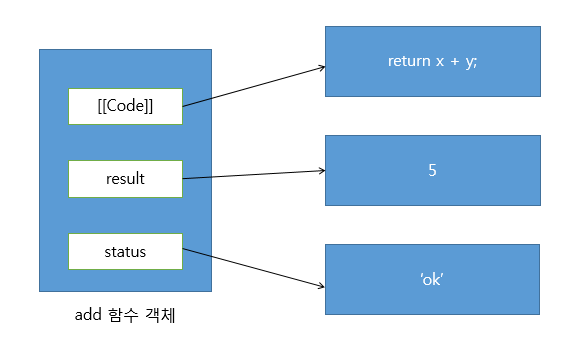

### 자바스크립트에서 함수는 값으로 취급된다
- 함수도 일반 객체처럼 취급됨
- 자바스크립트 함수가 할 수 있는 동작
	1. 리터럴에 의해 생성
	2. 변수나 배열 요소, 객체 프로퍼티 등에 할당 가능
	3. 함수 인자로 전달 가능
	4. 함수 리턴값으로 리턴 가능
	5. 동적으로 프로퍼티 생성 및 할당 가능

	⇒ 함수를 일급 객체라고 부르는 이유(1\~5 기능이 모두 가능한 객체)

- 따라서, 자바스크립트는 함수형 프로그래밍 가능

> 💡 **`일급 객체`로서의 자바스크립트 함수**
>
> - 자바스크립트 함수는 일급 객체이며, 이 함수는 일반 객체처럼 값(value)로 취급됨
> - 함수를 변수나 객체, 배열 등에 값으로 저장 가능
> - 다른 함수의 인자로 전달하거나 함수의 리턴값으로도 사용 가능

### 변수나 프로퍼티의 값으로 할당
- 함수는 숫자나 문자열처럼 변수, 프로퍼티 값으로 할당 가능
	```javascript
	// 변수에 함수 할당
	var foo = 100;
	var bar = function() { // bar에 함수 리터럴로 생성한 함수 저장됨
	return 100;
	}
	console.log(bar()); // 100
	// bar는 함수의 참조값을 저장하고 있으므로, bar()로 실제 함수 호출 가능

	// 프로퍼티에 함수 할당
	var obj = {};
	obj.baz = function () {
	return 100;
	}
	console.log(obj.baz()); // 100
	// baz처럼 객체의 프로퍼티나 배열의 원소 등에도 할당 가능
	```
### 함수 인자로 전달
```javascript
// 함수 표현식으로 foo() 함수 생성
var foo = function(func) { // 익명 함수를 인자로 받음
	func(); // 인자로 받은 func() 함수 호출
};

// foo() 함수 실행
foo(function() { // 익명함수 인자로 넣음
	console.log('function111');
}); // function111
```
### 리턴값으로 활용
```javascript
// 함수를 다른 함수의 리턴값으로 활용한 코드
var foo = function() {
	return function () {
  	console.log('function111');
  };
};

var bar = foo(); // foo() 함수 호출 시, 리턴값으로 전달되는 함수가 bar 변수에 저장됨
bar(); // function111 // () 함수 호출 연산자를 이용해 bar()로 리턴된 함수 실행
```
### 함수 객체의 기본 프로퍼티
- 일반 객체와는 다른 함수 객체만의 표준 프로퍼티가 정의됨
```javascript
function add (x, y) {
	return x + y;
}

console.dir(add);
```

- 실행결과: arguments, caller, length 등과 같은 다양한  프로퍼티가 기본적으로 생성됨

	![\[크롬 브라우저에서 실행한 결과 화면 - 기본\]](images/inside-js-4-fig-05.png)

	![\[크롬 브라우저에서 실행한 결과 화면 - 확장\]](images/inside-js-4-fig-06.png)

	⇒ 이러한 프로퍼티들이 함수를 생성할 때 포함되는 표준 프로퍼티임

- ECMA5 스크립트 명세서에서는 모든 함수가 length와 prototype 프로퍼티를 가져야 한다고 기술함
- name, caller, arguments, \[\[Prototype\]\] 프로퍼티는 ECMA 표준이 아님
	- name: 함수의 이름(익명 함수일 경우 빈 문자열)
	- caller: 자신을 호출한 함수(함수를 호출하지 않을 경우, null)
	- arguments: 함수를 호출할 때 전달된 인자값(함수를 호출하지 않을 경우, null)

	> 💡 **argument 객체**
	>
	> - argument 프로퍼티와 같은 이름으로, ECMA 표준에서는 arguments 객체를 정의함
	> - argument 객체는 함수를 호출할 때, 호출된 함수의 내부로 인자값과 함께 전달됨
	> - arguments 프로퍼티와 유사하게 함수를 호출할 때 전달 인자값의 정보를 제공

	- \[\[Prototype\]\]: 모든 자바스크립트 객체는 자신의 프로토타입을 가리키는 \[\[Prototype\]\] 라는 내부 프로퍼티를 가짐
		- add() 함수 역시 자바스크립트 객체이므로 \[\[Prototype\]\] 프로퍼티를 가지고, 이를 통해 자신의 부모 역할을 하는 프로토타입 객체를 가리킴
		- ECMA 표준에서는 add()와 같이 함수 객체의 부모 역할을 하는 프로토타입 객체를 Function.prototype 객체라고 명명, 이것도 함수 객체라고 정의
		- 출력된 값을 보면 Function Prototype 객체를 Empty() 함수로 명하고 있으며, 이 역시 함수 객체이므로 name, caller, arguments 등과 같은 함수 객체 프로퍼티를 가짐

	> 💡 **Function.prototype 객체의 프로토타입 객체는?**
	>
	> - 모든 함수들의 부모 객체는 Function Prototype 객체
	> - ECMAScript 명세서에서는 Function.prototype은 함수라고 정의
	> - 그렇다면, Function.prototype 함수 객체도 결국 함수이므로 Function.prototype 객체, 즉 자기 자신을 부모로 갖는 것인가? ⇒ ECMAScript 명세서에서는 예외적으로 Function.prototype 함수 객체의 부모는 자바스크립트의 모든 객체의 조상격인 Object.prototype 객체라고 설명함
	> - 즉, 위 예시의 Function Prototype 객체의 \[\[Prototype\]\] 프로퍼티는 Object.prototype 객체를 가리킴
	> - **다시 말해, Function.prototype 객체는 모든 함수들의 부모 역할을 하는 프로토타입 객체임**
	> - **모든 함수는 Function Prototype 객체가 있는 프로퍼티나 메서드를 자신의 것처럼 상속 받을 수 있음**

	> 💡 **Function.prototype 객체가 가져야 하는 프로퍼티**
	>
	> - `constructor` 프로퍼티
	> - `toString()` 메서드
	> - `apply(thisArg, argArray)` 메서드
	> - `call(thisArg, [, arg1 [, arg2, ]])` 메서드
	> - `bind(thisArg, [, arg1 [,arg2,]])` 메서드

### length 프로퍼티
- ECMAScript에서 정한, 모든 함수가 가져야 하는 표준 프로퍼티
- 함수가 정상적으로 실행될 때, 기대되는 인자의 개수를 나타냄
	```javascript
	function func0 () {
	}

	function func1 (x) {
	return x;
	}

	function func2 (x, y) {
	return x + y;
	}

	function func3 (x, y, z) {
	return x + y+ z;
	}

	console.log(func0.length); // 0
	console.log(func1.length); // 1
	console.log(func2.length); // 2
	console.log(func3.length); // 3
	```
### prototype 프로퍼티
- 모든 함수는 객체로서 prototype 프로퍼티를 가지고 있음
- 함수 객체의 prototype 프로퍼티는 모든 객체의 부모를 나타내는 내부 프로퍼티인 \[\[Prototype\]\]과 다름

> 💡 **prototype 프로퍼티와 \[\[Prototype\]\] 프로퍼티**
>
> - 공통점: 두 프로퍼티 모두 프로터타입 객체를 가리킴
> - 내부 프로퍼티인 \[\[Prototype\]\]: 객체 입장에서 자신의 부모 역할을 하는 프로토타입 객체를 가리킴
> - 함수 객체가 가지는 prototype 프로퍼티: 이 함수가 생성자로 사용될 때 이 함수를 통해 생성된 객체의 부모 역할을 하는 프로토타입 객체를 가리킴

- prototype 프로퍼티는 함수가 생성될 때 만들어짐
	- constructor 프로퍼티 하나만 있는 객체를 가리킴
	- 이 constructor 프로퍼티는 prototype 프로퍼티가 가리키는 프로토타입 객체의 유일한 프로퍼티임
	- 그리고 constructor 프로퍼티는 자신과 연결된 함수를 가리킴
- 자바스크립트에서는 함수를 생성할 때, 함수 자신과 연결된 프로토타입 객체를 동시에 생성
- 둘은 각각 prototype과 constructor라는 프로퍼티로 서로를 참조함

	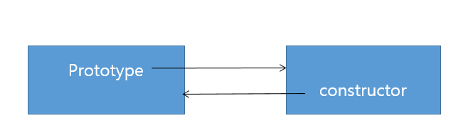

- 함수의 prototype 프로퍼티가 가리키는 프로토타입 객체는 일반적으로 따로 네이밍하지 않음
- 자신과 연결된 함수의 prototype 프로퍼티값을 그대로 이용함
- 예) add() 함수의 프로토타입 객체는 add.prototype이 됨
```javascript
function myFunction() {
	return true;
}
// 함수 생성과 동시에 myFunction() 함수의 prototype 프로퍼티에는 이 함수와 연결된 프로토타입 객체가 생성됨

console.dir(myFunction); // (1)
console.dir(myFunction.prototype); // (2)
console.dir(myFunction.prototype.constructor); // (3)
```

- 실행 결과
	1. `console.dir(myFunction)`

		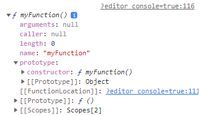

	2. `console.dir(myFunction.prototype)`: myFunction() 함수의 프로토타입 객체

		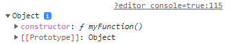

		- constructor, \[\[prototype\]\] 두 개의 프로퍼티 존재
		- 이 객체는 myFunction() 함수의 프로토타입 객체이므로 constructor 프로퍼티가 있음
		- 프로토타입 객체 역시 자바스크립트 객체이므로 예외 없이 자신의 부모 역할을 하는 \[\[Prototype\]\] 프로퍼티 존재
	3. `console.dir(myFunction.prototype.constructor)`: 프로토타입 객체와 매핑된 함수를 알아볼 수 있음

		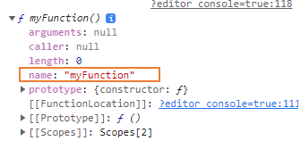

		- 결과값을 보면 myFunction() 함수를 가리킴
		- 이처럼 함수 객체와 프로토타입 객체는 서로 밀접하게 연결돼 있음

			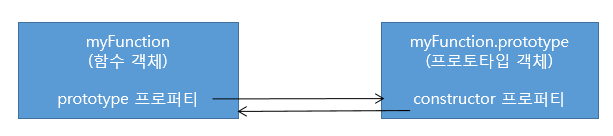

## 함수의 다양한 형태
### 콜백 함수
- 자바스크립트 함수 표현식에서 함수 이름은 꼭 붙이지 않아도 되는 선택 사항
- 함수의 이름을 지정하지 않아도 함수가 정의됨 ⇒ **익명 함수**
- 익명 함수의 대표적인 용도: **콜백 함수**
- 콜백 함수: 
	- 코드를 통해 명시적으로 호출하는 함수가 아닌, 개발자에 의해 단지 등록된 함수
	- 어떤 이벤트가 발생했거나 특정 시점에 도달했을 때 시스템에서 호출되는 함수
	- 특정 함수의 인자로 넘겨 코드 내부에서 호출되는 함수
- 예) 이벤트 핸들러 처리
	- 웹 페이지 로드, 또는 키보드 입력되는 등의 DOM 이벤트 발생 시, 브라우저는 정의된 DOM 이벤트에 해당하는 이벤트 핸들러를 실행시킴
	- 만약 이벤트 핸들러에 콜백 함수가 등록됐다면, 콜백 함수는 이벤트가 발생할 때마다 브라우저에 의해 실행됨

		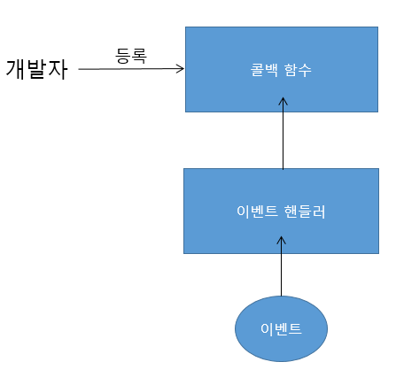

	```javascript
	<script>
	// 페이지 로드 시 호출될 콜백 함수
	window.onload = function() {
		alert('this is the callback function');
	}
	</script>
	```

	- window.onload는 이벤트 핸들러 ⇒ 웹 페이지의 로딩이 끝나는 시점에 load 이벤트가 발생하면 실행됨
	- window.onload 이벤트 핸들러를 익명 함수로 연결 ⇒ 따라서, 익명 함수가 콜백 함수로 등록됨

		⇒ 웹 페이지가 로딩될 때, 등록한 이벤트 핸들러가 호출되면서 경고창이 뜨게 됨
### 즉시 실행 함수
- 함수를 정의함과 동시에 바로 실행하는 함수
- 익명 함수를 응용한 형태
	```javascript
	(function (name) {
	console.log('this is the immediate function: ' + name);
	})('foo');
	// this is the immediate function: foo
	```

- 즉시 실행 함수를 만드는 방법
	- 함수 리터럴을 ()로 둘러쌈
	- 함수 이름은 있어도, 없어도 됨
	- 함수가 바로 호출될 수 있게 () 괄호 쌍을 추가함
	- 이때, 추가한 괄호 안에 값을 넣어 즉시 실행 함수의 인자로 넘길 수 있음
	- 예제의 경우, `('foo')`를 넘김
- 함수가 선언되자마자 실행되게 만드는 즉시 실행 함수의 경우, 같은 함수 재호출 불가능
- 최초 한 번의 실행만을 필요로 하는 초기화 코드 부분 등에 이용
- jQuery와 같은 자바스크립트 라이브러리나 프레임워크 소스에서 사용
	```javascript
	(function(window, undefined){
	// ....
	})(window);
	```

- jQuery에서 즉시 실행 함수를 사용하는 이유:
	- 자바스크립트의 변수 유효 범위 특성 때문
	- 자바스크립트에서는 **함수 유효 범위를 지원**
	- 기본으로, 자바스크립트는 변수를 선언할 경우, 프로그램 전체에서 접근할 수 있는 전역 유효 범위를 가짐
	- 함수 내부에서 정의된 매개변수와 변수들은 함수 **코드 내부서만 유효** / 함수 밖에서는 유효하지 않음
	- 따라서, 라이브러리 코드를 즉시 실행 함수 내부에 정의해두게 되면, **라이브러리 내 변수들은 함수 외부에서 접근 불가**
	- 즉시 실행 함수 내 라이브러리 코드를 추가하면 전역 네임스페이스를 더럽히지 않음
	- 다른 자바스크립트 라이브러리들이 동시에 로드가 되어도 라이브러리 간 **변수 이름 충돌 문제 방지 가능**
### 즉시 실행 함수 패턴
- 라이브러리 코드가 로드되면 실행되는 초기화 작업을 할 때 많이 사용
- jQuery 외에도 대부분의 라이브러리가 이와 같은 방식임
- 몇 가지 유명 라이브러리의 초기화 코드
	```javascript
	[ Underscore 1.3.3 ]
	(function() {
	var root = this;
	var previousUnderscore = root._;
	// ....
	var + = function(obj) { return new wrapper(obj); };
	// ....
	root['_'] = _;
	// ....
	}).call(this);
	```

	- Underscore 1.3.3은 call 함수를 this 인자와 함께 사용
	- 이렇게 넘긴 this가 즉시 실행 함수 내부의 this에 바인딩(this = 전역객체)
	- this는 함수 내부에서 root 라는 이름으로 사용됨
- 몇 가지 유명 라이브러리의 초기화 코드2
	```javascript
	[ Sugar 1.2 ]
	(function() {
	// ....
	// Initialize
	buildObject();
	buildString();
	buildFunction();
	initializeClass(date);
	})();
	```

	- Sugar 1.2는 특별한 인자 없이 즉시 실행 함수 호출
	- sugar에서 제공하는 대부분의 함수는 Object.prototype이나 Function.prototype 등 기존에 있는 객체에 들어가므로, 특별히 네임스페이스 정의 안 함
### 내부 함수
- 자바스크립트에서는 함수 코드 내부에서도 다시 함수 정의 가능
- 함수 내부에 정의된 함수를 **내부 함수**라고 함
- 내부 함수는 자바스크립트의 기능을 보다 강력하게 해 주는 클로저를 생성하거나, 
- 부모 함수 코드에서 외부에서의 접근을 막고 독립적인 헬퍼 함수를 구현하는 용도로 사용
	```javascript
	// parent() 함수 정의
	function parent() {
	var a = 100;
	  var b = 200;

	// child() 내부 함수 정의
	  function child() {
	  	var b = 300;

	    console.log(a); // child() 내부에 변수 a 가 선언되지 않았어도 100이 출력됨
	    console.log(b); // child() 함수에 선언이 되어 있으므로 parent()가 아닌 child() 함수의 변수 b 값이 출력됨
	  }
	  child(); 
	}

	parent();
	// 100
	// 300
	child(); // Uncaught ReferenceError: child is not defined
	```

	🔥 **내부 함수에서는 자신을 둘러싼 부모 함수의 변수에 접근이 가능**

	- child() 내부에 변수 a 가 선언되지 않았어도 100이 출력됨
	- child() 함수에 선언이 되어 있으므로 parent()가 아닌 child() 함수의 변수 b 값이 출력됨

		⇒ 내부 함수는 자신을 둘러싼 외부 함수의 변수에 접근 가능 → **스코프 체이닝**

	🔥 **내부 함수는 일반적으로 자신이 정의된 부모 함수 내부에서만 호출이 가능**

	- `child(); // Uncaught ReferenceError: child is not defined`: 함수가 정의되어 있지 않다는 에러

		⇒ 함수 내부에 선언된 변수는 함수 외부에서 접근 불가 → 자바스크립트의 함수 스코핑

		⇒ 부모 함수인 parent() 안에 선언된 child() 내부 함수 호출은 가능 → 내부 함수를 호출하는 부분과 내부 함수가 정의된 부분이 모두 부모 함수 내부에 있기 때문

	![\[예제의 동작을 나타낸 그림\]](images/inside-js-4-fig-13.png)

	- 함수를 둘러싼 박스 부분이 함수 스코프 의미
	- 기본적으로 함수 스코프 밖에서는 함수 스코프 안에 선언된 모든 변수나 함수에 접근 불가능
- 자바스크립트 스코프 체이닝 때문에, 함수 내부에서는 함수 밖에서 선언된 변수나 함수 접근 가능
- 하지만, 함수 외부에서도 특정 함수 스코프 안에 선언된 내부 함수 호출 가능

	⇒ 부모 함수에서 내부 함수를 외부로 리턴 시, 부모 함수 밖에서도 내부 함수 호출 가능

	```javascript
	function parent() {
	var a = 100;
	  // child() 내부 함수
	  var child = function() {
	  	console.log(a);
	  }

	  // child() 함수 반환
	  return child;
	}

	var inner = parent();
	inner(); // 100
	```

	- parent() 함수의 호출 결과로 반환된 inner() 함수를 호출하는 예제임
	- 내부 함수를 함수 표현식 형식으로 정의하고, child 함수 변수에 저장
	- parent() 함수의 리턴값으로 내부 함수의 참조값을 가진 child 함수 변수 리턴
	- parent() 함수가 호출되면 inner 변수에 child 함수 변수 값이 리턴
	- child 함수 변수는 내부 함수의 참조값이 있으므로, inner 변수도 child() 내부 함수를 참조

	![\[예제의 동작을 나타낸 그림\]](images/inside-js-4-fig-14.png)

	- 때문에, inner 변수에 함수 호출 연산자 ()를 붙여 함수 호출 구문을 만들면, parent() 함수 스코프 밖에서도 내부 함수 child() 가 호출됨
	- 호출하는 내부 함수에는 a 변수가 정의되어 있지 않음 ⇒ 스코프 체이닝으로 부모 함수에 a변수가 정의되어 있는지 확인하고, 그렇다면 그 값 출력
	- 실행이 끝난 parent() 와 같은 부모 함수 스코프의 변수를 참조하는 inner()와 같은 함수를 **클로저**라고 함
### 함수를 리턴하는 함수
- 자바스크립트 함수는 일급 객체이므로 일반 값처럼 함수 자체를 리턴할 수 있음
- 함수를 호출함과 동시에 다른 함수로 바꾸거나,
- 자기 자신을 재정의하는 함수를 구현할 수도 있음 ⇒ 자바스크립트의 언어적 유연성
	```javascript
	// self() 함수
	var self = function() {
	console.log('a');
	return function () {
	  	console.log('b');
	  }
	}

	self = self(); // a
	self(); // b
	```

	- 처음 self() 함수가 호출됐을 때, ‘a’가 출력됨
	- 다시 self 함수 변수에 self() 함수 호출 리턴값으로 내보낸 함수가 저장됨
	- 두 번째로 self() 함수가 호출됐을 때는 ‘b’가 출력됨
	- 즉, self() 함수 호출 후에, self 함수 변수가 가리키는 함수가 원래 함수에서 리턴받은 새로운 함수로 변경됨

		![\[예제의 동작을 나타낸 그림\]](images/inside-js-4-fig-15.png)

## 함수 호출과 this
- 함수의 기본적인 기능은 함수를 호출해 코드를 실행하는 것
- 자바스크립트 언어 자체가 C, C++ 같은 엄격한 문법 체크를 하지 않는 자유로운 특성
- 함수 호출 또한 다른 언어와는 달리 자유로움
### arguments 객체
- 자바스크립트에서는 함수를 호출할 때 함수 형식에 맞춰 인자를 넘기지 않더라도 에러가 발생하지 않음
	```javascript
	function func(arg1, arg2) {	
	console.log(arg1, arg2);
	}

	func(); // undefined undefined
	func(1); // 1 undefined
	func(1,2); // 1 2
	func(1,2,3); // 1 2
	```

	- func() 함수에 인자 개수를 달리해서 어떻게 넘기더라도 함수 호출 시 에러가 발생하지 않음
	- 함수의 인자보다 적게 함수를 호출했을 경우, 넘겨지지 않은 인자에는 undefined 값이 할당
	- 정의된 인자 개수보다 많게 함수를 호출했을 경우, 초과된 인수는 무시됨
- 자바스크립트의 이러한 특성 때문에, 함수 코드를 작성할 때 런타임 시 호출된 인자의 개수를 확인하고 이에 따라 동작을 다르게 해 줘야 할 경우가 있음 ⇒ **arguments 객체 사용**
- 자바스크립트에서는 함수를 호출할 때 인수들과 함께 암묵적으로 arguments 객체가 함수 내부로 전달됨
- arguments 객체는 함수를 호출할 때 넘긴 인자들이 배열 형태로 저장된 객체며, 유사 배열 객체임
	```javascript
	// add() 함수
	function add (a, b) {
	// arguments 객체 출력
	  console.dir(arguments);
	  return a + b;
	}

	console.log(add(1)); // NaN
	console.log(add(1,2)); // 3
	console.log(add(1,2,3)); // 3
	```

	![\[arguments 객체 출력을 크롬 브라우저에서 실행한 결과값\]](images/inside-js-4-fig-16.png)

	- arguments 객체의 구성(\[\[Prototype\]\] 제외)
		1. 함수를 호출할 때 넘겨진 인자(배열 형태): 함수를 호출할 때 첫 번째 인자는 0번 인덱스
		2. length 프로퍼티: 호출할 때 넘겨진 인자의 개수를 의미
		3. callee 프로퍼티: 현재 실행 중인 함수의 참조값(add() 함수)
- arguments는 객체이지 배열이 아님
- length 프로퍼티가 있으므로 배열과 유사하게 동작하지만,
- 배열은 아니므로 배열 메서드를 사용할 경우 에서 발생
- 유사 배열 객체에서 배열 메서드를 사용하는 방법이 없는 건 아님(**call, apply 메서드**를 이용)
- arguments 객체는 매개변수 개수가 정확하게 정해지지 않은 함수를 구현하거나, 전달된 인자의 개수에 따라 서로 다른 처리를 해 줘야 하는 함수를 개발하는 데 유용하게 사용됨
	```javascript
	function sum() { // 호출된 인자 개수에 상관없이 각각의 값을 모두 더해 리턴
	var result = 0;

	  for (var i=0; i<arguments.length; i++) {
	  	result += arguments[i];
	  }
	  return result;
	}
	console.log(sum(1,2,3)); // 6
	console.log(sum(1,2,3,4,5,6,7,8,9)); // 45
	```

	⇒ arguments 객체를 사용할 경우, 함수가 호출될 당시의 인자들에 배열 형태로 접근 가능
### 호출 패턴과 this 바인딩
- 자바스크립트에서 함수를 호출할 때 함수 내부로 전달되는 값:
	1. 기존 매개변수로 전달되는 인자값
	2. arguments 객체
	3. this 인자
- 자바스크립트의 여러가지 함수가 호출되는 방식(호출 패턴)에 따라 this는 다른 객체를 참조함(this 바인딩)
### 객체의 메서드를 호출할 때 this 바인딩
- 객체의 프로퍼티가 함수일 경우, 이 함수를 메서드라고 함
- 이 메서드를 호출할 때, 메서드 내부 코드에서 사용된 this는 해당 메서드를 호출한 객체로 바인딩됨
	```javascript
	// myObject 객체 생성
	var myObject = {
	name: 'foo',
	  sayName: function () {
	  	console.log(this.name);
	  }
	};

	// otherObject 객체 생성
	var otherObject = {
	name: 'bar'
	};

	// otherObject.sayName() 메서드
	otherObject.sayName = myObject.sayName;

	// sayName() 메서드 호출
	myObject.sayName(); // foo
	otherObject.sayName(); // bar
	```

	- sayName() 메서드에서 사용된 this는 자신을 호출한 객체에 바인딩됨

	![\[동작을 나타낸 그림\]](images/inside-js-4-fig-17.png)

### 함수를 호출할 때 this 바인딩
- 자바스크립트에서 함수를 호출하면, 해당 함수 내부 코드에서 사용된 this는 전역 객체에 바인딩됨
- 브라우저에서 자바스크립트를 실행하는 경우 전역 객체는 window 객체가 됨

> 💡 **전역 객체란 무엇인가? (브라우저, Node.js)**
>
> - 브라우저 환경에서 자바스크립트를 실행하는 경우, 전역 객체는 window 객체가 됨
> - Node.js와 같은 자바스크립트 언어를 통해 서버 프로그래밍을 할 수 있게 해 주는 자바스크립트 런타임 환경에서의 전역 객체는 global 객체임
>
> 	⇒ Node.js는 브라우저 기반의 프로그래밍을 넘어 서버 기반 프로그래밍 영역까지 개발을 가능하게끔 해 주는 플랫폼

- 자바스크립트의 모든 전역 변수는 실제로는 전역 객체의 프로퍼티들임
	```javascript
	var foo = 'foo';

	console.log(foo); // foo
	console.log(window.foo); // foo
	```

	- 따라서 전역 변수는 전역 객체(window)의 프로퍼티로도 접근할 수 있음
- 함수를 호출할 때 this는 전역 객체에 바인딩됨
	```javascript
	var test = 'test';
	console.log(window.test); // test

	// sayFoo() 함수
	var sayFoo = function() {
	console.log(this.test); // sayFoo() 함수 호출 시 this는 전역 객체에 바인딩됨
	};
	sayFoo(); // test
	```

	- 자바스크립트의 전역 변수는 전역 객체 window의 프로퍼티로 접근 가능하므로, 쟈window.test 가능
	- 자바스크립트에서는 함수를 호출할 때 this는 전역 객체에 바인딩 됨
	- sayFoo() 함수가 호출된 시점에서 this 는 전역 객체인 window에 바인딩 됨
- 함수 호출에서의 this 바인딩 특성: 내부 함수를 호출했을 경우에도 그대로 적용
	```javascript
	// 전역 변수 value 정의
	var value = 100;

	// myObject 객체 생성
	var myObject = {
	value: 1,
	  func1: function() {
	  	this.value += 1;
	    console.log("func1: " + this.value);

	    // func2() 내부 함수
	    func2 = function() {
	    	this.value += 1;
	      console.log("func2: " + this.value);
	      	// func3() 내부 함수
	        func3 = function() {
	        	this.value += 1;
	          console.log("func3: " + this.value);
	        }
	        func3();
	    }
	    func2();
	  }

	};

	myObject.func1();
	// func1: 2
	// func2: 101
	// func3: 102
	```

	- 위 코드를 실행하면 다음과 같은 결과가 나올 것 같지만, 아님
		```javascript
		// func1: 2
		// func2: 3
		// func3: 4
		```

		![\[원래 의도한 내부 함수의 this 바인딩\]](images/inside-js-4-fig-18.png)

	- 자바스크립트에서는 내부 함수 호출 패턴을 정의해 놓지 않음
	- 내부 함수도 결국 함수이므로 이를 호출할 때는 함수 호출로 취급됨
	- 따라서, 함수 호출 패턴 규칙에 따라 내부 함수의 this는 전역 객체 window에 바인딩 됨
	- 그러므로, 실행 결과는 다음과 같음
		1. func1() 에서 사용된 this는 이 메서드를 호출한 객체 myObject를 가리킴
		2. func2() 에서 사용된 this는 전역 객체 window를 가리킴
		3. func3() 에서 사용된 this는 전역 객체 window를 가리킴
		```javascript
		// func1: 2
		// func2: 3
		// func3: 4
		```

		![\[실제 내부 함수의 this 바인딩\]](images/inside-js-4-fig-19.png)

- 내부 함수가 this를 참조하는 자바스크립트의 한계를 극복하려면 부모 함수(func1() 메서드)의 this를 내부 함수가 접근 가능한 다른 변수에 저장하는 방법이 사용됨

	⇒ 보통 관례상 this 값을 저장하는 변수 이름을 that 이라고 지음

	⇒ 이렇게 되면 내부 함수에서는 that 변수로 부모 함수의 this 가 가리키는 객체에 접근 가능

	```javascript
	// 내부 함수 this 바인딩
	var value = 100;

	// myObject 객체 생성
	var myObject = {
	value: 1,
	  func1: function() {
	  	var that = this;
	  	this.value += 1;
	    console.log("func1: " + this.value);

	    // func2() 내부 함수
	    func2 = function() {
	    	that.value += 1;
	      console.log("func2: " + that.value);
	      	// func3() 내부 함수
	        func3 = function() {
	        	that.value += 1;
	          console.log("func3: " + that.value);
	        }
	        func3();
	    }
	    func2();
	  }

	};

	myObject.func1();
	// func1: 2
	// func2: 3
	// func3: 4
	```

	- 부모 함수인 func1()의 this 값을 that 변수에 저장
	- func2(), func3() 내부 함수는 자신을 둘러싼 부모 함수인 func1()의 변수에 접근 가능
	- func2(), func3() 도 that 변수로 func1() 의 this가 바인딩된 객체인 myObject에 접근 가능
	- func1() 함수의 this는 myObject를 가리키므로, myObject.value 값이 1 증가
	- 부모 함수 func1()의 that 변수에도 myObject 객체의 참조값이 저장되어 있으므로, myObject.value 값이 각각 1씩 증가

	![\[변수 that을 통해 내부 함수의 this 바인딩 한계 극복하기\]](images/inside-js-4-fig-20.png)

	⇒ 기존 부모 함수 func1() 메서드의 this를 that이라는 변수에 저장하고, 내부 변수에서는 that으로 부모 함수의 this 가 가리키는 객체에 접근

- 자바스크립트에서는 이와 같은 this 바인딩의 한계를 극복하려고, this 바인딩을 명시적으로 할 수 있도록 call과 apply 메서드를 제공
- jQuery, underscore.js 등과 같은 자바스크립트 라이브러리의 경우 bind라는 이름의 메서드를 통해, 사용자가 원하는 this에 바인딩할 수 있는 기능을 제공하고 있음
### 생성자 함수를 호출할 때 this 바인딩
- 자바스크립트 생성자 함수는 자바스크립트의 객체를 생성하는 역할
- 자바와 같은 객체지향 언어에서의 생성자 함수 형식과는 다르게 형식이 정해져 있지 않음

	⇒ 기존 함수에 new 연산자를 붙여 호출하면 해당 함수는 생성자 함수로 동작

	⇒ 함수 이름의 첫 문자를 대문자로 쓰며, 특정 함수가 생성자 함수로 정의되어 있음을 알림

- 자바스크립트에서는 생성자 함수를 호출할 때, `생성자 함수 코드 내부에서 this`는 `메서드와 함수 호출 방식에서의 this 바인딩`과는 다르게 동작
### 생성자 함수가 동작하는 방식
- new 연산자로 자바스크립트 함수를 생성자로 호출 시, 다음과 같은 순서로 동작
	1. 빈 객체 생성 및 this 바인딩:
		1. 생성자 함수 코드가 실행되기 전 빈 객체 생성됨
		2. 바로 이 객체가 생성자 함수가 새로 생성하는 객체 ⇒ 이 객체가 this로 바인딩됨
		3. 하지만, 여기서 생성된 객체는 엄밀히 말하면 빈 객체는 아님

			⇒ 자바스크립트 모든 객체는 자신의 부모인 프로토타입 객체와 연결되며,

			⇒ 이를 통해 부모 객체의 프로퍼티나 메서드를 마치 자신의 것처럼 사용함

		4. 생성자 함수가 생성한 객체는 자신을 생성한 생성자 함수의 prototype 프로퍼티가 가리키는 객체를 자신의 프로토타입 객체서 설정(자바스크립트 고유 규칙)
	2. this 프로퍼티를 통한 프로퍼티 생성
		1. 이후에는 함수 코드 내부에서 this를 사용해서, 앞에서 생성된 빈 객체에 동적으로 프로퍼티나 메서드를 생성할 수 있음
	3. 생성된 객체 리턴
		1. 리턴문이 동작하는 방식은 경우에 따라 다름
		2. 특별하게 리턴문이 없을 경우: this로 바인딩된 새로 생성한 객체가 리턴됨 ⇒ 명시적으로 this를 리턴해도 결과는 같음

			(주의 - 생성자 함수가 아닌 일반 함수를 호출할 때 리턴값이 명시되어 있지 않으면, undefined가 리턴됨)

		3. 리턴값이 새로 생성한 객체(this)가 아닌 다른 객체를 반환하는 경우: 생성자 함수를 호출했다고 해도 this가 아닌 해당 객체가 리턴됨
	```javascript
	// Person() 생성자 함수
	var Person = function (name) {
	// 함수 코드 실행 전
	  this.name = name;
	  // 함수 리턴
	}

	// foo 객체 생성
	var foo = new Person('foo');
	console.log(foo.name); // foo
	```

	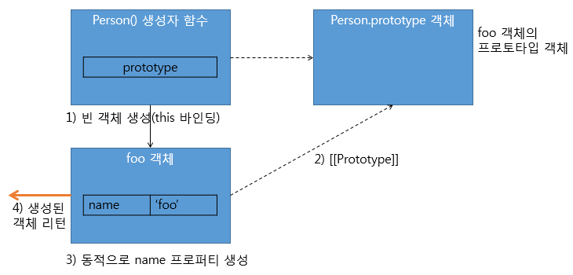

	1. Person() 함수가 생성자로 호출되면, 함수 코드가 실행되기 전에 빈 객체가 생성됨
	2. 여기서 생성된 빈 객체는 Person() 생성자 함수의 prototype 프로퍼티가 가리키는 객체(Person.prototype 객체)를 \[\[Prototype\]\] 링크로 연결, 자신의 프로토타입 설정
	3. this가 가리키는 빈 객체에 name이라는 동적 프로퍼티 생성
	4. 리턴값이 특별히 없으므로 this로 바인딩한 객체가 생성자 함수의 리턴값으로 반환됨 ⇒ foo 변수에 저장
### 객체 리터럴 방식과 생성자 함수를 통한 객체 생성 방식의 차이
- 객체 리터럴 방식으로 생성된 객체는 같은 형태의 객체를 재생성할 수 없음
- Person() 생성자 함수를 사용해 객체를 생성한다면, 생성자 함수를 호출할 때 다른 인자를 넘김으로써 같은 형태의 서로 다른 객체 bar와 baz 생성 가능
	```javascript
	// 객체 리터럴 방식으로 foo 객체 생성
	var foo = {
	name: 'foo',
	  age: 35,
	  gender: 'man'
	};
	console.dir(foo);

	// 생성자 함수
	function Person(name, age, gender, position) {
	this.name = name;
	  this.age = age;
	  this.gender = gender;
	}

	// Person 생성자 함수를 이용해 bar 객체, baz 객체 생성
	var bar = new Person('bar', 33, 'woman');
	console.dir(bar);

	var baz = new Person('baz', 25, 'woman');
	console.dir(baz);
	```

	- `console.dir`로 자바스크립트 객체 출력한 결과

		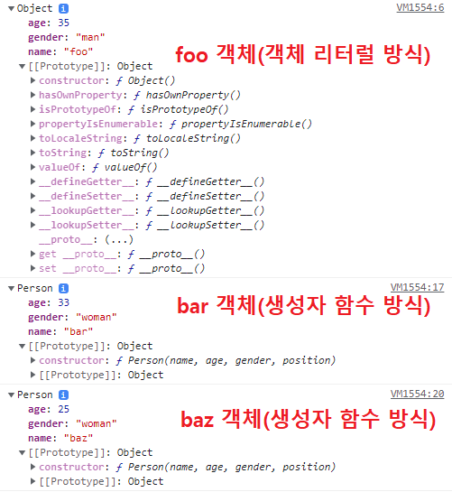

	- 객체 리터럴 방식과 생성자 함수 방식의 차이는 프로토타입 객체(\[\[Prototype\]\] 프로퍼티)에 있음
		- 객체 리터럴 방식: 자신의 프로토타입 객체가 Object(Object.prototype)
		- 생성자 함수 방식: 자신의 프로토타입 객체가 Person(Person.prototype) 

			⇒ 자바스크립트 객체 생성 규칙 때문에 차이가 발생함

- 자바스크립트 객체는 자신을 생성한 생성자 함수의 **prototype 프로퍼티**가 가리키는 객체를 자신의 **프로토타입 객체**로 설정함
	- 객체 리터럴 방식에서 객체 생성자 함수는 Object()
	- 생성자 함수 방식의 경우 Person() 생성자 함수 자체
### 생성자 함수를 new를 붙이지 않고 호출할 경우
- 자바스크립트에서는 일반 함수와 생성자 함수가 별도의 차이가 없음
- new 를 붙여서 함수를 호출하면 생성자 함수로 동작함
- 객체 생성을 목적으로 작성한 생성자 함수를 new 없이 호출하거나, 일반 함수를 new 를 붙여 호출할 때 코드 오류가 발생할 수 있음
- 일반 함수 호출과 생성자 함수를 호출할 때 this 바인딩 방식이 다름
	- 일반 함수 호출: this가 window 전역 객체에 바인딩됨
	- 생성자 함수 호출: this는 새로 생성되는 빈 객체에 바인딩됨
	```javascript
	var qux = Person('qux', 20, 'man');
	console.log(qux); // undefined

	console.log(window.name); // qux
	console.log(window.age); // 20
	console.log(window.gender); // man
	```

	- Person() 함수를 new 없이 일반 함수 형태로 호출: this는 함수 호출이므로 전역 객체인 window 객체로 바인딩됨
	- Person() 함수는 리턴값이 없음 ⇒ 생성자 함수는 별도의 리턴값이 정해져 있지 않은 경우 새로 생성된 객체가 리턴, 일반 함수를 호출할 대는 undefined 리턴
- 자바스크립트에서는 일반 함수와 생성자 함수의 구분이 별도로 없음
- 따라서, 일반적으로 생성자 함수로 사용할 함수는 첫 글자를 대문자로 표기
- 이러한 규칙을 사용하더라도 new를 사용해서 호출하지 않을 경우 코드 에러가 발생할 수 있음
- 이를 방지하기 위해 객체 생성을 위한 별도 코드 패턴을 사용하기도 함 - **강제로 인스턴스 생성하기**
	```javascript
	function A(arg) {
	if (!(this instanceof A)) { // =if (!(this instanceof arguments.callee)) {
	  return new A(arg);
	  }
	  this.value = arg ? arg : 0;
	}

	var a = new A(100);
	var b = A(10);

	console.log(a.value); // 100
	console.log(b.value); // 10
	console.log(global.value); // undefined
	```

	- 함수 A에 A가 호출될 때, this가 A의 인스턴스인지 확인하는 분기문이 추가됨
	- this가 A의 인스턴스가 아니라면, new 로 호출된 것이 아님을 의미 ⇒ new로 A를 호출하여 반환
	- `var b = A(10);`와 같이 전역 객체에 접근하지 않고, 새 인스턴스가 생성되어 b에 반환됨
	- `if (!(this instanceof arguments.callee))`: 
		- arguements.callee는 곧 호출된 함수를 가리킴
		- 특정 함수 이름과 상관없이 이 패턴을 공통으로 사용하는 모듈을 작성할 수 있는 장점이 있음
### call과 apply 메서드를 이용한 명시적인 this 바인딩
- 자바스크립트에선 함수 호출이 발생할 때, 각각의 상황에 따라 this가 정해진 객체에 자동으로 바인딩됨
- 이런 내부적인 this 바인딩 외에도 this를 특정 객체에 **명시적으로 바인딩**시키는 방법도 있음 ⇒ **`apply(), call() 메서드`**
- 두 메서드는 모든 함수의 부모 객체인 Function.prototype 객체의 메서드이므로, 모든 함수는 다음과 같은 형식으로 apply() 메서드 호출 가능
	```javascript
	function.apply(thisArg, argArray)
	```

- `call() 메서드`:
	- apply() 메서드와 기능이 같음
	- 차이점은 넘겨 받는 인자의 형식
	- apply()에서 두 번째 인자로 배열 형태로 넘긴다면, call()은 각각 하나의 인자로 넘김
	```javascript
	Person.call(foo, 'foo', 30, 'man');
	```

- `apply() 메서드`:
	- apply() 메서드를 호출하는 주체는 함수
	- apply() 메서드도 this를 특정 객체에 바인딩할 뿐 결국 본질적인 기능은 함수 호출
	- Person()이라는 함수에 Person.apply() 이렇게 호출한다면 이것의 기본적인 기능은 Person() 함수를 호출하는 것
	- 첫 번째 인자 thisArg는 apply() 메서드를 호출한 함수 내부에서 사용한 this에 바인딩할 객체를 가리킴
	- 첫 번째 인자로 넘긴 객체가 this로 명시적으로 바인딩됨
	- 두 번째 
	- apply() 메서드의 기능도 결국 함수를 호출하는 것 ⇒ 함수에 넘길 인자를 argArray 배열로 넘김

	⇒ **apply() 메서드**는 `두 번째 인자인 argArray 배열`을 자신을 호출한 함수의 인자로 사용하되, 함수 내부에서 사용된 `this`는 `첫 번째 인자인 thisArg 객체로 바인딩`해서 함수를 호출하는 기능을 함

	```javascript
	// 생성자 함수
	function Person(name, age, gender) {
	this.name = name;
	  this.age = age;
	  this.gender = gender;
	}

	// foo 빈 객체 생성 - 객체 리터럴 방식
	var foo = {};

	// apply() 메서드 호출
	Person.apply(foo, ['foo', 30, 'man']);
	console.dir(foo);
	```

	![\[실행 결과\]](images/inside-js-4-fig-23.png)

	- apply() 메서드를 사용해 Person() 함수를 호출
	- 첫 번째 인자로 넘긴 foo가 Person() 함수에서 this로 바인딩됨
	- 두 번째 인자로 넘긴 배열 `['foo', 30, 'man']`은 호출하려는 Person() 함수의 인자 name, age, gender로 각각 전달됨
	- 이 코드는 결국 `Person('foo', 30, 'man')` 함수를 호출하며, **this를 foo 객체에 명시적으로 바인딩**하는 것을 의미
	- 실행 결과를 보면, foo 객체에 제대로 프로퍼티가 생성되어 있음을 확인 가능
- apply(), call() 메서드는 this를 원하는 값으로 명시적으로 매핑, 특정 함수나 메서드를 호출한다는 장점이 있음
- arguments 객체와 같은 유사 배열 객체에서 배열 메서드를 사용하는 경우가 대표적 용도
	- arguments 객체는 실제 배열이 아니므로, pop(), shift() 같은 표준 배열 메서드를 사용할 수 없음 ⇒ **apply() 메서드 이용 시 가능**
	```javascript
	function myFuntion() {
	console.dir(arguments);

	  // arguments.shift(); // 에러 발생: arguments 객체는 유사배열 객체이므로 에러

	  // arguments 객체를 배열로 변환
	  var args = Array.prototype.slice.apply(arguments);
	  console.dir(args);
	}

	myFuntion(1,2,3);
	```

	![\[실행 결과\]](images/inside-js-4-fig-24.png)

	- apply() 메서드로 arguments 객체에 마치 배열 메서드가 있는 것처럼 처리 가능
	- `Array.prototype.slice.apply(arguments);`: 
		1. Array.prototype.slice() 메서드로 호출한다
		2. 이때, this는 arguments 객체로 바인딩한다

		⇒ arguments 객체가 Array.prototype.slice() 메서드를 마치 자신의 메서드인 양 arguments.slice() 와 같은 형태로 메서드 호출

		(모든 배열 객체의 부모 역할을 하는 자바스크립트 기본 프로토타입 객체 Array.prototype 는 slice()를 비롯한 push(), pop() 등과 같은 배열 표준 메서드를 보유)

	- Array.prototype.slice.apply(Arguments)의 결과값: apply() 메서드의 두 번째로 slice() 메서드를 호출할 때 사용할 인자를 넘기지 않음 ⇒ arguments 객체로 인자 없이 slice() 메서드를 호출한 형태
	- slice() 메서드는 인자 없이 호출할 경우, 해당 메서드를 호출한 배열을 복사한 새로운 배열 생성(예시 - arguments 배열 생성)
	- 따라서, arguments 객체의 모든 요소를 그대로 복사한 배열이 생성되고, args 변수에 리턴됨
	- arguments와 args는 프로퍼티 내용은 같지만 \[\[Prototype\]\] 프로퍼티는 다름
	- 즉,  arguments는 객체이므로 Object.prototype, args는 배열이므로 Array.prototype이 프로토타입인 것을 확인 가능
### 함수 리턴
- 자바스크립트 함수는 항상 리턴값을 반환
- return 문을 사용하지 않더라도 다음의 규칙으로 항상 리턴값 전달
	1.  일반 함수나 메서드는 리턴값을 지정하지 않을 경우, undefined 값 리턴
		```javascript
		var noReturnFunc = function() {
			console.log(1);
		};

		var result = noReturnFunc(); // 1
		console.log(result); // undefined
		```

	2. 생성자 함수에서 리턴값을 지정하지 않을 경우, 생성된 객체가 리턴
		1. 생성자 함수에서 별도의 리턴값을 지정하지 않을 경우, this로 바인딩된 새로 생성된 객체가 리턴됨
		2. 때문에, 생성자 함수에서는 일반적으로 리턴값을 지정하지 않음
		3. 하지만 만약 다음과 같이 생성자 함수에서 this로 바인딩되는 생성된 객체가 아닌 다른 객체를 리턴한다면?
			```javascript
			function Person(name, age, gender) {
				this.name = name;
			  this.age = age;
			  this.gender = gender;

				// 명시적으로 다른 객체 반환
			  return {name:'bar', age:20, gender:'woman'};
			}

			var foo = new Person('foo', 30, 'man');
			console.dir(foo);
			```

			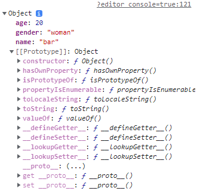

			- `return {name:'bar', age:20, gender:'woman'};`: 생성자 함수의 리턴값을 새로 생성한 객체가 아닌, 객체 리터럴 방식의 특정 객체로 지정한 경우

				⇒ Person() 생성자 함수를 호출해서 새로운 객체를 생성하더라도, 리턴값에서 명시적으로 넘긴 객체나 배열 리턴

				⇒ 이 부분이 없다면, `var foo = new Person('foo', 30, 'man');`에서는 새로 생성되는 foo 객체가 리턴됨

		- 생성자 함수의 리턴값으로 넘긴 값이 객체가 아닌 불린, 숫자, 문자열의 경우: 이러한 리턴값을 무시하고 this로 바인딩된 객체가 리턴
			```javascript
			function Person(name, age, gender) {
				this.name = name;
			  this.age = age;
			  this.gender = gender;
			  return 100;
			}

			var foo = new Person('foo', 30, 'man');
			console.log(foo);
			```

			![\[실행 결과\]](images/inside-js-4-fig-26.png)

## 프로토타입 체이닝
### 프로토타입의 두 가지 의미
- 자바스크립트는 기존 C++, 자바 같은 객체지향 프로그래밍 언어와는 다른 프로토타입 기반 객체지향 프로그래밍 지원
- 자바는 클래스를 정의하고 이를 통해 객체를 생성하지만, 자바스크립트에는 이런 클래스 개념이 없음
- 대신 객체 리터럴이나 생성자 함수로 객체 생성함 → 각 객체의 부모 객체가 **‘프로토타입’** 객체
- 상속 개념과 마찬가지로 자식 객체는 부모 객체가 가진 프로퍼티 접근이나 메서드를 상속받아 호출 가능
- 자바스크립트 모든 객체는 자신의 부모인 프로토타입 객체를 가리키는 참조 링크 형태의 숨겨진 프로퍼티 보유 ⇒ **암묵적 프로토타입 링크**
- 이 링크는 모든 객체의 **\[\[Prototype\]\] 프로퍼티**에 저장됨
- 단, 함수 객체의 **`prototype 프로퍼티`**와 객체의 숨은 **`프로퍼티 [[Prototype]] 링크`**는 다름
- **자바스크립트 객체 생성 규칙**: 모든 객체는 자신을 생성한 생성자 함수의 prototype 프로퍼티가 가리키는 프로토타입 객체를 자신의 부모 객체로 설정하는 \[\[Prototype\]\] 링크로 연결함
	```javascript
	// Person 생성자 함수
	function Person(name) {
	this.name = name;
	}

	// foo 객체 생성
	var foo = new Person('foo');

	console.dir(Person);
	console.dir(foo);
	```

	- Person() 생성자 함수는 prototype 프로퍼티로 자신과 링크된 프로토타입 객체를 가리킴
	- Person() 생성자 함수로 생성된 foo 객체는 Person() 함수의 프로토타입 객체를 \[\[Prototype\]\] 링크로 연결
	- 결국, prototype 프로퍼티나 \[\[Prototype\]\] 링크는 같은 프로토타입 객체를 가리킴
	- `prototype 프로퍼티`는 함수의 입장에서 **자신과 링크된 프로토타입 객체**를 가리킴
	- `[[Prototype]] 링크`는 객체의 입장에서 **자신의 부모 객체인 프로토타입 객체**를 내부에 숨겨진 링크로 가리킴
	- 결국, 자바스크립트에서 객체를 생성하는 건 생성자 함수의 역할
	- **생성된 객체의 실제 부모 역할**을 하는 건 생성자 자신이 아닌 **생성자의 prototype 프로퍼티가 가리키는 프로토타입 객체**임

	![\[객체, 생성자 함수, 프로토타입 객체의 관계\]](images/inside-js-4-fig-27.png)

	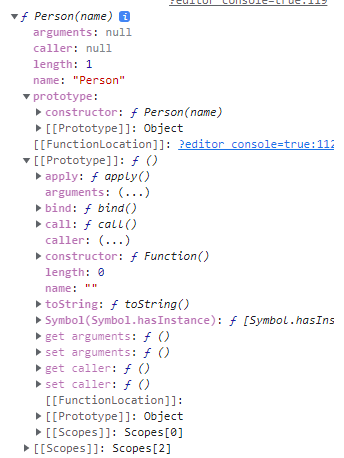

	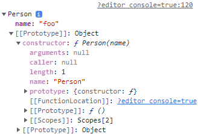

	- Person() 생성자 함수의 prototype 프로퍼티, foo 객체의 \[\[Prototype\]\] 프로퍼티 ⇒ **같은 프로토타입 객체를 가리킴**
	- 해당 프로토타입 객체는 constructor 프로퍼티가 Person() 생성자 함수를 가리킴
	- \[\[Prototype\]\] 프로퍼티는 모든 객체에 존재하는 숨겨진 프로퍼티 ⇒ 객체 자신의 프로토타입 객체를 가리키는 참조 링크 정보
### 객체 리터럴 방식으로 생성된 객체의 프로토타입 체이닝
- 자바스크립트 객체는 자기 자신의 프로퍼티 뿐만 아니라, 자신의 부모 역할을 하는 프로토타입 객체의 프로퍼티 또한 자신의 것처럼 접근 가능 ⇒ **프로토타입 체이닝**
	```javascript
	var myObject = {
	name: 'foo',
	  sayName: function() {
	  	console.log(this.name);
	  }
	};

	myObject.sayName(); // foo
	console.log(myObject.hasOwnProperty('name')); // true
	console.log(myObject.hasOwnProperty('nickName')); // false
	myObject.sayNickName(); // Uncaught TypeError: myObject.sayNickName is not a function
	```

	- `hasOwnProperty()` 메서드: 이 메서드를 호출한 객체에 인자로 넘긴 문자열 이름의 프로퍼티나 메서드가 있는지 체크하는 자바스크립트 표준 API 함수
	- 객체 리터럴로 생성한 객체는 Object() 라는 내장 생성자 함수로 생성됨
	- Object() 생성자 함수도 함수 객체이므로 prototype 프로퍼티 속성 보유
	- 따라서, 객체 리터럴 형태의 myObject는 Object() 함수의 prototype 프로퍼티가 가리키는 Object.prototype 객체를 자신의 프로토타입 객체로 연결함

	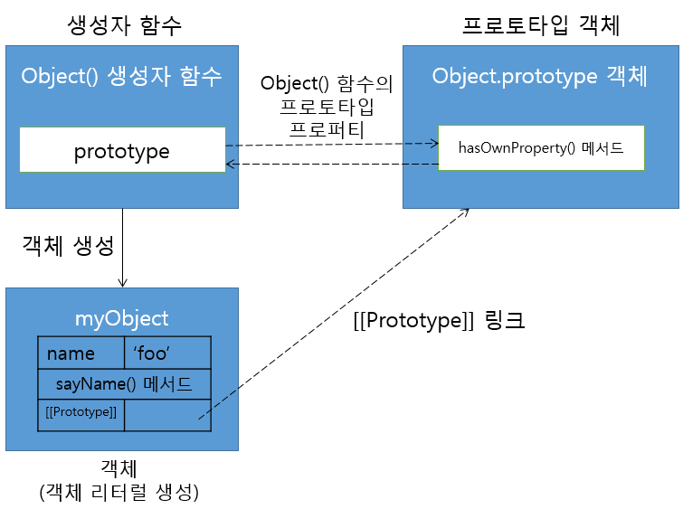

### 프로토타입 체이닝
- 자바스크립트에서 특정 객체의 프로퍼티나 메서드에 접근하려고 할 때, 해당 객체(myObject)에 접근하려는 프로퍼티 또는 메서드가 없다면 \[\[Prototype\]\] 링크를 따라 자신의 부모 역할을 하는 프로토타입 객체의 프로퍼티를 차례대로 검색
- 위 예제에서도 sayName()은 객체 내 메서드가 있어 바로 수행,
- 반면 hasOwnProperty() 메서드는 myObject 객체에 없으므로 \[\[Prototype\]\] 링크를 따라 부모 역할을 하는 Object.prototype 프로토타입 객체 내에서 검색
### 생성자 함수로 생성된 객체의 프로토타입 체이닝
- **`생성자 함수`**와 **`객체 리터럴 방식`**으로 객체를 생성하는 경우의 공통점: 자바스크립트에서 모든 객체는 자신을 생성한 생성자 함수의 **prototype 프로퍼티가 가리키는 객체**를 **자신의 프로토타입 객체(부모 객체)로 취급**함
	```javascript
	// Person() 생성자 함수
	function Person(name, age, hobby) {
	this.name = name;
	  this.age = age;
	  this.hobby = hobby;
	}

	// foo 객체 생성
	var foo = new Person('foo', 30, 'tennis');

	// 프로토타입 체이닝
	console.log(foo.hasOwnProperty('name')); // true

	// Person.prototype 객체 출력
	console.dir(Person.prototype);
	```

	- foo 객체의 생성자는 Person() 함수
	- foo 객체의 프로토타입 객체는 Person 생성자 함수 객체의 prototype 프로퍼티가 가리키는 객체(Person.prototype)가 됨
	- 즉, foo 객체의 프로토타입 객체는 Person.prototype이 됨
	- foo.hasOwnProperty() 메서드는 프로토타입 체이닝으로 foo의 부모 객체인 Person.prototype 객체에서 찾은 것
	- Person.prototype 객체 출력 결과, constructor 프로퍼티만 있는 것을 확인 가능

	![\[실행 결과\]](images/inside-js-4-fig-31.png)

	- Person.protototype 역시 자바스크립트 객체이므로, Object.prototype을 프로토타입 객체로 가짐
	- 프로토타입 체이닝은 Person.prototype에서 끝나는 게 아니라, Object.prototype 객체로 계속 이어짐 ⇒ hasOwnProperty()은 Object.prototype 객체의 메서드 이므로 에러 발생 없이 ture 출력

	![\[생성자 함수 방식에서의 객체와 프로토타입 객체의 관계\]](images/inside-js-4-fig-32.png)

### 프로토타입 체이닝의 종점
- Object.prototype 객체는 프로토타입 체이닝의 종점
- 객체 리터럴 방식이나 생성자 함수 방식에 상관없이 모든 자바스크립트 객체는 프로토타입 체이닝으로 Object.prototype 객체가 가진 프로퍼티와 메서드에 접근하고, 서로 공유 가능
```java
var myObject = {
	name: 'foo',
  sayName: function() {
  	console.log(this.name);
  }
};
```

```java
function Person(name, age, hobby) {
	this.name = name;
  this.age = age;
  this.hobby = hobby;
}
var foo = new Person('foo', 30, 'tennis');
```

![\[두 예제의 프로토타입 체이닝을 합친 그림\]](images/inside-js-4-fig-33.png)

- 때문에, 자바스크립트 표준 빌트인 객체인 Object.prototype에는 hasOwnProperty()나 isPrototypeOf() 등과 같이 모든 객체가 호출 가능한 표준 메서드들이 정의되어 있음
### 기본 데이터 타입 확장
- 숫자, 문자열, 배열 등에서 사용되는 표준 메서드들의 경우, 이들의 프로토타입인 Number.prototype, String.prototype, Array.prototype 등에 정의되어 있음
- 이러한 기본 내장 프로토타입 객체 또한 Object.prototype을 자신의 프로토타입으로 가지고 있어 프로토타입 체이닝으로 연결됨
- ECMAScript 명세서에는 자바스크립트 각 네이티브 객체별로 공통으로 제공해야 하는 메서드들을 각각의 프로토타입 객체 내에 메서드로 정의해야 한다고 기술함
- 자바스크립트는 Object.prototype, String.prototype 등과 같이 표준 빌트인 프로토타입 객체에도 사용자가 직접 정의한 메서드들을 추가하는 것을 허용함
	```javascript
	String.prototype.testMethod = function () {
	console.log("testMethod()");
	}

	var str = "this is test";
	str.testMethod(); // testMethod()

	console.dir(String.prototype);
	```

	- str 변수에 문자열을 생성한 후 testMethod() 호출 시, 프로토타입 체이닝으로 String.prototype에 정의한 testMethod()가 호출됨
	- 본 예제처럼 String.prototype 객체에 testMethod() 메서드를 추가하면, 이 메서드는 일반 문자열 표준 메서드처럼 모든 문자열에서 접근 가능

		![\[실행 결과\]](images/inside-js-4-fig-34.png)

		![\[String.prototype 객체를 통한 사용자 정의 문자열 메서드 추가\]](images/inside-js-4-fig-35.png)

### 프로토타입도 자바스크립트 객체다
- 함수가 생성될 때, 자신의 prototype 프로퍼티에 연결되는 프로토타입 객체는 디폴트로 constructor 프로퍼티만을 가진 객체임
- 프로토타입 객체 역시 자바스크립트 객체이므로 일반 객체처럼 동적으로 프로퍼티 추가, 삭제 가능
- 변경된 프로퍼티는 실시간으로 프로토타입 체이닝에 반영됨
	```javascript
	// Person() 생성자 함수
	function Person(name) {
	this.name = name;
	}

	// foo 객체 생성
	var foo = new Person('foo');

	// foo.saHello(); // foo 객체에 sayHello() 메서드가 정의되어 있지 않아 에러 발생

	// 프로토타입 객체에 sayHello() 메서드 정의
	Person.prototype.sayHello = function() {
	console.log('hello');
	}

	foo.sayHello(); // hello // Person.prototype 객체에서 sayHello() 검색
	```
### 프로토타입 메서드와 this 바인딩
- 프로토타입 객체는 메서드를 가질 수 있음
- 프로토타입 메서드 내부에서 this 를 사용한다면 어디에 바인딩 될까? ⇒ 메서드 호출 패턴에서의 this는 그 메서드를 호출한 객체에 바인딩됨
	```javascript
	// Person() 생성자 함수
	function Person(name) {
	this.name = name;
	}

	// getName() 프로토타입 메서드
	Person.prototype.getName = function() {
	return this.name;
	};

	// foo 객체 생성
	var foo = new Person('foo');

	console.log(foo.getName()); // foo

	// Person.prototype 객체에 name 프로퍼티 동적 추가
	Person.prototype.name = 'person';
	console.log(Person.prototype.getName()); // person
	```

	- `var foo = new Person('foo');`: foo 객체에서 getName()을 찾을 수 없으므로 프로토타입 체이닝 발생, Person.prototype의 getName() 사용

		⇒ 이 때, getName()을 호출한 객체는 foo 이므로 this는 foo 객체에 바인딩

	- `Person.prototype.name = 'person';`: Person.prototype 객체에 바로 접근해서 getName() 메서드 호출 시, 메서드를 호출한 객체 Person.prototype에 this 바인딩

	![\[프로토타입 메서드와 this 바인딩\]](images/inside-js-4-fig-36.png)

### 디폴트 프로토타입은 다른 객체로 변경이 가능
- 디폴트 프로토타입 객체는 함수가 생성될 때 같이 생성됨
- 함수의 prototype 프로퍼티에 연결됨
- 자바스크립트에서는 함수를 생성할 때 해당 함수와 연결되는 디폴트 프로토타입 객체를 다른 일반 객체로 변경 가능
- 주의점:
	- 생성자 함수의 프로토타입 객체가 변경되면, 변경 시점 이후 생성된 객체들은 변경된 프로토타입 객체로 \[\[Prototype\]\] 링크를 연결함
	- 그에 반해, 생성자 함수의 프로토타입이 변경되기 이전 생성된 객체들은 기존 프로토타입 객체로의 \[\[Prototype\]\] 링크를 그대로 유지함
	```javascript
	// 1. Person() 생성자 함수
	function Person(name) {
	this.name = name;
	}
	console.log(Person.prototype.constructor);
	/*
	ƒ Person(name) {
		this.name = name;
	}
	*/

	// 2. foo 객체 생성
	var foo = new Person('foo');
	console.log(foo.country); // undefined

	// 3. 디폴트 프로토타입 객체 변경
	Person.prototype = {
	country: 'korea',
	};
	console.log(Person.prototype.constructor); // ƒ Object() { [native code] }

	// 4. bar 객체 생성
	var bar = new Person('bar');

	// 5. 출력 결과
	console.log(foo.country); // undefined
	console.log(bar.country); // korea
	console.log(foo.constructor);
	/*
	ƒ Person(name) {
		this.name = name;
	}
	*/
	console.log(bar.constructor); // ƒ Object() { [native code] }
	```

	![\[예제 동작 구조\]](images/inside-js-4-fig-37.png)

	1. Person() 함수 생성 시 디폴트로 같이 생성되는 Person.prototype 객체는 자신과 연결된 Person() 생성자 함수를 가리키는 constructor 프로퍼티만을 가짐

		⇒ 때문에, Person.prototype.constructor는 Person() 생성자 함수를 가리킴

	2. foo 객체 생성: 객체 생성 규칙에 따라 foo 객체는 Person.prototype 객체를 자신의 프로토타입으로 연결

		⇒ 그러나, foo 객체는 country 프로퍼티가 없고, 디폴트 프로토타입 객체 Person.prototype도 없음

	3. 자바스크립트에서는 디폴트 프로토타입 객체 또한 변경 가능

		⇒ 객체 리터럴 방식으로 생성한 country 프로퍼티를 가진 객체로 Person.prototype 프로토타입 객체 변경

		1. 변경한 프로토타입 객체는 단지 country 프로퍼티가 있음 ⇒ constructor 프로퍼티가 없음
		2. 이 경우도 프로토타입 체이닝 발생 ⇒ 변경한 프로토타입 객체는 객체 리터럴 방식으로 생성했으므로, Object.prototype을 \[\[Prototype\]\] 링크로 연결
		3. Object.prototype 객체로 프로토타입 체이닝 발생
		4. Object.prototype 역시 Object() 생성자 함수와 연결된 빌트인 프로토타입 객체여서, Object() 생성자 함수를 constructor 프로퍼티에 연결함
		5. 따라서, Person.prototype.constructor의 값은 Object() 생성자 함수가 출력됨
	4. bar 객체 생성: Person() 생성자 함수의 prototype 프로퍼티는 디폴트 프로토타입 객체가 아닌 새로 변경된 프로토타입 객체를 가리킴

		⇒ 따라서, bar 객체는 새로 변경된 프로토타입 객체를 \[\[Prototype\]\] 링크로 가리킴

	5. foo객체는 디폴트 프로토타입 객체를, bar 객체는 새로 변경된 프로토타입 객체를 각각 \[\[Prototype\]\] 링크로 연결

		⇒ 프로토타입이 달라 foo, bar 객체는 프로토타입 체이닝이 서로 다른 결과값을 만듦

		⇒ 또한, foo.constructor도 Person() 생성자 함수를 가리키지만,  bar.constructor는 Object()를 가리킴
### 객체의 프로퍼티 읽기나 메서드를 실행할 때만 프로토타입 체이닝이 동작함
- 객체의 특정 프로퍼티를 읽으려고 할 때, 프로퍼티가 해당 객체에 없는 경우 프로토타입 체이닝이 발생
- 반대로, 객체에 있는 특정 프로퍼티에 값을 쓰려고 한다면 이땐 프로토타입 체이닝이 발생하지 않음
- 자바스크립트는 객체에 없는 프로퍼티에 값을 쓰려고 할 경우 동적으로 객체에 프로퍼티를 추가하기 때문
	```javascript
	// Person() 생성자 함수
	function Person(name) {
	this.name = name;
	}

	Person.prototype.country = 'korea';

	var foo = new Person('foo');
	var bar = new Person('bar');
	console.log(foo.country); // korea // 1.
	console.log(bar.country); // korea // 2.

	foo.country = 'usa';
	// 3.
	console.log(foo.country); // usa
	console.log(bar.country); // korea
	```

	- foo, bar 객체는 둘 다 Person.prototype 객체를 프로토타입으로 가짐
	1. foo.country에 접근하려 했을 때, foo 객체는 name 프로퍼티밖에 없으므로 프로토타입 체이닝 ⇒ foo의 프로토타입 객체인 Person.prototype의 country 프로퍼티값이 출력
	2. foo.country 값에 ‘usa’ 를 저장하면, 프로토타입 체이닝이 동작하지 않고, foo 객체에 country 프로퍼티값이 동적으로 생성
	3. foo.country는 프로토타입 체이닝 없이 값이 출력, bar 객체는 프로토타입 체이닝을 거침

	![\[동작 그림\]](images/inside-js-4-fig-38.png)

