<table_of_contents color="gray"/>
# 5. 실행 컨텍스트와 클로저
## 실행 컨텍스트 개념
- 콜 스택(Call Stack): 함수를 호출할 때 해당 함수의 호출 정보가 쌓여있는 스택을 의미
	- 가령,  C언어의 경우 함수가 호출될 때마다 해당 함수의 호출 정보가 기존 함수의 호출 정보 위에 스택 형태로 하나 씩 쌓임
	- 콜 스택의 호출 정보 등으로 코드의 실행 과정 추적, 디버깅과 같은 작업 수행
- 자바스크립트 또한 이 범주를 크게 벗어나지 않음
- 실행 컨택스트는 콜 스택에 들어가는 실행 정보 하나와 비슷함
- ECMAScript에서는 실행 컨텍스트를 **실행 가능한 코드를 형상화하고 구분하는 추상적인 개념**으로 기술
- 이를 콜 스택과 연관 하여 정의하면, **실행 가능한 자바스크립트 코드 블록이 실행되는 환경**이라고 할 수 있음
- 이 컨텍스트 안에 실행에 필요한 여러 가지 정보를 담고 있음
- 여기서 말하는 **실행 가능한 코드 블록**: 대부분의 경우 **함수**
- ECMAScript에서는 실행 컨텍스트가 형성되는 경우를 세 가지로 규정함
	1. 전역 코드
	2. eval() 함수로 실행되는 코드
	3. 함수 안의 코드를 실행할 경우
- 대부분 함수로 실행 컨텍스트를 만듦
- 코드 블록 안에는 변수 및 객체, 실행 가능한 코드가 들어있음
- 코드가 실행되면 실행 컨텍스트 생성 → 실행 컨텍스트는 스택 안에 하나씩 쌓임 → 제일 위에 위치하는 실행 컨텍스트가 현재 실행되고 있는 컨텍스트
- EMCAScript에서는 실행 컨텍스트의 생성을 다음처럼 설명: **현재 실행되는 컨텍스트에서 이 컨텍스트와 관련 없는 실행 코드가 실행되면, 새로운 컨텍스트가 생성되어 스택에 들어가고 제어권이 그 컨텍스트로 이동**
	```javascript
console.log("this is global context"); // this is global context

function ExContext1() {
	console.log("this is ExContext1");
};

function ExContext2() {
	ExContext1();
  console.log("this is ExContext2");
};

ExContext2();
// this is ExContext1
// this is ExContext2
	```
	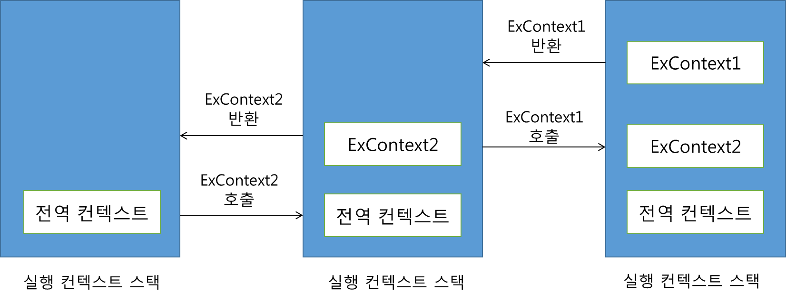
	- 전역 실행 컨텍스트가 가장 먼저 실행
		(전역 실행 컨텍스트 = 가장 먼저 실행되는 실행 컨텍스트)
	- 새로운 함수 호출 → 새로운 컨텍스트가 만들어지고 실행, 종료되면 반환
	- 이하 과정 반복 후 → 전역 실행 컨텍스트의 실행이 완료되면 모든 실행 종료
## 실행 컨텍스트 생성 과정
```javascript
function execute(param1, param2) {
	var a = 1, b = 2;
  function func() {
  	return a + b;
  }
  return param1 + param2 + func();
}

execute(3, 4);
```
### 1. 활성 객체 생성
- 실행 컨택스트가 생성되면 자바스크립트 엔진은 해당 컨텍스트에서 실행에 필요한 여러 가지 정보를 담을 객체를 생성함 ⇒ 활성 객체
- 활성 객체에 앞으로 사용하게 될 매개변수나 사용자가 정의한 변수 및 객체를 저장하고,
- 새로 만들어진 컨텍스트로 접근 가능
	(엔진 내부에서 접근할 수 있다는 것이지, 사용자가 접근할 수 있다는 것은 아님)
	
### 2. arguments 객체 생성
- 다음 단계에서 arguments 객체를 생성
- 앞서 만들어진 활성 객체는 arguments 프로퍼티로 이 arguments 객체를 참조함
- 예시) execute() 함수의 param1, param2가 들어왔을 경우 활성 객체의 상태를 표현함
	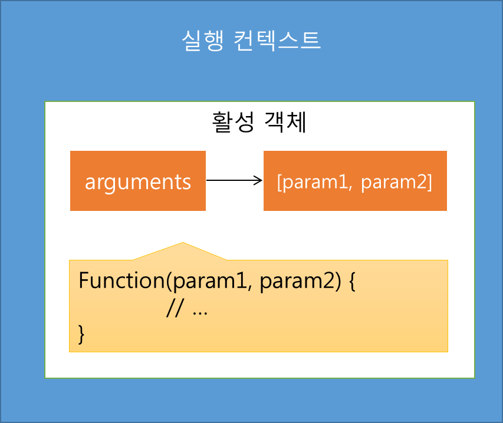
### 3. 스코프 정보 생성
- 현재 컨텍스트의 유효 범위를 나타내는 스코프 정보를 생성함
- 이 스코프 정보는 현재 실행 중인 실행 컨텍스트 안에서 연결 리스트와 유사한 형식으로 만들어짐
- 현재 컨텍스트에서 특정 변수에 접근해야 할 경우, 이 리스트를 활용함
- 이 리스트로 현재 컨텍스트의 변수 뿐 아니라, 상위 실행 컨텍스트의 변수도 접근 가능
- 이 리스트에서 찾지 못한 변수는 결국 정의되지 않은 변수에 접근하는 것으로 판단, 에러 검출
- 이 리스트를 스코프 체인이라고 하며, \[\[scope\]\] 프로퍼티로 참조됨
- 현재 생성된 활성 객체가 스코프 체인의 제일 앞에 추가됨
- 예시) execute() 함수의 인자나 지역 변수 등에 접근할 수 있음
	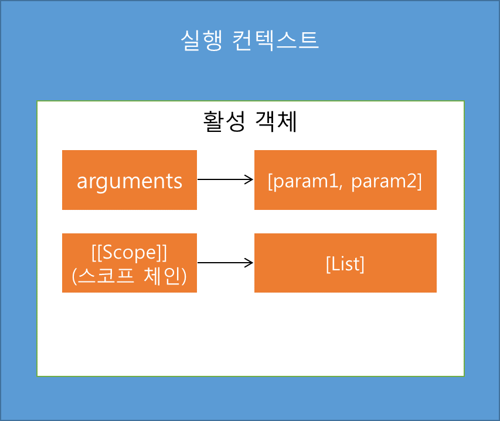
### 4. 변수 생성
- 실행 컨텍스트 내부에서 사용되는 지역 변수가 생성됨
- ECMAScript 에서는 생성되는 변수를 저장하는 변수 객체를 언급하는데, 실제적으로 앞서 생성된 활성 객체가 변수 객체로 사용됨
- 활성 객체, 변수 객체는 같은 의미
- 변수 객체 안에서 호출된 함수 인자는 각각의 프로퍼티가 만들어지고 그 값이 할당됨
- 만약 값이 넘겨지지 않았다면, undefined가 할당됨
- 예) execute() 함수 안에 정의된 변수 a, b와 함수 func가 생성됨
	- 주의점: 이 과정에서는 변수나 내부 함수를 단지 메모리에 생성하고, 초기화는 각 변수나 함수에 해당하는 표현식이 실행되기 전까지는 이루어지지 않음
	- 따라서, 변수 a, b에는 먼저 undefined가 할당됨
	- 표현식의 실행은 변수 객체 생성이 다 이루어진 후 시작됨
	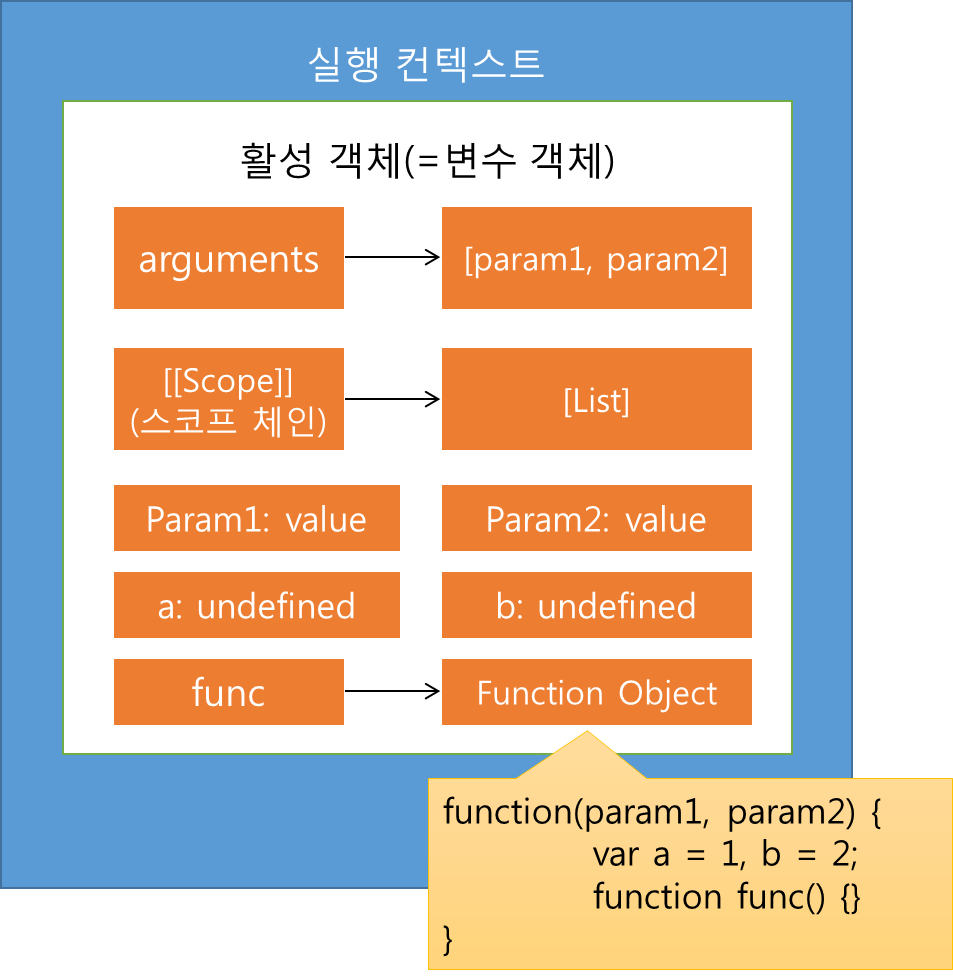
### 5. this 바인딩
- 여기서 this가 참조하는 객체가 없으면 전역 객체를 참조함
	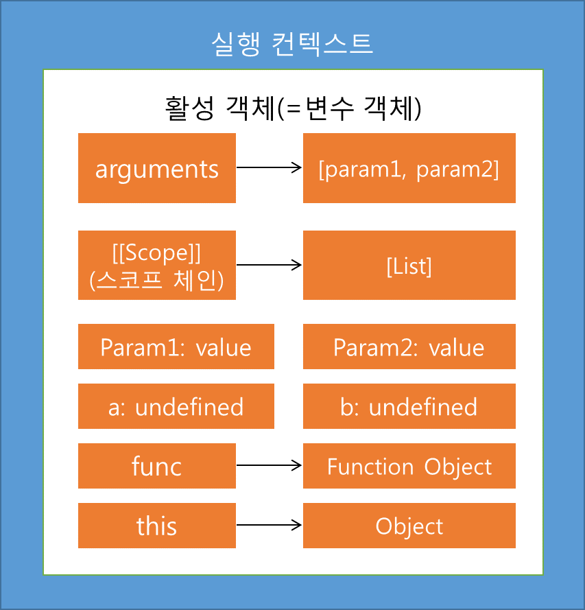
### 6. 코드 실행
- 이렇게 하나의 실행 컨텍스트가 생성 → 변수 객체가 만들어진 후 → 코드에 있는 여러 가지 표현식 실행
- 이렇게 실행되며 변수의 초기화 및 연산, 또 다른 함수 실행 등이 이루어짐
- 그림에서 undefined가 할당된 변수 a, b에도 이 과정에서 1, 2의 값이 할당됨
### ‼️ 전역 실행 컨텍스트는 일반적인 실행 컨텍스트와는 다름
- arguments 객체가 없으며, 전역 객체 하나만을 포함하는 스코프 체인이 있음
- ECMAScript에서 언급된 바에 의하면, 실행 컨텍스트가 형성되는 세 가지 중 하나로서 전역 코드가 있는데, 이 전역 코드가 실행될 때 생성되는 컨텍스트가 전역 실행 컨텍스트임
- 전역 실행 컨텍스트는 변수를 초기화하고, 이것의 내부 함수는 일반적인 탑 레벨의 함수로 선언됨
- 전역 실행 컨텍스트는 변수를 초기화하고, 이것의 내부 함수는 일반적인 타
- 또한, 전역 실행 컨텍스트의 변수 객체가 전역 객체로 사용됨
- 즉, 전역 실행 컨텍스트에서는 변수 객체가 곧 전역 객체임
- 따라서, 전역적으로 선언된 함수와 변수가 전역 객체의 프로퍼티가 됨
- 전역 실행 컨텍스트 역시, this를 전역 객체의 참조로 사용함
<callout icon="💡" color="gray_bg">
	**브라우저에서는  최상위 코드가 곧 전역 코드지만, Node.js 에서는 다름**
	```javascript
var a = 10;
b = 15;
console.log(window.a); // 10
console.log(window.b); // 15
	```
	- 브라우저에서 위 코드는 잘 실행됨
	- var a로 정의한 변수가 전역 객체인 window의 한 프로퍼티로 들어감
	- 하지만 Node.js에서는 다름
	```javascript
var a = 10;
b = 15;
console.log(global.a); // undefined
console.log(global.b); // 15
	```
	- Node.js 에서는 최상위 코드가 브라우저와는 달리 전역 코드가 아님
	- 따라서 var a 로 정의된 변수가 전역 객체에 들어가지 않음
	- Node.js에서는 일반적으로 자바스크립트 파일, 이를테면 filname.js가 하나의 모듈로 동작하고, 이 파일의 최상위에 변수를 선언해도 그 모듈의 지역 변수가 됨
	- 하지만, var를 사용하지 않을 경우 전역 객체인 global에 들어가고, 이는 전역 객체를 오염시키는 원인이 되므로 주의 필요
</callout>
## 스코프 체인
- 실행 컨텍스트 생성 과정에서 설명한 스코프 체인이 어떻게 만들어지는지 살펴볼 필요가 있음
- 스코프 체인을 알아야 자바스크립트 변수에 대한 인식 메커니즘을 알 수 있고, 현재 사용되는 변수가 어디에서 선언된 변수인지 정확히 알 수 있음
- 3장에서 설명한 프로토타입 체인과 거의 비슷한 메커니즘
- 자바스크립트도 스코프, 즉 유효 범위가 있음
- 이 유효 범위 안에서 변수와 함수가 존재함
	```javascript
void example_scope() {
	int i = 0;
  int value = 1;
  for (i = 0; i < 10; i++) {	
  	int a = 10;
  }
  printf("a: \d", a); // 컴파일 에러
  
  if (i == 10) {
  	int b = 20;
  }
  printf("b: \d", b); // 컴파일 에러
  printf("value: \d", value); // 1
}
	```
	- C 코드를 예로 들면, \{\}로 묶여 있는 범위 엔에서 선언된 변수는 블록이 끝나는 순간 사라지므로, 밖에서는 접근 불가
	- 함수의 \{\} 뿐만 아니라, if, for문의 \{\}이 한 블록으로 묶여, 그 안에서 선언된 변수가 밖에서는 접근이 불가능
	- 자바스크립트에서는 함수 내 \{\} 블록, for, if \{\} 블록과 같은 구문은 유효 범위 없음
	- 오직 함수만이 유효 범위의 한 단위가 됨
	- 이 유효 범위를 나타내는 스코프가 \[\[scope\]\] 프로퍼티로, 각 함수 객체 내 연결 리스트 형식으로 관리됨 ⇒ 스코프 체인
	- 이 스코프 체인은 다음 그림과 같이 각 실행 컨텍스트의 변수 객체가 구성 요소인 리스트와 같음
		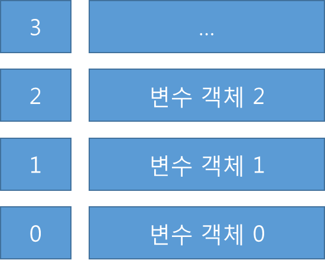
	- 각각 함수는 \[\[scope\]\] 프로퍼티로 자신이 생성된 실행 컨텍스트의 스코프 체인을 참조함
	- 함수가 실행되는 순간 실행 컨텍스트가 만들어지고, 이 실행 컨텍스트는 실행된 함수의 \[\[scope\]\] 프로퍼티를 기반으로 새로운 스코프 체인을 생성함
### 1. 전역 실행 컨텍스트의 스코프 체인
```javascript
var var1 = 1;
var var2 = 2;
console.log(var1); // 1
console.log(var2); // 2
```
- 예제 코드는 전역 코드임
- 함수가 선언되지 않아 함수 호출이 없고, 실행 가능한 코드들만 나열됨
- 코드 실행: 전역 실행 컨텍스트 생성 → 변수 객체 생성
- 변수 객체의 스코프 체인: 현재 전역 실행 컨텍스트 단 하나만 실행되고 있기에, 참조할 상위 컨텍스트가 없음
- 따라서, 자신이 최상위에 위치하는 변수 객체
- 이 변수 객체의 스코프 체인은 자기 자신만을 가짐
- 그러므로, 변수 객체의 \[\[scope\]\]는 변수 객체 자신을 가리킴
- var1, var2 변수들이 생성되고 변수 객체에 의해 참조됨 → 이 변수 객체가 곧 전역 객체가 됨
	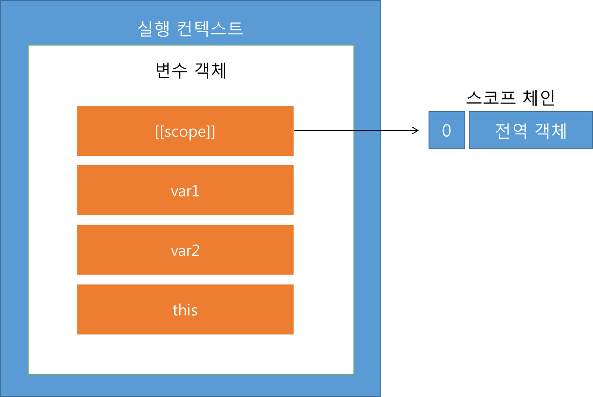
### 2. 함수를 호출한 경우 생성되는 실행 컨텍스트의 스코프 체인
- 예시1)
	```javascript
var var1 = 1;
var var2 = 2;
function func() {
	var var1= 10;
	var var2 = 20;
	console.log(var1); // 10
	console.log(var2); // 20
}
func();
console.log(var1); // 1
console.log(var2); // 2
	```
	- 코드 실행: 전역 실행 컨텍스트 생성 → func() 함수 객체 생성
	- 이 함수 객체의 \[\[scope\]\]: 함수 객체가 생성될 때, 그 함수 객체의 \[\[scope\]\]는 현재 실행되는 컨텍스트의 변수 객체에 있는 \[\[scope\]\]를 그대로 가짐
	- 따라서, func 함수 객체의 \[\[scope\]\]는 전역 변수 객체가 됨
	```javascript
func(); // 함수 실행 단계
	```
	- 함수를 실행했으므로 새로운 컨텍스트가 만들어짐 ⇒ func 컨텍스트
	- func 컨텍스트의 스코프 체인은 실행된 함수의 \[\[scope\]\] 프로퍼티를 그대로 복사한 후, 현재 생성된 변수 객체를 복사한 스코프 체인의 맨 앞에 추가
	- func() 함수 객체의 \[\[scope\]\] 프로퍼티가 전역 객체 하나만을 가지고 있었으므로, func 실행 컨텍스트의 스코프 체인은 다음과 같이 `[func 변수 객체 - 전역 객체]`가 됨
	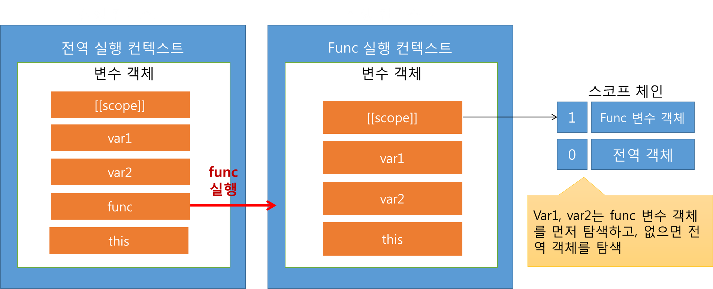
	- 각 함수 객체는 \[\[scope\]\] 프로퍼티로 현재 컨텍스트의 스코프 체인을 참조함
	- 한 함수가 실행되면 새로운 실행 컨텍스트가 만들어짐 → 새로운 실행 컨텍스트는 자신이 사용할 스코프 체인을 다음과 같은 방법으로 만듬:
		현재 실행되는 함수 객체의 \[\[scope\]\] 프로퍼티 복사 → 새롭게 생성된 변수 객체를 해당 체인의 제일 앞에 추가
	- 스코프 체인 요약: **스코프 체인 = 현재 실행 컨텍스트의 변수 객체 + 상위 컨텍스트의 스코프 체인**
- 예시2)
	```javascript
var value = "value1";

function printFunc() {
	var value = "value2";
  
  function printValue() {
  	return value;
  }
  console.log(printValue());
}
printFunc(); // value2
	```
	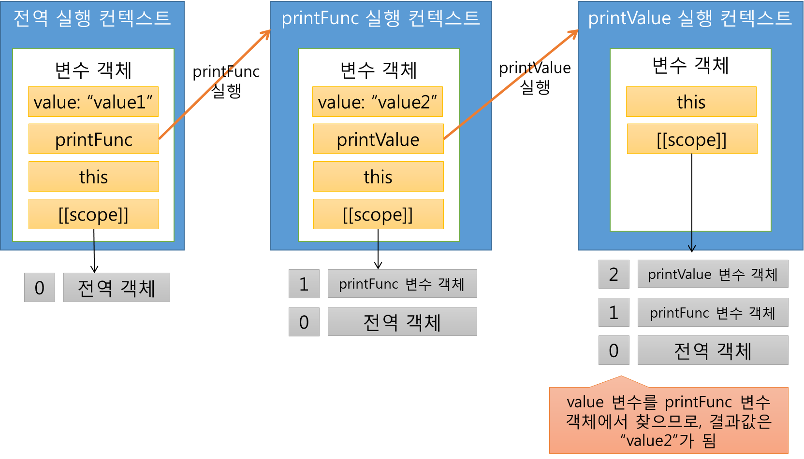
- 예시3)
	```javascript
var value = "value1";

function printValue() {
	return value;
}

function printFunc(func) {
	var value = "value2";
  console.log(func());
}
printFunc(printValue); // value1
	```
	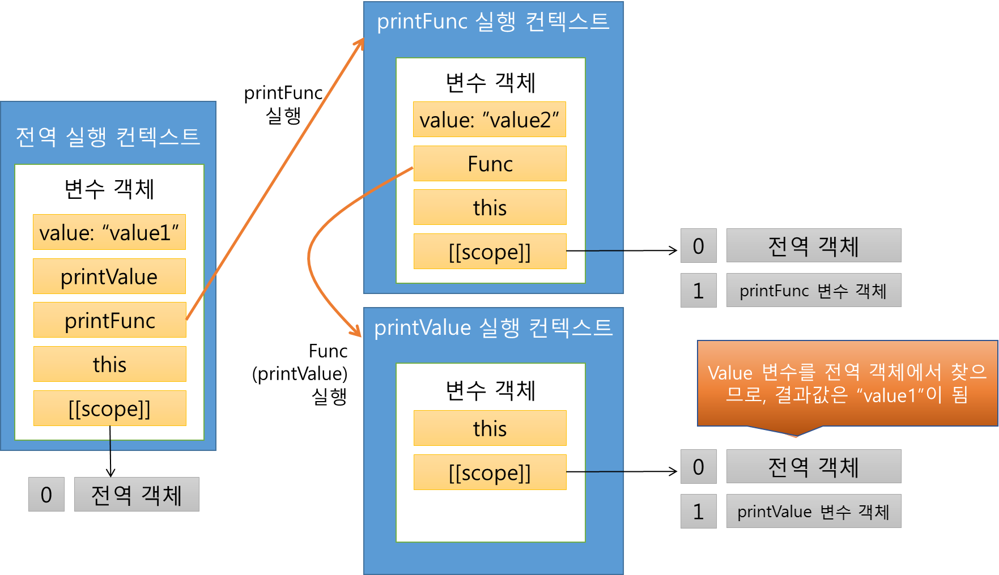
- 여기까지, 실행 컨텍스트가 만들어지며 스코프 체인이 어떻게 형성되는지 살펴봄
- 이렇게 만들어진 스코프 체인으로 식별자 인식이 이루어짐
- 식별자 인식은 스코프 체인의 첫번째 변수 객체부터 시작 → 식별자와 대응되는 이름을 가진 프로퍼티가 있는지 확인
- 함수를 호출할 때, 스코프 체인의 가장 앞에 있는 객체가 변수 객체이믐로, 이 객체에 있는 공식 인자, 내부 함수, 지역 변수에 대응되는지 먼저 확인
- 첫 번째 객체에 대응되는 프로퍼티를 발견하지 못하면, 다음 객체로 이동하여 찾음
- 이런 식으로 대응되는 이름의 프로퍼티를 찾을 때까지 계속됨
- 여기서 this는 식별자가 아닌 키워드로 분류됨 → 스코프 체인의 참조 없이 접근할 수 있음
### 스코프 체인을 사용자가 임의로 수정하는 키워드 with
- with는 eval과 함께, 성능을 높이고자 할 때 사용하지 말아야 할 키워드
- with 구문은 표현식을 실행 → 표현식이 객체면 객체는 현재 실행 컨텍스트의 스코프 체인에 추가(활성화 객체 바로 앞)
- with 구문은 다른 구문(혹은 블록 구문)을 실행하고 실행 컨텍스트의 스코프 체인을 전에 있던 곳에 저장함
- 함수 선언은 with 구문의 영향을 받지 않고 함수 객체 생성
- 함수 표현식은 안에서 with 구문과 함께 실행 가능
	```javascript
var y = {x:5};

function withExamFunc() {
	var x = 10;
  var z;
  
  with(y) {
  	z = function() {
    	console.log(x); // 5(y 객체의 x가 출력됨)
    }
  }
  z();
}
withExamFunc();
	```
	- withExamFunc() 함수가 호출되면 실행 컨텍스트는 전역 변수 객체와 현재 실행 컨텍스트의 변수 객체를 포함하는 스코프 체인이 있음
	- 여기에 with 구문의 실행으로 전역 변수 y에 의해 참조되는 객체를 함수 표현식이 실행되는 동안 스코프 체인의 맨 앞에 추가
	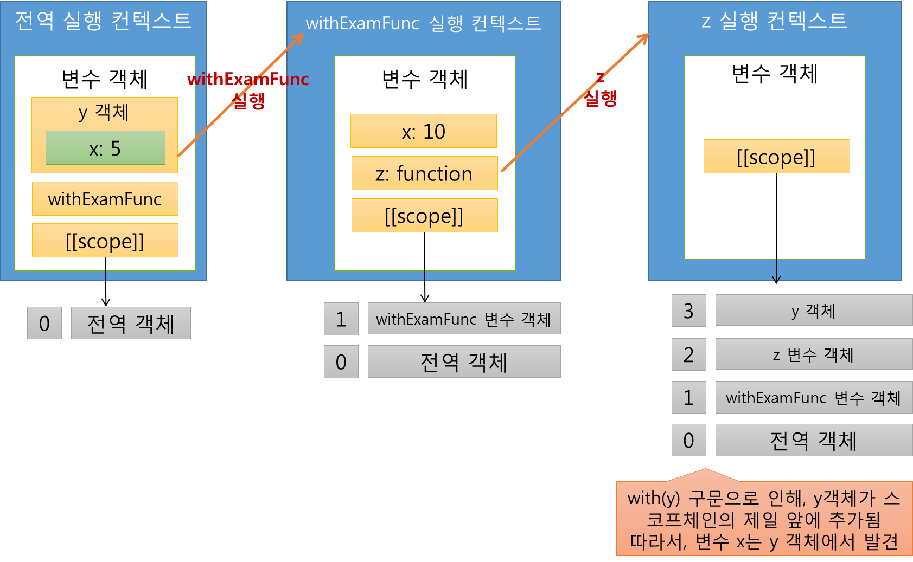
	- 따라서, 예제의 결과값은 y 객체 안에 정의된 x의 값인 5를 출력함
### 호이스팅
- 실행 컨텍스트를 이해했다면 호이스팅의 원인도 이해할 수 있음
	```javascript
foo();
bar();

var foo = function() {
	console.log(x);
}

function bar() {
	console.log(x);
}

var x = 1;

// Uncaught TypeError: foo is not a function
	```
	- 이 예제는 다음과 같음
	```javascript
var foo;

function bar() {
	console.log(x);
}

var x;

foo();
bar();

foo = function() {
	console.log(x);
}

x = 1;

// Uncaught TypeError: foo is not a function
	```
	- 함수 생성 과정에서 변수 foo, 함수 객체 bar, 변수 x를 차례로 생성
	- foo와 x에는 undefined가 할당
	- 실행이 시작되면 foo(), bar()를 연속해서 호출
	- foo에 함수 객체의 참조가 할당되고, 변수 x에 1이 할당됨
	- foo()에서 TypeError 발생 ⇒ foo가 선언되어 있지만 함수가 아니기 때문
	- foo()를 커멘트 처리 후 실행하면 bar() 에서는 undefined가 출력됨 ⇒ x에 1이 할당되기 전에 실행했기 때문
	```javascript
var foo;

function bar() {
	console.log(x); // undefined
}

var x;

// foo();
bar(); // 1

foo = function() {
	console.log(x);
}

x = 1;
	```
## 클로저
### 클로저의 개념
```javascript
function outerFunc() {
	var x = 10;
  var innerFunc = function() { console.log(x); }
  return innerFunc;
}

var inner = outerFunc();
inner(); // 10
```
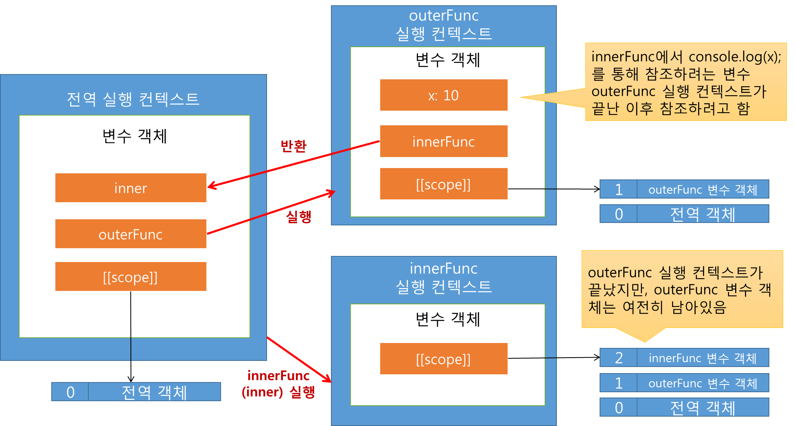
- innerFunc()의 \[\[scope\]\]은 outerFunc 변수 객체와 전역 객체를 가짐
- 그런데, innerFunc()은 outerFunc()의 실행이 끝난 후 실행됨
- 그렇다면, outerFunc 실행 컨텍스트가 사라진 이후 innerFunc 실행 컨텍스트가 생성되는 것인데, innerFunc()의 스코프 체인은 outerFunc 변수 객체를 여전히 참조할 수 있나?
	⇒ outerFunc 실행 컨텍스트는 사라졌지만, outerFunc 변수 객체는 여전히 남아있고, innerFunc의 스코프 체인으로 참조됨 ⇒ **클로저**
### 클로저 더 알아보기
- 자바스크립트 함수는 일급 객체로 취급됨
- 이는 하무를 다른 함수의 인자로 넘길 수도 있고, return으로 함수를 통째로 반환받을 수도 있음을 의미
- 최종 반환되는 함수가 외부 함수의 지역변수에 접근하고 있다는 것이 중요
- 이 지역변수에 접근하려면, 함수가 종료되어 외부 함수의 컨텍스트가 반환되더라도 변수 객체는 반환되는 내부 함수의 스코프 체인에 그대로 남아있어야 접근 가능 ⇒ 클로저
- **클로저**: 이미 생명 주기가 끝난 외부 함수의 변수를 참조하는 함수
- 따라서, 예제에서 outerFunc에서 선언된 x를 참조하는 innerFunc가 클로저가 됨
- 클로저로 참조되는 외부 변수, 즉, outerFunc의 x와 같은 변수를 **자유 변수**라고 함
- 클로저라는 이름은 함수가 자유 변수에 대해 닫혀있다(close bound)는 의미: 자유 변수에 엮여 있는 함수라는 뜻
```javascript
function outerFunc() {
	var x = 1; // 자유 변수
  
  return function () {
  	/* x와 arguments를 활용한 로직(클로저) */
  };
  
}

var new_func = outerFunc();

/* outerFunc 실행 컨텍스트가 끝남 */

new_func();
```
- 외부 함수의 호출이 이루어지고, 외부 함수에서 새로운 함수가 반환
- 반환된 함수가 클로저, 이 클로저는 자유 변수를 묶고 있음
- 반환된 클로저는 새로운 함수로 사용됨
<callout icon="💡" color="gray_bg">
	클로저는 자바스크립트 외 여러 언어에서 차용되고 있는 특성
	- 특히 함수를 일급 객체로 취급하는 언어(함수형 언어)에서 주요하게 사용되는 특성
</callout>
```javascript
function outerFunc(arg1, arg2) {
	var local = 8;
  function innerFunc(innerArg) {
  	console.log((arg1 + arg2)/(innerArg + local));
  }
  return innerFunc;
}

var exam1 = outerFunc(2, 4);
exam1(2); // 0.6
```
- outerFunc() 함수를 호출하고 반환되는 함수 객체인 inenrFunc()가 exam1로 참조 ⇒ **exam(n)의 형태로 실행**
- outerFunc()가 실행되며 생성되는 변수 객체가 스코프 체인에 들어가게 되고, 이 스코프 체인은 inenrFunc의 스코프 체인으로 참조됨
- 즉, outerFunc() 함수가 종료되었지만, 여전히 내부 함수(innerFunc())의 \[\[scope\]\]로 참조되므로 가비지 컬렉션의 대상이 되지 않고, 여전히 접근 가능하게 살아있음
- 따라서, 이후에 exam1(n)을 호출해도, innerFunc()에서 참조하고자 하는 변수 local에 접근 가능
- 이 outerFunc 변수 객체의 프로퍼티값은 실행 컨텍스트가 끝났음에도 읽기 및 쓰기 가능
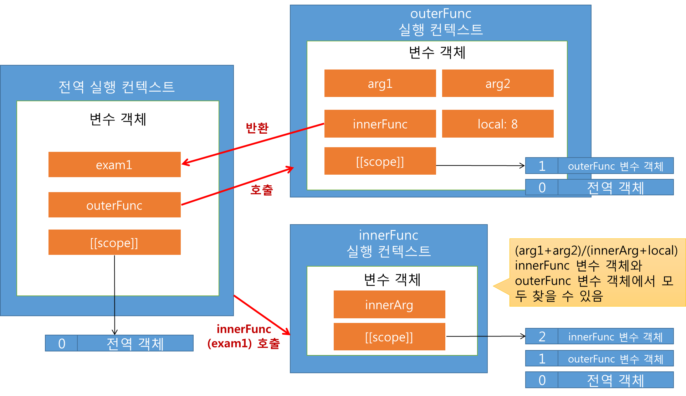
- 따라서 exam1(2)를 호출하면, arg1, arg2, local값은 outerFunc 변수 객체에서 찾고,
- innerArg는 innerFunc 변수 객체에서 찾음
- 결과: ((2+4)/(2+8))
<callout icon="💡" color="gray_bg">
	**innerFunc()에서 접근하는 변수 대부분 스코프 체인의 첫 번째 객체가 아닌 그 이후의 객체에 존재함**
	- 이는 성능 문제를 유발시킬 수 있는 여지가 있음
	- 대부분의 클로저에서는 스코프 체인에서 뒤쪽에 있는 객체에 자주 접근하므로, 성능 저하의 이유로 지목되기도 함
	- 클로저를 사용한 코드가 그렇지 않은 코드보다 메모리 부담이 많아짐
	- 클로저를 쓰지 않는 것은 자바스크립트의 강력한 기능 하나를 무시하고 사용하는 것과 다름 없음
	- 결론적으로 클로저를 영리하게 사용하는 지혜가 필요함
</callout>
### 클로저의 활용
- 클로저는 성능적인 면과 자원적인 면에서 손해를 볼 수 있으므로 무차별적 사용은 지양하는 게 좋음
1. **특정 함수에 사용자가 정의한 객체의 연결하기**
	```javascript
function HelloFunc(func) {
	this.greeting = "hello";
}

HelloFunc.prototype.call = function(func) {
	func ? func(this.greeting) : this.func(this.greeting);
}

var userFunc = function(greeting) {
	console.log(greeting);
}

var objHello = new HelloFunc();
objHello.func = userFunc;
objHello.call(); // hello
	```
	- 함수 HelloFunc는 greeting 변수가 있고, func 프로퍼티로 참조되는 함수를 [call()](https://schwhitezer.tistory.com/39) 함수로 호출함
	- 사용자는 func 프로퍼티에 자신이 정의한 함수를 참조시켜 호출 가능
	- 다만, HelloFunc.prototype.call()을 보면 알 수 있듯 자신의 지역 변수인 greeting만을 인자로 사용자가 정의한 함수에 넘김
	- 앞 예제에서 사용자는 userFunc() 함수를 정의해 objHello.func()에 참조시킨 뒤, HelloFunc()의 지역 변수인 greeting을 화면에 출력
	- 이 예제에서 HelloFunc()는 greeting만을 인자로 넣어 사용자가 인자로 넘긴 함수를 실행시킴
		⇒ 사용자가 정의한 함수도 한 개의 인자를 받는 함수를 정의할 수밖에 없음
2. **여기서 사용자가 원하는 인자를 더 넣어서 HelloFunc()를 이용해 호출하려면?**
	```javascript
function saySomething(obj, methodName, name) {
	return (function(greeting) {
  	return obj[methodName](greeting, name);
  });
}

function newObj(obj, name) {
	obj.func = saySomething(this, "who", name);
  return obj;
}

newObj.prototype.who = function(greeting, name) {
	console.log(greeting + " " + (name || "everyone"));
}
	```
	- 새로운 함수 newObj() 선언
	- 이 함수는 HelloFunc()의 객체를 좀 더 자유롭게 활용하려고 정의한 함수
	- 첫 번째 인자로 받는 obj는 HelloFunc()의 객체가 되고, 두 번째 인자는 사용자가 출력을 원하는 사람 이름이 됨
	- newObj() 함수의 객체를 다음과 같이 만들어보자
	```javascript
var obj1 = new newObj(objHello, "zzoon");
	```
	- 앞 코드로 다음 코드 실행됨
	```javascript
obj.func = saySomething(this, "sho", name);
return obj;
	```
	- 첫 번째 인자 obj의 func 프로퍼티에 saySomething() 함수에서 반환되는 함수를 참조 후 반환
	- 결국 obj1은 인자로 넘겼던 objHello 객체에서 func 프로퍼티에 참조된 함수만 바뀐 객체가 됨
	- 따라서, 다음과 같이 호출 가능
	```javascript
obj1.call();
	```
	- 전체 코드
	```javascript
function HelloFunc(func) {
	this.greeting = "hello";
}

HelloFunc.prototype.call = function(func) {
	func ? func(this.greeting) : this.func(this.greeting);
}

var userFunc = function(greeting) {
	console.log(greeting);
}

var objHello = new HelloFunc();

function saySomething(obj, methodName, name) {
	return (function(greeting) {
  	return obj[methodName](greeting, name);
  });
}

function newObj(obj, name) {
	obj.func = saySomething(this, "who", name);
  return obj;
}

newObj.prototype.who = function(greeting, name) {
	console.log(greeting + " " + (name || "everyone"));
}

var obj1 = new newObj(objHello, "zzoon");
obj1.call(); // hello zzoon
	```
	- 코드 실행 결과, newObj.prototype.who 함수가 호출되어 “hello zzoon”을 출력
	- saySomthing() 함수 안에서는 해당 작업 수행됨
		```javascript
function saySonthing(obj, methodName, name) {
	return (function(greeting) {
  	return obj[methodName](greeting, name);
  });
}
		```
		- 첫 번째 인자: newObj 객체 - obj1
		- 두 번째 인자: 사용자가 정의한 메서드 이름 - “who”
		- 세 번째 인자: 사용자가 원하는 사람 이름 값 - “zzoon”
		- 반환: 사용자가 정의한 newObj.prototype.who() 함수를 반환하는 helloFunc()의 func 함수
	- 이렇게 반환되는 함수가 HelloFunc이 원하는 function(greeting) \{\} 형식의 함수가 됨
	- 이것이 HelloFunc 객체의 func로 참조됨
	- obj1.call()로 실행되는 것은 실질적으로 newObj.prototype.who()가 됨
	- 이와 같은 방식으로 사용자는 자신의 객체 메서드의 who 함수를 HelloFunc에 연결시킬 수 있음
	- 클로저는 saySomething()에서 반환되는 function(greeting)\{\} 이 되고, 이 클로저는 자유 변수 obj, methodName, name을 참조함
- 앞 예제는 정해진 형식의 함수를 콜백해주는 라이브러리가 있을 경우, 그 정해진 형식과는 다른 형식의 사용자 정의 함수를 호출할 때 유용하게 사용됨
- 예로, 브라우저에서 onclick, onmouseover와 같은 프로퍼티에 해당 이벤트 핸들러를 사용자가 정의해 놓을 수 있는데, 이 이벤트 핸들러의 형식은 function(event) \{\} 임
- 이를 통해 브라우저는 발생한 이벤트를 event 인자로 사용자에게 넘겨주는 방식
- 여기에 event 외의 원하는 인자를 더 추가한 이벤트 핸들러를 사용하고 싶을 때, 클로저 적절히 활용 가능
### 함수의 캡슐화
- 사용자의 입력을 받은 후, 이 전역 변수에 접근하여 완성된 문장을 출력하는 방식으로 작성한 함수
	```javascript
var buffAr = [
	'i am ',
  '',
  '. i live in ',
  '',
  ' i\'am',
  '',
  ' years old.',
];

function getCompletedStr(name, city, age) {
	buffAr[1] = name;
  buffAr[3] = city;
 	buffAr[5] = age;
  return buffAr.join('');
}

var str = getCompletedStr('zzoon', 'seoul', 16);
console.log(str); // i am zzoon. i live in seoul i'am16 years old.
	```
	- 위 코드의 단점: buffAr라는 배열은 전역 변수로서, 외부에 노출되어 있음
	- 다른 함수에서 이 배열에 쉽게 접근해 값을 바꿀 수도 있고, 실수로 같은 이름의 변수를 만들어 버그가 생길 수도 있음
	- 다른 코드와의 통합 혹은 이 코드를 라이브러리로 만드려고 할 때, 까다로운 문제를 발생시킬 가능성이 있음
- 클로저를 활용해 buffAr를 추가적인 스코프에 넣고 사용한 경우
	```javascript
var getCompletedStr = (function() {
	var buffAr = [
    'i am ',
    '',
    '. i live in ',
    '',
    'i\'am',
    '',
    ' years old.',
  ];
  return (function(name, city, age) {
    buffAr[1] = name;
    buffAr[3] = city;
    buffAr[5] = age;
  	return buffAr.join('');
  });
})();

var str = getCompletedStr('zzoon', 'seoul', 16);
console.log(str); // i am zzoon. i live in seouli'am16 years old.
	```
	- 변수 
	- 반환되는 함수가 클로저가 되고, 클로저는 자유 변수 buffAr을 스코프 체인에서 참조할 수 있음
	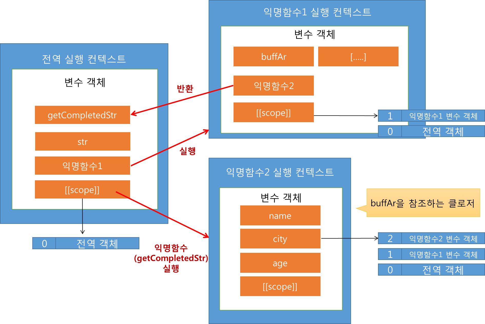
### setTimeout()에 지정되는 함수의 사용자 정의
- setTimeout() 함수는 웹 브라우저에서 제공하는 함수
- 첫 번째 인자로 넘겨지는 함수 실행의 스케줄링을 할 수 있음
- 두 번째 인자인 밀리
- setTimeout()으로 자신의 코드를 호출하고 싶다면, 첫 번째 인자로 해당 함수 객체의 참조를 넘겨주면 되지만, 이걸로는 실제 실행될 때 함수에 인자를 줄 수 없음
- 그렇다면 정의한 함수에 인자를 넣어줄 수 있게 하려면 어떻게 해야 할 까? ⇒  클로저로 해결
	```javascript
function callLater(obj, a, b) {
	return (function() {
  	obj['sum'] = a + b;
    console.log(obj['sum']);
  });
}

var sumObj = {
	sum: 0
}

var func = callLater(sumObj, 1, 2);
setTimeout(func, 500); // 3
	```
	- 사용자가 정의한 함수 callLater를 setTimeout 함수로 호출하려면, 변수 func에 함수를 반환받아 setTimeout() 함수의 첫 번째 인자로 넣어주면 됨
	- 반환받는 함수는 클로저고, 사용자가 원하는 인자에 접근 가능
### 클로저를 활용할 때 주의사항
1. 클로저의 프로퍼티값이 쓰기 가능하므로 그 값이 여러 번 호출로 항상 변할 수 있음에 유의
	```javascript
function outerFunc(argNum) {
	var num = argNum;
  return function(x) {
  	num += x;
    console.log('num: ', num);
  }
}

var exam = outerFunc(40);
exam(5); // num:  45
exam(-10); // 위 결과값인 45에서 -10 = num:  35 (원래 argNum값인 40 - 10 = 30 ---[x])
	```
	- exam 값을 호출할 때마다, 자유 변수 num의 값은 계속해서 변화됨
2. 하나의 클로저가 여러 함수 객체의 스코프 체인에 들어가 있는 경우도 있음
	```javascript
function func() {
	var x = 1;
  return {
  	func1: function() { console.log(++x); },
    func2: function() { console.log(-x); }
  };
};

var exam = func();
exam.func1(); // 2
exam.func2(); // 위 결과값인 2에 -를 붙임 = -2 (원래 x값인 1 * -1 = -1 ---[x])
	```
	- 반환되는 객체에 두 개의 함수가 정의되어 있는데, 두 함수 모두 자유 변수 x를 참조함
	- 각각의 함수가 호출될 때마다 x의 값이 변함
3. 루프 안에서 클로저를 활용할 때는 주의가 필요
	```javascript
function countSeconds(howMany) {	
	for(var i = 0; i <= howMany; i++) {
  	setTimeout(function() {
    	console.log(i);
    }, i * 1000);
  }
};
countSeconds(3);
	```
	- 의도: 1, 2, 3을 1초 간격으로 출력하는 의도로 만든 예
	- **결과: 4가 연속 3번 1초 간격으로 출력됨**
	- setTimeout 함수의 인자로 들어가는 함수는 자유 변수 i를 참조
	- 하지만 이 함수가 실행되는 시점은 countSecondes() 함수의 실행이 종료된 이후이고, i 값은 이미 4가 된 상태
	- 그러므로, setTimeout()로 실행되는 함수는 모두 4를 출력하게 됨
4. 의도대로 수정된 3. 의 코드
	```javascript
function countSeconds(howMany) {	
	for(var i = 0; i <= howMany; i++) {
  	(function (currentI) {
    	setTimeout(function() {
      	console.log(currentI);
      }, currentI * 1000);
    }(i));
  }
};
countSeconds(3);
	```
	- 즉시 실행 함수를 실행시켜 루프
