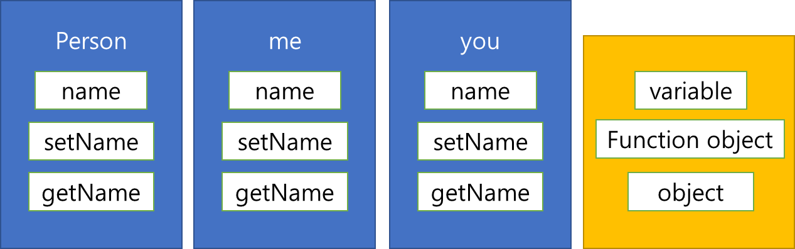
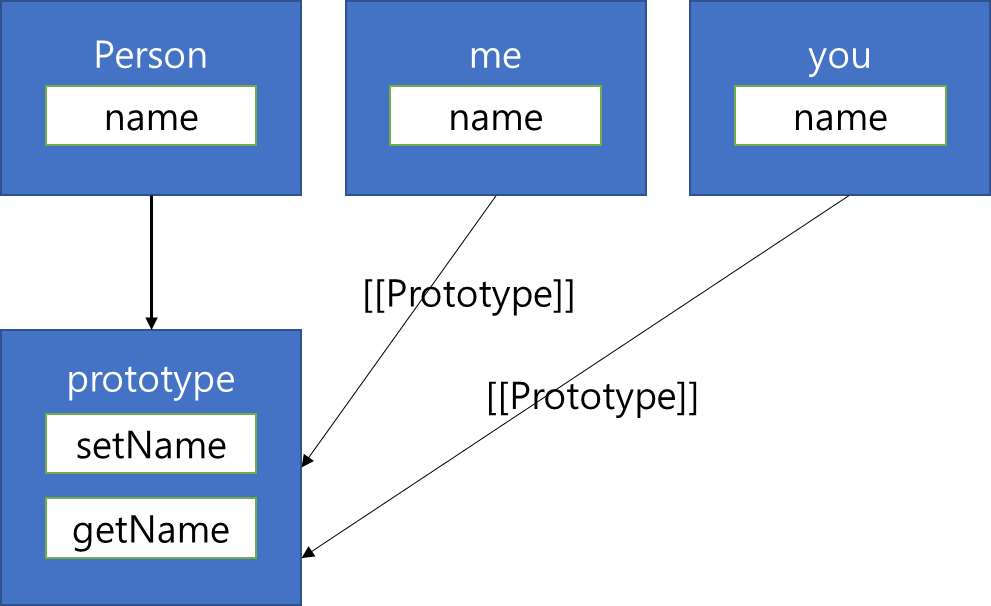
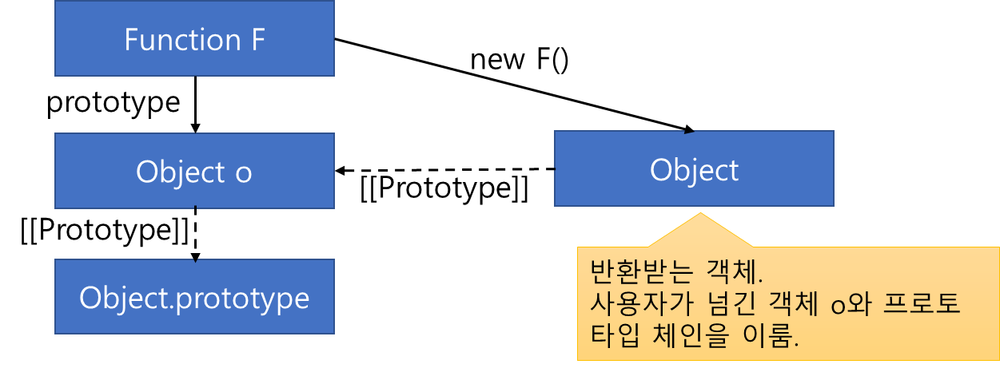
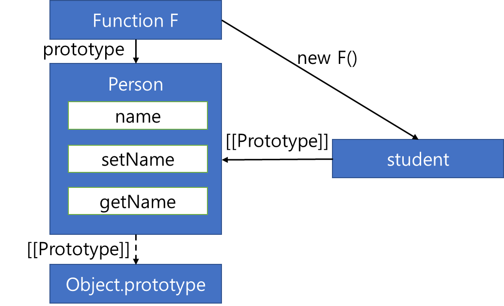
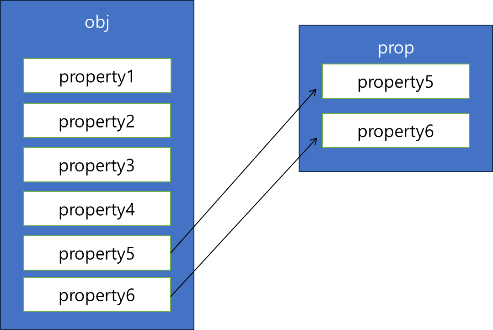
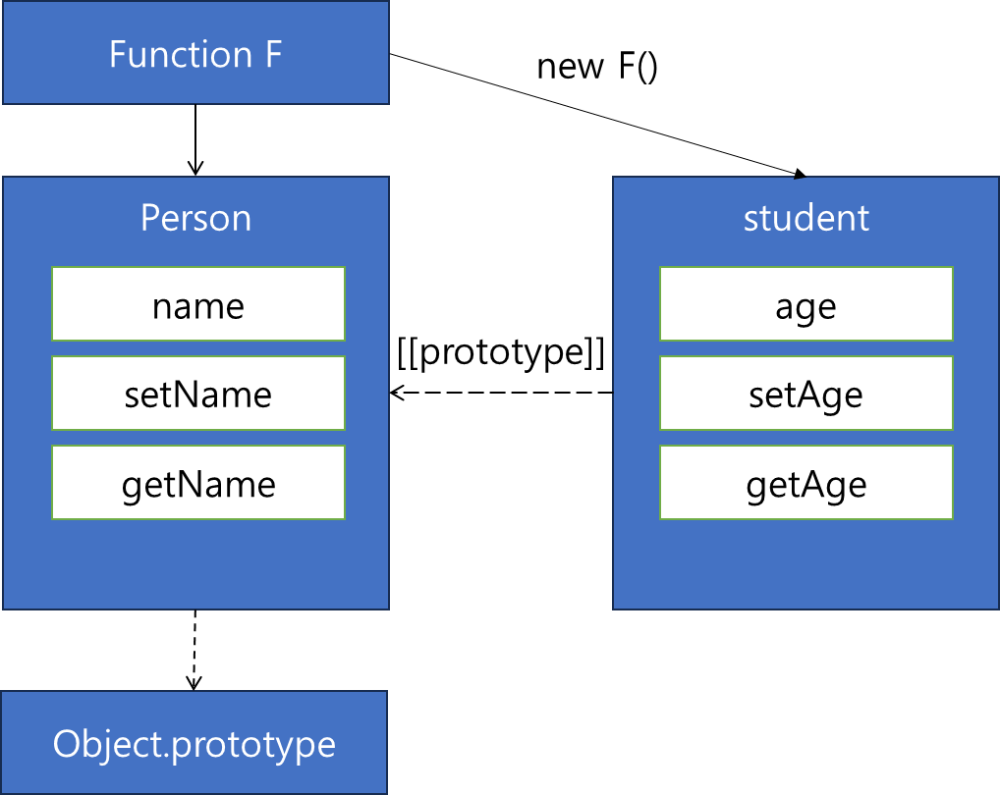
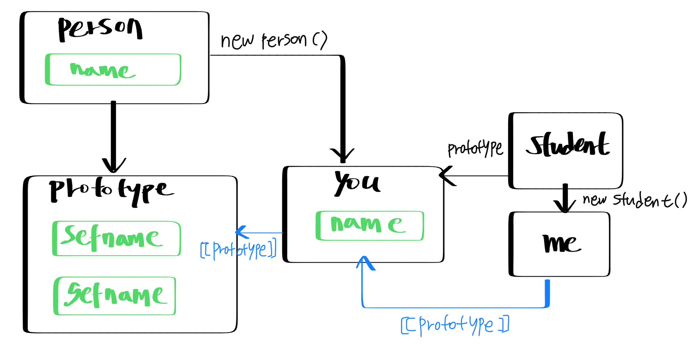
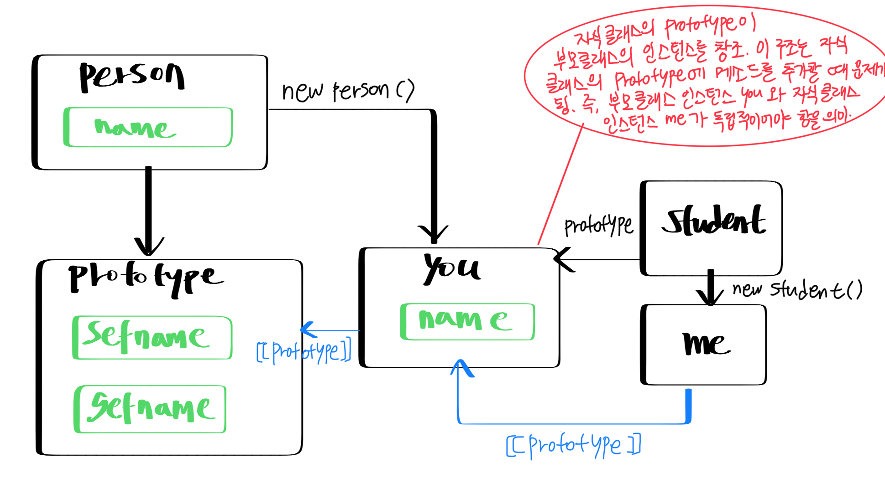
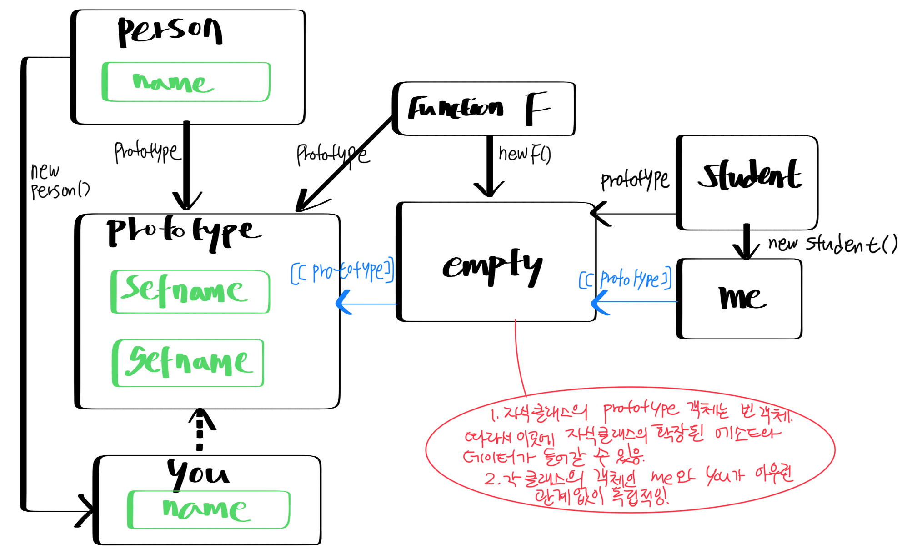
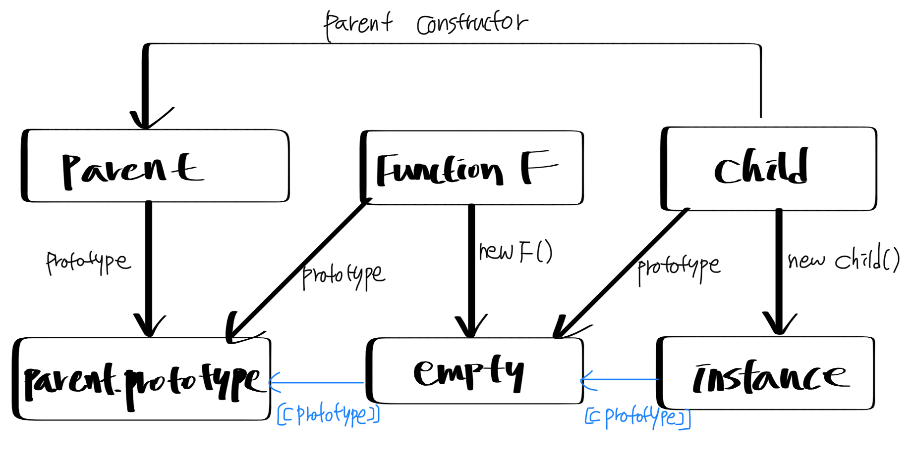

# 6. 객체지향 프로그래밍
- 다음과 같은 객체지향 언어의 특성을 자바 스크립트로 구현
	- 클래스, 생성자, 메서드
	- 상속
	- 캡슐화
- 객체지향 언어로서 클래스 기반의 언어와 프로토타입 기반의 언어를 구분하는 방법
	- 클래스 기반 언어: 
		- 클래스롤 객체의 기본적인 형태와 기능을 정의
		- 생성자로 인스턴스를 만들어 사용
		- 클래스에 정의된 메서드로 여러 가지 기능 수행
		- 모든 인스턴스가 클래스에 정의된 대로 같은 구조, 보통 런타임에 바꿀 수 없음
		- EX) **Java, C++**
	- 프로토타입 기반 언어
		- 객체의 자료구조, 메서드 등을 동적으로 변경 가능
		- 정적 타입 언어, 동적 타입 언어의 차이가 거의 비슷함
		- 정확성, 언전성, 예측성 등 관점: 클래스 기반 언어 \> 프로토타입 기반 언어
		- 동적으로 자유롭게 객체의 구조와 동작 방식을 바꿀 수 있다는 정점 보유
		- EX) **자바스크립트**
- 프로토타입은 자바스크립트로 객체지향을 구현하는 필수 요소임
## 클래스, 생성자, 메서드
- C++, Java 같은 경우, class라는 키워드를 제공해 클래스를 만들 수 있음

	⇒ 클래스와 같은 이름의 메서드로 생성자를 구현함

- 자바스크립트에는 이런 개념이 없음
- 자바스크립트는 거의 모든 것이 객체이며, 특히 함수 객체로 많은 것을 구현

	⇒ 클래스, 생성자, 메서드도 모두 함수로 구현 가능

- new 연산자 복습 예제
	```java
	function Person(arg) {
	this.name = arg;

	this.getName = function() {
		return this.name;
	}

	this.setName = function(value) {
		this.name = value;
	}
	}

	var me = new Person("zzoon");
	console.log(me.getName()); // zzoon

	me.setName("iamjoo");
	console.log(me.getName()); // iamjoo
	```

	- `var me = new Person("zzoon");`: new 키워드로 새로운 객체 me를 만듬
	- 해당 형태는 기존 객체지향 프로그래밍 언어에서 한 클래스의 인스턴스를 생성하는 코드와 매우 유사
	- 함수 Person이 클래스이자, 생성자 역할을 함
	- 자바스크립트에서 클래스 기반의 객체 지향 프로그래밍은 기본적인 형태가 이와 같음
	- 클래스 및 생성자의 역할을 하는 함수가 있고, 사용자는 new 키워드로 인스턴스를 생성하여 사용 가능
	- 예제에서 생성된 me는 Person의 인스턴스로서 name 변수가 있고, getName()과 setName() 함수가 있음
- 해당 예제의 문제점: Person 함수의 구현이 바람직하지 못함
	- 이 Person을 생성자로 하여 여러 개의 객체를 생성한다고 가정
	```java
	var me = new Person("me");
	var you = new Person("you");
	var him = new Person("him");
	```

	- 이와 같이 객체를 생성하여 사용하면, 별 문제 없이 작동하긴 함
	- 하지만, 각 객체는 자기 영역에서 공통적으로 사용 가능한 setName(), getName() 함수를 따로 생성함

		⇒ 불필요하게 중복되는 영역을 메모리에 올려놓고 사용하므로, 자원 낭비

		

- 따라서, 문제 해결을 위해 다른 방식의 접근 필요

	⇒ 자바스크립트의 특성 함수 객체의 프로토타입을 활용할 수 있음

	```java
	function Person(arg) {
	this.name = arg;
	}

	Person.prototype.getName = function() {
	return this.name;
	}

	Person.prototype.setName = function(value) {
	this.name = value;
	}

	var me = new Person("me");
	var you = new Person("you");
	console.log(me.getName()); // me
	console.log(you.getName()); // you
	```

	- Person 함수 객체의 prototype 프로퍼티에 getName(), setName() 함수를 정의
	- Person으로 객체를 생성한다면, 각 객체는 각자 따로 함수 객체를 생성할 필요 없이, setName()과 getName() 함수를 프로토타입 체인으로 접근 가능

		

	- 자바스크립트에서 클래스 안의 메서드를 정의할 때는 프로토타입 객체에 정의 후, new로 생성한 객체에서 접근할 수 있게 하는 것이 좋음
	- 더글라스 크락포트의 메서드 정의법
		```java
		Function.prototype.method = function(name, func) {
			if (!this.prototype[name]) {
		this.prototype[name] = func;
			}
		}
		```

	- 위 함수를 이용해 이전 예제를 다시 구현
		```java
		Function.prototype.method = function(name, func) {
			this.prototype[name] = func;
		}

		function Person(arg) {
			this.name = arg;
		}

		Person.method("setName", function(value) {
			this.name = value;
		});

		Person.method("getName", function() {
			return this.name;
		});

		var me = new Person("me");
		var you = new Person("you");
		console.log(me.getName());
		console.log(you.getName());
		```

		> 💡 더글라스 크락포드는 함수를 생성자로 사용해 프로그래밍하는 것을 추천하지 않음
		>
		> - 생성된 함수는 new로 호출될 수 있을 뿐 아니라, 직접 호출도 가능하기 때문
		> - new로 호출될 때와 직접 호출될 때의 this에 바인딩되는 객체가 달라지는 게 문제
		> - 일단 생성자로 사용되는 함수는 첫 글자를 대문자로 표기할 것을 권고

## 상속
- 자바스크립트는 클래스를 기반으로 하는 전통적인 상속을 지원하지 않음
- 자바스크립트 특성 중 객체 프로토타입 체인을 이용해 상속 구현 가능
	1. 클래스 기반 전통적인 상속 방식을 흉내
	2. 클래스 개념 없이 객체의 프로토타입으로 상속 구현 ⇒ 프로토타입을 이용한 상속
- 프로토타입을 이용한 상속은 객체 리터럴을 중심으로 철저히 프로토타입을 이용, 상속을 구현
### 1. 프로토타입을 이용한 상속
- 더글라스 크락포드가 자바스크립트 객체를 상속하는 방법으로 소개한 코드
	```java
	function create_object(o) {
	function F() {
		F.prototype = o;
		return new F();
	}
	}
	```

	

	- create_object() 함수는 인자로 들어온 객체를 부모로 하는 자식 객체를 생성하여 반환
	- 새로운 빈 함수 객체 F를 만들고, F.prototype 프로퍼티에 인자로 들어온 객체를 참조
	- 함수 객체 F를 생성자로 하는 새로운 객체를 만들어 반환
	- 반환된 객체는 부모 객체의 프로퍼티에 접근 가능 / 자신만의 프로퍼티를 만들 수도 있음
	- 이렇게 프로토타입의 특성을 활용해 상속을 구현하는 것: 프로토타입 기반의 상속
	- create_object() 함수는 EC5에서 Object.create() 함수로 제공되므로, 따로 구현할 필요 없음
- create_object() 함수를 이용해 상속을 구현한 예제
	```java
	var person = {
	name: "zzoon",
	getName: function() {
		return this.name;
	},
	setName: function(arg) {
		this.name = arg;
	}
	};

	function create_object(o) {
	function F() {
		F.prototype = o;
		return new F();
	}
	}

	var student = create_object(person);

	student.setName("me");
	console.log(student.getName()); // me
	```

	- person 객체를 상속해 student 객체를 만듬
	- 프로토타입 기반 상속 특징:
		- 클래스의 인스턴스를 따로 생성하지 않음
		- 부모 객체에 해당하는 person 객체와 이 객체를 프로토타입 체인으로 참조할 수 있는 자식 객체 student를 만들어 사용

		⇒ 상속 개념 구현

		

- 지금까지 방법: 부모 객체의 메서드를 그대로 상속받아 사용하는 방법

	⇒ 여기서 자식은 자신의 메서드를 재정의 혹은 추가로 기능을 더 확장시킬 수 있어야 함

	```java
	student.setAge = function(age) {...}
	student.getAge = function() {...}
	```

	- 이처럼 단순히 기능 확장을 시킬 수 있지만, 코드가 지저분해짐
- 보다 깔끔한 방법: 자바스크립트에서는 범용적으로 extend() 함수로 객체에 자신의 원하는 객체 혹은 함수를 추가
- jQuery 1.0의 extend() 함수 활용 방법
	```java
	jQuery.extend = jQuery.fn.extend = function(obj, prop) {
	if (!prop) { prop = obj; obj = this; }
	for (var i in prop) { obj[i] = prop[i]; }
	return obj;
	}
	```

- 위 코드 분석
	- `jQuery.extend = jQuery.fn.extend = …`
		- jQuery.fn: jQuery.prototype
		- jQuery 함수 객체, jQuery 함수 객체의 인스턴스 모두 extend 함수가 있겠다는 뜻
		- jQuery.extend()로 호출하거나, 아래와 같은 형태로도 호출 가능
		```javascript
		var elem = new jQuery(...);
		elem.extend();
		```

	- `if (!prop) { prop = obj; obj = this; }`
		- extend 함수의 인자가 하나만 들어오는 경우, 현재 객체(this)에 인자로 들어오는 객체의 프로퍼티를 복사함을 의미
		- 두 개가 들어오는 경우, 첫 번째 객체에 두 번째 객체의 프로퍼티를 복사하겠다는 것을 뜻함
	- `for (var i in prop) obj[i] = prop[i];`
		- 루프를 돌며 prop의 프로퍼티를 obj로 복사

	

- 위 코드의 약점
	```javascript
	obj[i] = prop[i];
	```

	- 해당 코드는 얕은 복사를 의미
	- 즉, 문자 혹은 숫자 리터럴 등이 아닌 객체(배열, 함수 객체 포함)인 경우 해당 객체를 복사하지 않음 → 참조만 함
	- 두 번째 객체의 프로퍼티가 변경되면 첫 번째 객체의 프로퍼티도 함께 변경됨
	- 그러므로, 보통 extend 함수를 구현하는 경우 대상이 객체일 땐 깊은 복사를 하는 것이 일반적

	> 💡 깊은 복사
	>
	> - 복사하려는 대상이 객체인 경우
	>
	> 	⇒ 빈 객체를 만들어 extend 함수를 재귀적으로 다시 호출하는 방법 사용
	>
	> - 주의점: 함수 객체인 경우, 그대로 얕은 복사를 진행한다!
	> - 예시 코드) jQuery 1.7의 extend 함수 중 일부 코드
	> 	```javascript
	> 	for (; i < length; i++) {
	> 		// Only deal with non-null/undefined values
	> 		if ((options = arguments[i]) != null) { // 인자로 넘어 온 객체의 프로퍼티를 options로 참조, 이 프로퍼티가 null이 아닌 경우 블록 안으로 진입
	> 			// Extend the base object
	> 			for (name in options) {
	> 	src = target[name]; // src는 반환될 복사본 target의 프로퍼티를 가리킴
	> 	copy = options[name]; // copy는 복사할 원본의 프로퍼티를 가리킴
	>
	> 	// Prevent never-ending loop
	> 	if (target === copy) {
	> 		contunue;
	> 	}
	>
	> 	// Recurse if we're merging plain objects or arrays
	> 	if (deep && copy && (jQuery.isPlainObject(copy) || (copyIsArray = jQuery.isArray(copy)))) {
	> 		// depp 플래그: jQuery의 extend 함수는 사용자가 첫 번째 인자로 Boolean 값을 넣어 깊은 복사를 할 것인지를 선택할 수 있게 함.
	> 		// copy 프로퍼티가 객체거나 배열인 경우, 재귀 호출을 하려고 블록 안으로 진입함
	>
	> 		if (copyIsArray) { // copy가 배열인 경우 빈 배열을, 객체인 경우 빈 객체를 clone에 할당
	> 			copyIsArray = false;
	> 			clone = src && jQuery.isArray(src) ? src : [];
	> 		} else {
	> 			clone = src && jQuery.isPlainObject(src) ? src : {};
	> 		}
	> 		// 여기서 src가 같은 배열, 혹은 같은 객체면 clone에 해당 배열 혹은 객체를 참조
	> 		// 이는 복사본에 같은 이름의 프로퍼티가 있는 경우, 원본과 똑같은 배열이거나 객체라면 새롭게 할당시키지 않고, 복사본의 해당 프로퍼티에 추가될 수 있게 하기 위해서임
	>
	> 		// Never move original objects, clone them
	> 		target[name] = jQuery.extend(deep, clone, copy);
	> 		// extend 함수를 다시 호출
	> 		// clone이라는 빈 객체에 copy 객체를 복사함을 의미
	> 		// copy 객체 안에 객체 혹은 배열이 있는 경우, 다시 재귀 호출이 이루어짐
	>
	> 	// Don't bring in undegined values
	> 	} else if (copy !== undefined) {
	> 		target[name] = copy;
	> 	}
	> 	// copy 프로퍼티가 객체 혹은 배열이 아닌 경우, undefined인지를 살피고 target 객체에 할당
	> 			}
	> 		}
	> 		// Return the modified objects
	> 		return target;
	> 		// 만들어진 복사본 반환
	> 	}
	> 	```
	>
	> - jQuery의 extend 함수는 사용자가 얕은 복사를 할 것인지, 깊은 복사를 할 것인지 선택할 수 있게 구현됨

- 사용 예시
	```javascript
	(function($) {
	$.extend($.fn, {
		my_func: function() {
			// ...
		}
	})
	})(jQuery);
	```

	- 위와 같은 형태로 플러그인을 구현할 수 있음
	- extend 함수로, 사용자는 자신이 정의한 my_func 함수를 jQuery 함수 객체에 추가할 수 있고, 다음과 같이 호출할 수 있음
	```javascript
	$.my_func();
	```

	- 주의) extend 함수로 자신의 함수 혹은 객체를 추가할 때, 이름이 충돌하지 않게 주의
- extend() 함수 추가 활용
	```javascript
	var person = {
	name: "zoe",
	  getName: function() {
	  	return this.name;
	  },
	  setName: function(arg) {
	  	this.name = arg;
	  }
	};

	function create_object(o) {
	function F() {};
	  F.prototype = o;
	  return new F();
	}

	function extend(obj, prop) {
	if (!prop) { prop = obj; obj = this; }
	  for (var i in prop)  obj[i] = prop[i];
	  return obj;
	};

	var student = create_object(person);
	var added = {
	setAge: function(age) {
	  	this.age = age;
	  },
	  getAge: function() {
	  	return this.age;
	  }
	};

	extend(student, added);

	student.setAge(25);
	console.log(student.getAge());
	```

	

	- 얕은 복사를 사용하는 extend() 함수를 사용해 student 객체를 확장시킴
	- extend() 함수는 기능 확장 뿐 아니라, 상속에서도 자식 클래스를 확장할 때 유용하게 사용됨
### 2. 클래스 기반의 상속
- 원리는 `프로토타입을 이용한 상속`에서 소개한 내용과 거의 같음
- 함수의 프로토타입을 적절히 엮어 상속을 구현해 냄
- 차이점
	- 프로토타입을 이용한 상속: 객체 리터럴로 생성된 객체의 상속
	- 클래스 기반의 상속: 클래스 역할을 하는 함수로 상속 구현
	```javascript
	function Person(arg) {
	this.name = arg;
	}

	Person.prototype.setName = function(value) {
	this.name = value;
	};

	Person.prototype.getName = function() {
	return this.name;
	};

	function Student(arg) {}

	var you = new Person("iam");
	Student.prototype = you;

	var me = new Student("zoe");
	me.setName("zoe");
	console.log(me.getName());
	```

	- Student 함수 객체를 만들어, 이 함수 객체의 프로토타입으로 하여금 Person 함수 객체의 인스턴스를 참조하게 함
	- Student 함수 객체로 생성된 객체 me의 \[\[Prototype\]\] 링크가 생성자의 프로토타입 프로퍼티 Student.prototype인 you를 가리키고, 
	- new Person()으로 만들어진 객체의 \[\[Prototype\]\] 링크는 Person.prototype 프로퍼티에 접근할 수 있고, setName()과 getName() 호출 가능



- 해당 그림의 문제점: me 인스턴스를 생성할 때, 부모 클래스인 Person의 생성자를 호출하지 않음
	```javascript
	var me = new Student("zoe");
	```

	- me 인스턴스 생성 → “zoe”를 인자로 넘김

		⇒ 그러나, 이를 반영하는 코드가 없음

	- 생성된 me 객체는 빈 객체 → setName() 메서드가 호출되고 나서야 me 객체에 name 프로퍼티가 만들어짐
- 부모의 생성자가 호출되지 않으면, 인스턴스 초기화가 제대로 이루어지지 않는 문제 발생
	- 해결 방법: Student 함수에 다음 코드를 추가, 부모 클래스 생성자 호출
	```javascript
	function Student(arg) {
	Person.apply(this, arguments);
	}
	```

	- Student 함수 안에서 새롭게 생성된 객체를 apply 함수의 첫 번째 인자로 넘겨 Person 함수 실행
	- 이런 방식으로 자식 클래스의 인스턴스에 대해서도 부모 클래스의 생성자 실행
	- 클래스 간 상속에서 하위 클래스의 인스턴스를 생성할 때, 부모 클래스의 생성자를 호출하는 데 필요한 방식
### ➡ 심화:
- 자식 클래스의 객체가 부모 클래스의 객체를 프로토타입 체인으로 직접 접근 

	→ 부모 클래스의 인스턴스와 자식 클래스의 인스턴스가 서로 독립



- 두 클래스의 프로토타입 사이에 중개자 만들기
	```javascript
	function Person(arg) {
	this.name = arg;
	}

	Function.prototype.method = function(name, func) {
	this.prototype[name] = func;
	}

	Person.method("setName", function(value) {
	this.name = value;
	});
	Person.method("getName", function(value) {
	return this.name;
	});

	function Student(arg) {}

	function F() {};
	F.prototype = Person.prototype;
	Student.prototype = new F();
	Student.prototype.constructor = Student;
	Student.super.Person.prototype;

	var me = new Student();
	me.setName("zoe");
	console.log(me.getName());
	```

	- 프로토타입 체인 형성 과정은 `프로토타입을 이용한 상속의 상속` 방식과 매우 유사
	- 함수의 프로토타입을 이용한 것이니 비슷할 수밖에 없음
	- 빈 함수 F()를 생성 → F()의 인스턴스를 Person.prototype과 Student 사이에 둠 → 인스턴스를 Student.prototype에 참조

		

	- 빈 함수의 객체를 중간에 둠 → Person의 인스턴스, Student의 인스턴스를 서로 독립적으로 만듦
	- Person 함수 객체에서 this에 바인딩되는 것은 Student의 인스턴스가 접근할 수 없음
	- 이 상속이 앞서 소개된 상속보다 좀 더 나은 코드
### ➡ 즉시 실행 함수와 클로저를 활용해 최적화된 상속 관계 함수 코드
- 스토얀 스테파노프
	```javascript
	var inherit = function(Parent, Child) {
	var F = function () {};
	return function(Parent, Child) {
		F.prototype = Parent.prototype;
		Child.prototype = new F();
		Child.prototype.constructor = Child;
		Child.super = Parent.prototype;
	};
	}();
	```

	- 클로저(반환되는 함수)는 F() 함수를 지속적으로 참조 → F()는 가비지 컬렉션의 대상이 되지 않고 계속 남아있음
	- 이를 활용, 함수 F()의 생성은 단 한 번 이루어짐 → inherit 함수가 계속 호출돼도 함수 F()의 생성을 새로 할 필요 없음

> 💡 **끝맺음: 자바스크립트로 구현하는 상속**
>
> - 함수 생성자를 이용하는 방식
> - 객체 리터럴을 그대로 상송하는 방법
>
> 	⇒ 모두 프로토타입 체인을 이용하는 원리는 같음

## 캡슐화
- 객체지향 프로그래밍에서 중요한 부분
- 기본적으로 관련된 여러 가지 정보를 하나의 틀 안에 담는 것 의미
- 응용:
	- 멤버 변수, 메서드: 서로 관련된 정보
	- 클래스: 이것을 담는 하나의 큰 틀
- 중요: 정보의 공개 여부 → `정보 은닉`
- C++, Java의 경우: public, private 멤버 선언으로 해당 정보의 노출 여부 결정
- 자바스크립트는 이러한 키워드를 지원하지 않음
- 하지만, 자바스크립트에서도 정보 은닉이 가능함
	```javascript
	var Person = function(arg) {
	var name = arg ? arg : "zoe";
	this.getName = function() {
		return name;
	}
	this.setName = function(arg) {
		name = arg;
	}
	};

	var me = new Person();
	console.log(me.getName());
	me.setName("iam");
	console.log(me.getName());
	console.log(me.name); // undefined
	```

	- private 멤버로 name 선언, public 멤버로 getName(), setName() 선언
	- this 객체의 프로퍼티로 선언하면 외부에서 new 키워드로 생성한 객체로 접근 가능
	- var로 선언된 멤버들은 외부에서 접근 불가능
	- public 메서드가 클로저 역할, private 멤버인 name에 접근 가능
- 좀 더 깔끔한 코드
	```javascript
	var Person = function(arg) {
	var name = arg ? arg : name;

	return {
		getName: function() {
			return name;
		},
		setName: function(arg) {
			name = arg;
		}
	};
	}
	var me = Person(); /* or var me = new Person(); */
	console.log(me.getName());
	```

	- Person 함수 호출 → 객체 반환
	- 이 객체에 Person 함수의 private 멤버에 접근할 수 있는 메서드 포함
	- 사용자는 반환받는 객체로 메서드 호출 가능, private 멤버에 접근 가능
	- 메서드가 담겨있는 객체를 반환하는 함수는 여러 유명 자바스크립트 라이브러리에서 쉽게 볼 수 있는 구조
	- 주의점: 접근하는 private 멤버가 객체나 배열이면 얕은 복사로 참조만을 반환 → 사용자가 이를 쉽게 변경할 수 있음
	```javascript
	var ArrCreate = function(arg) {
	var arr = [1,2,3];

	return {
		getArr: function() {
			return arr;
		}
	};
	}

	var obj = ArrCreate(); /* or var me = new Person(); */
	var arr = obj.getArr();
	arr.push(5);
	console.log(obj.getArr()); // [1,2,3,5]
	```

	- 이와 같은 문제로, 객체를 반환하는 경우 신중함 필요
	- 보통, 객체를 반환하지 않고 객체의 주요 정보를 새로운 객체에 담아 반환하는 방법을 많이 사용
	- 그러나, 객체가 반드시 반환되어야 하는 경우: 깊은 복사로 복사본을 만들어 반환
	```javascript
	var Person = function(arg) {
	var name = arg ? arg : name;

	return {
		getName: function() {
			return name;
		},
		setName: function(arg) {
			name = arg;
		}
	};
	}
	var me = Person(); /* or var me = new Person(); */
	console.log(me.getName());
	```

	- 사용자가 반환받은 객체는 Person 함수 객체의 프로토타입에는 접근할 수 없음

		⇒ Person을 부모로 하는 프로토타입을 이용한 상속을 구현하기가 용이하지 않다는 것을 의미

	- 보완: 객체가 아닌, 함수를 반환하는 것이 좋음
	```javascript
	var Person = function(arg) {
	var name = arg ? arg : "zoe";

	var Func = function() {};
	Func.prototype = {
		getName: function() {
			return name;
		},
		setName: function(arg) {
			name = arg;
		}
	};
	return Func;
	}();

	var me = new Person();
	console.log(me.getName());
	```

	- 클로저를 활용하여 name에 접근할 수 없게 함
	- 즉시 실행 함수에서 반환되는 Func이 클로저가 됨 → 이 함수가 참조하는 name 프로퍼티가 자유 변수가 됨
	- 따라서, 사용자는 name에 대한 접근이 불가
## 객체지향 프로그래밍 응용 예제
### 1. 클래스의 기능을 가진 subClass 함수
- 프로토타입을 이용한 상속, 클래스 기반의 상속에서 소개한 내용을 바탕으로, 기존 클래스와 같은 기능을 하는 자바스크립트 함수 만들기
- 이 함수는 다음 세 가지를 활용해 구현함(`함수 이름: subClass`)
	1. 함수의 프로토타입 체인
	2. extend 함수
	3. 인스턴스를 생성할 때 생성자 호출(`생성자: _init 함수`)
### 1-1. subClass 함수 구조
- subClass는 상속받을 클래스에 넣을 변수 및 메서드가 담긴 객체를 인자로 받아 부모 함수를 상속받는 자식 클래스를 생성
- 여기서의 부모 함수: subClass() 함수를 호출할 때 this 객체 의미
	```javascript
	var SuperClass = subClass(obj);
	var SubClass = SuperClass.subClass(obj);
	```

	- superClass를 상속받는 subClass를 만들고자 할 때: `SuperClass.subClass()`의 형식으로 호출 구현
	- 최상위 클래스 SuperClass는 자바스크립트의 Function을 상속받게 됨
- 함수 subClass의 구조는 다음과 같이 구성됨
	```javascript
	function subClass(obj) {
	// 1. 자식 클래스 (함수 객체) 생성
	// 2. 생성자 호출
	// 3. 프로토타입 체인을 활용한 상속 구현
	// 4. obj를 통해 들어온 변수 및 메서드를 자식 클래스에 추가
	// 5. 자식 함수 객체 반환
	}
	```
### 1-2. 자식 클래스 생성 및 상속
```javascript
function subClass(obj) {
	// ...
	var parent = this;
	var F = function() {};

	var child = function() {};

	/* 프로토타입 체이닝에서 설명됨 */
	F.prototype = parent.prototype;
	child.prototype = new F();
	child.prototype.constructor = child;
	child.parent = parent.prototype;
	child.parent_constructor = parent;

	// ...
	return child;
}
```

- 자식 클래스는 child라는 이름의 함수 객체를 생성함으로써 만들어짐
- 부모 클래스를 가리키는 parent는 this를 그대로 참조
- 프로토타입 체인 구성은 `클래스 기반의 상속`에서 설명된 방식을 그대로 사용

	

	- child.parent_constructor에 부모의 생성자를 참조시킴
	- 이유는 추후 설명(`생성자 호출` 파트)
	- 이렇게 프로토타입 체인을 구성하여 부모를 상속받는 새로운 자식 클래스가 만들어지고 반환됨
### 1-3. 자식 클래스 확장
- 사용자가 인자로 넣은 객체를 자식 클래스에 넣어 자식 클래스 확장
	```javascript
	for (var i on obj) {
	if (obj.hasOwnProperty(i)) {
		child.prototype[i] = obj[i];
	}
	}
	```

	- `프로토타입을 이용한 상속`에서 살펴본 extend() 함수의 역할을 하는 코드를 넣음. (얕은 복사로 객체의 프로퍼티 복사하는 방식으로)

	> 💡 **hasOwnProperty 메서드**
	>
	> - Object.prototype 프로퍼티에 정의되어 있는 메서드
	> - 인자로 넘기는 이름에 해당하는 프로퍼티가 객체 내에 있는지 판단
	> - 프로퍼티를 찾을 때, 다음과 같이 프로토타입 체인을 타고 올라가지 않고 해당 객체 내에서만 찾음
	> ```javascript
	> o = new Object();
	> o.prop = 'exists';
	> o.hasOwnProperty('prop'); // return true
	> o.hasOwnProperty('toString'); // return false
	> o.hasOwnProperty('hasOwnProperty'); // return false
	> ```

### 1-4. 생성자 호출
- 클래스 인스턴스가 생성될 때:
	- 클래스 내 정의된 생성자가 호출되어야 함
	- 부모 클래스의 생성자 역시 호출됨
- 이를 자식 클래스 안에 구현한 코드(`클래스 기반의 상속` 참고)
	```javascript
	var child = function() {
	if (parent._init) {
		parent._init.apply(this, arguments);
	}
	if (child.prototype._init) {
		child.prototype._init.apply(this, arguments);
	}
	};
	```

	- 해당 코드의 문제:
		- `parent._init`이나 `child.prototype._init` 을 찾을 때, `_init` 프로퍼티가 없으면 프로토타입 체인으로 상위 클래스의 `_init` 함수를 찾아서 호출할 수 있음
		- 따라서, 다음과 같이 `hasOwnProperty` 함수 사용 권장
	```javascript
	var child = function() {
	if (parent.hasOwnProperty("_init")) {
		parent._init.apply(this, arguments);
	}
	if (child.prototype.hasOwnProperty("_init")) {
		child.prototype._init.apply(this, arguments);
	}
	};
	```

	- 생성자 호출이 완성된 듯 보이지만, 한 가지를 더 고려해야 함
	- 이 코드는 단순히 부모/자식이 한 쌍을 이루었을 때만 제대로 동작함
- 자식을 또 다른 함수가 다시 상속받았을 때의 코드
	```javascript
	var SuperClass = subClass();
	var SubClass = SuperClass.subClass();
	var Sub_SubClass = SubClass.subClass();

	var instance = new Sub_SubClass();
	```

	- 이 코드에서 `instance`를 생성할 때, 그 상위 클래스의 상위 클래스인 `SuperClass`의 생성자가 호출되지 않음
	- 따라서, 부모 클래스의 생성자를 호출하는 코드는 재귀적으로 구현할 필요가 있음
	- 이미  `child.parent_constructor`에 부모의 생성자 함수를 참조시켜 놓았으므로, 구현에는 문제 없음
	```javascript
	var child = function() {
	var _parent = child.parent_constructor;

	if (_parent && _parent !== Function) {
	// 현재 클래스의 부모 생성자가 있으면 그 함수를 호출
	// 다만, 부모가 Function인 경우는 최상위 클래스에 도달했으므로 실행하지 않음

		_parent.apply(this, arguments); // 부모 함수의 재귀적 호출
	}

	if (child.prototype.hasOwnProperty("_init")) {
		child.prototype._init.apply(this, arguments);
	}
	};
	```
### 1-5. subClass 보완
- parent를 단순히 this.prototype으로 지정해서는 안 됨
- 처음에 최상위 클래스를 Function을 상송받는 것으로 정했는데, 현재 코드에는 이를 처리하는 코드가 없음
- 따라서, 코드를 다음과 같이 수정
	```javascript
	parent = this; // 수정 전

	// 수정 후
	if (this === window) {
	var parent = Function;
	} else {
	var parent = this;
	}
	```

- 좀 더 깔끔하게 수정
	```javascript
	var parent = this === window ? Function : this;
	// Node.js의 경우 global 사용
	```

- 또 하나 빠진 부분: `subClass` 안에서 생성하는 자식 클래스의 역할을 하는 함수는 `subClass` 함수가 있어야 함
- 다음 코드 추가
	```javascript
	child.subClass = arguments.callee;
	```

	- `arguments.callee`: 현재 호출된 함수 의미
	- 현재 호출된 함수가 `subClass` 이므로, `child.subClass`는 `subClass` 함수를 참조함
### ➡ 만들어진 subClass 함수의 전체 코드
```javascript
function subClass(obj) {
	var parent = this === window ? Function : this; // Node.js의 경우 global 사용
	var F = function() {};

	var child = function() {
		var _parent = child.parent;

		if (_parent && _parent !== Function) {
			_parent.apply(this, arguments);
		}

		if (child.prototype._init) {
			child.prototype._init.apply(this, arguments);
		}
	};

	F.prototype = parent.prototype;
	child.prototype = new F();
	child.prototype.constructor = child;
	child.parent = parent;
	child.subClass = arguments.callee;

	for (var i in obj) {
		if (obj.hasOwnProperty(i)) {
			child.prototype[i] = obj[i];
		}
	}

	return child;
}
```
### 1-6. subClass 활용
- subClass 함수로 상속 예제 만들기
	```javascript
	var person_obj = {
	_init: function() {
		console.log("person init");
	},
	getName: function() {
		return this._name;
	},
	setName: function(name) {
		this._name = name;
	}
	};

	var student_obj = {
	_init: function() {
		console.log("student init");
	},
	getName: function() {
		return "Student Name: " + this._name;
	}
	};

	var Person = subClass(person_obj); // (Person 클래스 정의)
	var Person = new Person(); // (person init 출력)
	person.setName("zoe");
	console.log(person.getName()); // zoe

	var Student = Person.subClass(student_obj); // (Student 클래스 정의)
	var student = new Student(); // (person init, student init 출력)
	student.setName("iam");
	console.log(student.getName()); // Student Name: iam

	console.log(Person.toString()); // (Person이 Function을 상속받는지 확인)
	```

	- 쟁점
		1. 생성자 함수가 호출되는가?
		2. 부모의 메서드가 자식 인스턴스에서 호출되는가?
		3. 자식 클래스가 확장 가능한가?
		4. 최상위 클래스인 Person은 Function을 상속받는가?
### 1-7. subClass 함수에 클로저 적용
- 마지막으로, subClass 함수에 클로저 적용
- subClass 함수에서 수정할 코드: 프로토타입 체이닝을 위해 만든 임시 함수 객체 `F`
- 이 함수 객체는 subClass 함수가 호출될 때마다 생성됨 → 클로저로 단 한 번만 생성되게 수정
	```javascript
	var subClass = function() {
	var F = function() {};
	var subClass = function(obj) { 
		//... 
	}
	return subClass;
	}
	```

	- 즉시 실행 함수로 새로운 컨텍스트 생성 → `F()` 함수 객체 생성
	- `F()` 함수 객체를 참조하는 안쪽의 `subClass()` 함수 반환
	- `F()` 함수 객체는 클로저에 엮여서 가비지 컬렉션의 대상이 되지 않음 → `subClass()` 함수를 호출할 때마다 사용
### 2. subClass 함수와 모듈 패턴을 이용한 객체지향 프로그래밍
- `캡슐화`에서 언급된 모듈 패턴은 객체지향 프로그래밍과 큰 관계가 없어 보임
- 하지만, 캡슐화의 중요한 개념인 정보를 은닉하려면 모듈 패턴은 상당히 유용
- 여기서는 모듈 패턴으로 캡슐화 구현, 앞 절에서 소개한 `subClass()` 함수로 상속을 구현하는 방법 설명
	```javascript
	var person = function(arg) {
	var name = undefined;
	return {
		_init: function(arg) {
			name = arg ? arg : "zoe";
		},
		getName: function() {
			return name;
		},
		setName: function() {
			name = arg;
		}
	};
	}

	Person = subClass(person());
	var iam = new Person("iam");
	console.log(iam.getName());

	Student = Person.subClass();
	var student = new Student("student");
	console.log(student.getName());
	```

	- Person 함수 객체는 name의 정보를 캡슐화시킨 객체를 반환받는 역할
	- 반환받은 객체는 `subClass()` 함수의 인자로 들어가 클래스 역할을 하는 Person 함수 객체를 완성시킴 → Person 함수 객체 활용, 상속 구현 가능
- 자바스크립트의 객체 지향적인 구현을 기존의 전통적인 방식에 맞추는 건 잘못된 판단
- 객체지향 프로그래밍 자체가 재사용성 및 유지보수의 용이성을 높이기 위해 끊임없이 연구되고 있음
- 자바스크립트 역시 이러한 목적을 달성하기 위해 그 만의 특성의 있으므로 기존 틀에 얽매이지 않고 잘 활용하는 것이 효율적인 프로그래밍에 중요함
