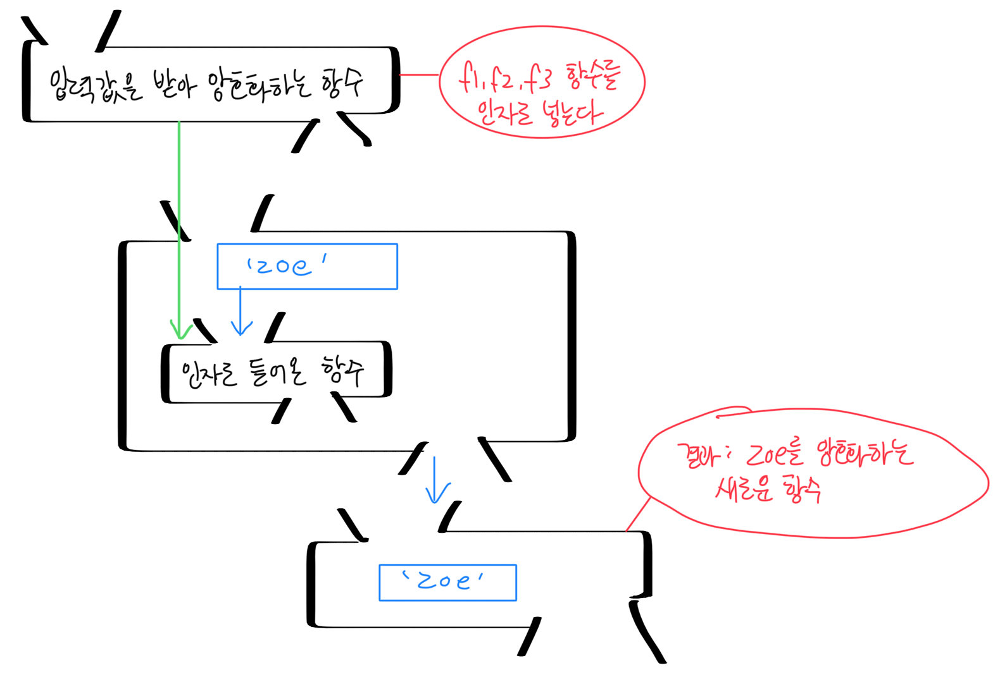
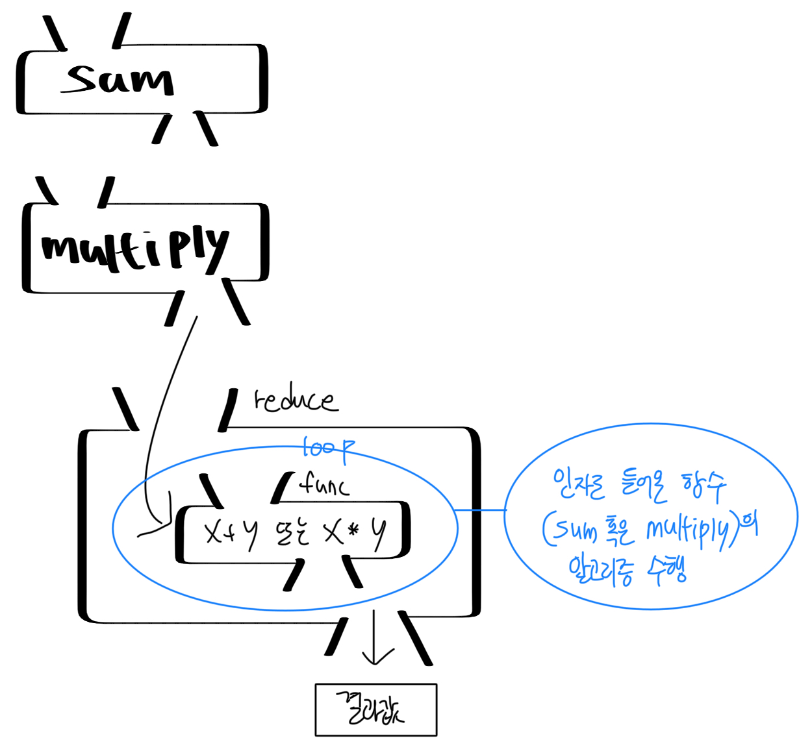
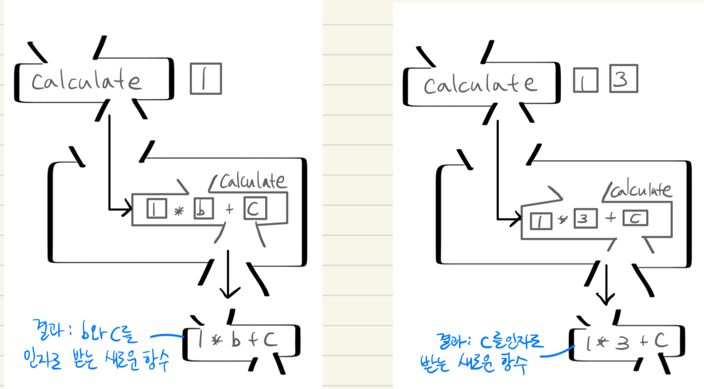
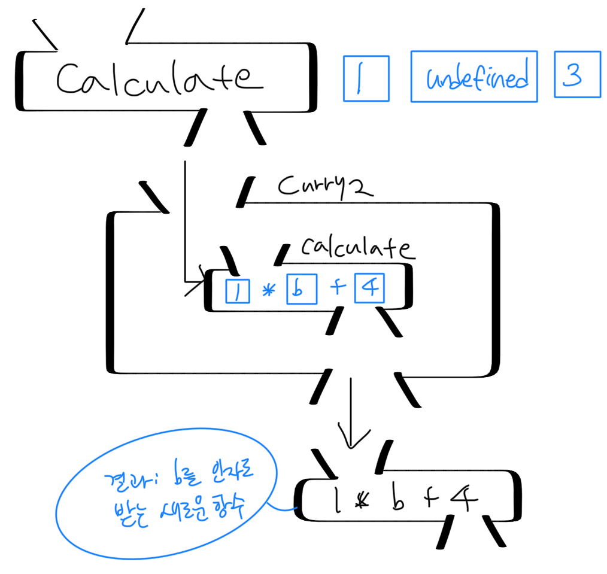
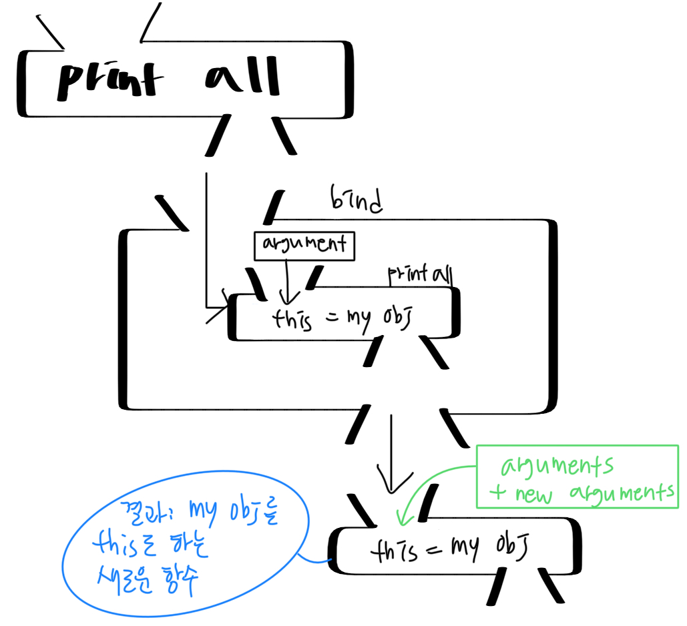
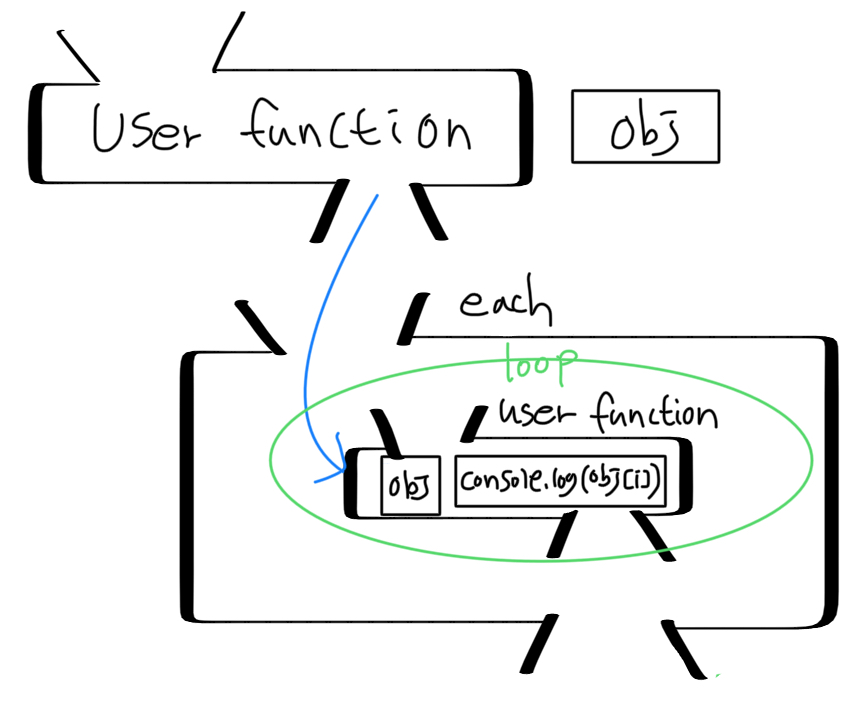
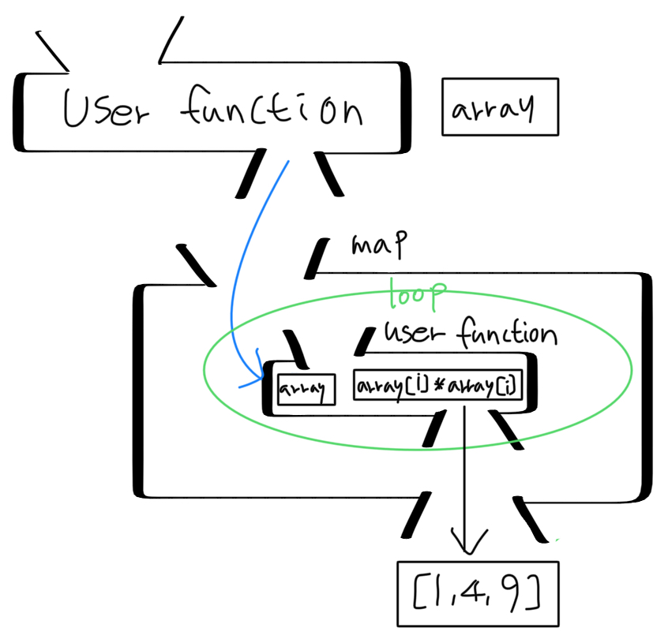
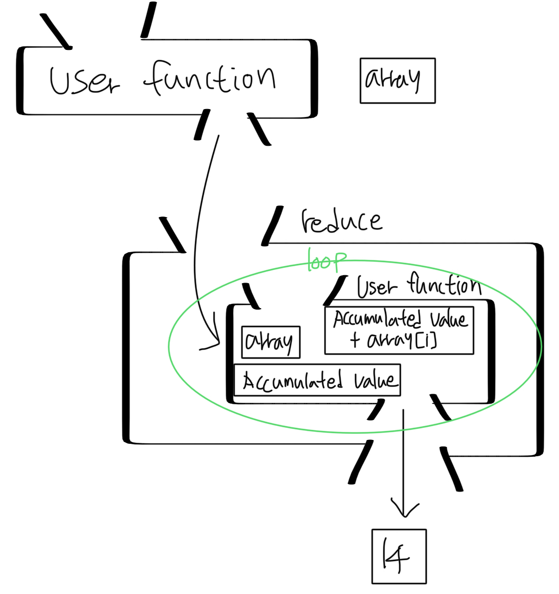

<table_of_contents color="gray"/>
# 7. 함수형 프로그래밍
- 프로그래밍의 여러 가지 패러다임 중 하나
- 함수형 프로그래밍에 좀 더 관심이 있다면, Lisp 또는 Haskell과 같은 언어 공부 추천
## 함수형 프로그래밍의 개념
- 함수의 조합으로 작업을 수행함을 의미
- 중요: 해당 작업이 이루어지는 동안 작업에 필요한 데이터와 상태는 변하지 않음 ⇒ 변하는 것은 오직 함수 뿐
- 예시) 함수형 프로그래밍을 표현하는 슈도 코드
	```javascript
// 특정 문자열을 암호화하는 함수가 여러 개 있다고 가정
f1 = encrypt1;
f2 = encrypt2;
f3 = encrypt3;

// 여기서 f1, f2, f3는 입력값이 정해지지 않고, 서로 다른 암호화 알고리즘만 있음
pure_value = 'zoe'; // 암호화할 문자열
encrpyted_value = get_encrypted(x); // 암호화된 문자열
// :암호화 함수를 받아 입력받은 함수로 pure_value를 암호화한 후 반환

// 즉, 다음과 같이 처리
encrypted_value = get_encrypted(f1);
encrypted_value = get_encrypted(f2);
encrypted_value = get_encrypted(f3);
	```
	- 이를 그림으로 표현
		
	- 여기서 `pure_value`는 작업에 필요한 데이터며, 작업이 수행되는 동안 변하지 않음
	- `encrypted()`가 작업하는 동안 변할 수 있는 건 오로지 입력으로 들어오는 함수 뿐
	- 반대로 이야기하면, `f1, f2, f3`는 외부(여기서는 `zoe`라는 변수)에 아무런 영향을 미치지 않는 함수라고 할 수 있음 ⇒ **순수 함수**
	- `get_encrypted()`함수: 
		- 인자로서 `f1, f2, f3` 함수를 받음
		- 해당 예시에는 결과 값이 encrypted_value 지만, 결과 값을 다른 형태의 함수로서도 반환 가능 → 함수를 또 하나의 값으로 간주, 함수의 인자 또는 반환값으로 사용 가능한 함수 ⇒ **고계 함수**
- 해당 예시에서, 프로그래머는 입력으로 넣을 암호화 함수를 새롭게 만드는 방식으로 암호화 방법 개선 가능
- 내부 데이터 및 상태는 그대로 둔 채, 제어할 함수를 변경 및 조합함으로써 원하는 결과를 얻어내는 것이 함수형 프로그래밍의 특성
- 높은 수준의 모듈과가 가능
- 순수 함수의 조건을 충족하는 함수 구현으로 모듈 집약적인 프로그래밍 가능
- 간단한 모듈의 재구성, 조합으로 프로그래밍 가능
<callout icon="💡" color="gray_bg">
	**명령형 프로그래밍**
	- 함수형 프로그래밍의 반대 개념
	- C등의 언어로 구현했던 대부분의 프로그래밍 방식이 이것
	- 컴퓨터가 수행할 일의 명령을 순서대로 기술하는 프로그래밍 방식
	- 함수형 프로그래밍 언어 함수처럼 입력값을 받고 출력값을 계산하는 순수한 의미의 함수도 있지만, 특정 작업을 수행하는 여러 가지 명령이 기술되어 있는 함수도 있음 ⇒ **프로시저 함수**
	- 프로시저는 함수형 프로그래밍의 순수 함수와는 목적 자체가 다름
	- 예시) `printf()`
		```javascript
int ret = printf("print this to screen\n");
		```
		- `printf` 함수 역시 입력값과 결과값(반환값)이 있음
		- 중요한 것은 결과값이 아니라, `printf` 함수가 실행되며 입력값을 화면에 출력하는 동작이 중요
		- 결과값은 이 동작이 제대로 수행되었는지를 알려주는 보조적 역할
		- 실제 `printf` 결과값을 받아 처리하는 코드 자체가 없는 경우도 많음
	- 명령형 프로그래밍 함수는 이처럼 특정 작업의 순차적인 명령을 기술하는 데 중점을 둠
		⇒ 함수형 프로그래밍에서 말하는 순수 함수와는 거리가 있음
</callout>
- 함수형 프로그래밍 함수는 순수 함수로서, 외부에 아무런 영향을 주지 않는 선에서 자신의 로직을 처리, 결과를 반환하는 역할
- 결과값을 얻는 것이 함수 호출의 목적이고, 결과값으로 또 다른 작업을 처리하게 됨
## 자바스크립트에서의 함수형 프로그래밍
- 자바스크립트에서도 함수형 프로그래밍이 가능
- 일급 객체로서의 함수, 클로저를 지원하기 때문
- 예시) 앞선 암호화 예시를 자바스크립트로 구현
	```javascript
var f1 = function(input) {
	var result;
	// 암호화 작업 수행
	result = 1;
	return result;
}

var f2 = function(input) {
	var result;
	// 암호화 작업 수행
	result = 2;
	return result;
}

var f3 = function(input) {
	var result;
	// 암호화 작업 수행
	result = 3;
	return result;
}

var get_encrypted = function(func) {
	var str = 'zoe';
	return function() { // 여기서 반환하는 익명 함수가 클로저
		return func.call(null, str);
	}
}
// 이 클로저에서 접근하는 변수 str은 외부에서는 접근 불가
// :클로저로 함수형 프로그래밍의 개념을 정확히 구현 가능

var encrypted_value = get_encrypted(f1)();
console.log(encrypted_value);

var encrpyted_value = get_encrypted(f2)();
console.log(encrypted_value);

var encrpyted_value = get_encrypted(f3)();
console.log(encrypted_value);
	```
	- 자바스크립트에서 앞서 예로 든 함수형 프로그래밍 슈도(pseudo) 코드 구현 가능
	- 함수가 일급 객체로 취급되기 때문에 가능한 것
	- 함수의 인자로 함수를 넘기고, 결과로 함수를 반환 가능
	- 또한, 변수 `str` 값이 영향을 받지 않게 하려고 클로저를 사용
	-
### 1. 배열의 각 원소 총합 구하기
- 배열의 각 원소 총합 구하기 - **명령형 프로그래밍 방식**
	```javascript
function sum(arr) {
	var len = arr.length;
	var i = 0, sum = 0;

	for (; i<len; i++) {
		sum += arr[i];
	}
	return sum;
}

var arr = [1,2,3,4];
console.log(sum(arr)); // 10
	```
- 배열의 각 원소 총 곱한 값 구하기 - **명령형 프로그래밍 방식**
	```javascript
function multiply(arr) {
	var len = arr.length;
	var i = 0, result = 0;

	for (; i<len; i++) {
		result *= arr[i];
	}
	return result;
}

var arr = [1,2,3,4];
console.log(multiply(arr)); // 10
	```
	- 명령형 프로그래밍 방식으로 작성된 코드: 문제 하나하나를 각각의 함수로 구현해 해결
		⇒ 배열의 각 원소를 또 다른 방식으로 산술하여 결과값을 얻으려면 새로운 함수를 다시 구현해야 함
- 배열의 각 원소 계산 결과 값 구하기 - **함수형 프로그래밍 방식**
	```javascript
function reduce(func, arr, memo) {
	var len = arr.length, i = 0, accum = memo;

	for (; i<len; i++) {
		accum = func(accum, arr[i]);
	}
	return accum;
}
	```
	- `reduce()` 함수는 함수와 배열을 인자로 넘겨받고, 루프를 돌며 함수를 실행
	- 함수 실행 후, 얻은 결과값은 변수 `accum`에 계속 저장
	- 위 작업을 원소 개수만큼 루프를 돌면서 수행
	- 루프 종료 후, 최종적으로 `accum` 값을 반환
	- 사용자는 `reduce()` 함수의 인자로 들어가는 함수를 직접 정의할 수 있음
	```javascript
var arr = [1, 2, 3, 4];

var sum = function(x, y) {
	return x + y;
};

var multiply = function(x, y) {
	return x * y;
};

console.log(reduce(sum, arr, 0));
console.log(reduce(multiply, arr, 1));
	```
	
- 함수형 프로그래밍을 이용해 코드를 훨씬 간결하게 작성 가능
- 다른 문제가 나오더라도 사용자가 해당 연산을 하는 함수를 작성해 `reduce()` 함수로 결과를 얻을 수 있음
- 함수형 프로그래밍은 기존 프로그래밍 방식보다 한 단계 높은 모듈화가 가능
<callout icon="💡" color="gray_bg">
	**reduce() 함수**
	- 자바스크립트에서 범용적으로 사용되는 함수
	- 각 배열의 요소를 처음부터 하나씩 뽑아 연산에 사용, 최종 결과값을 도출
</callout>
### 2. 팩토리얼
- 팩토리얼 구현하기 - **명령형 프로그래밍 방식**
	```javascript
// 방법1
function fact(num) {
	var val = 1;
	for (var i = 2; i <= num; i++) {
		val = val * i;
	}
	return val;
}

console.log(fact(100));
	```
	```javascript
// 방법2; 재귀호출
function fact(num) {
	if (num == 0) return 1;
	else return num * fact(num-1);
}
	```
- 팩토리얼 구현하기 - **함수형 프로그래밍 방식**(성능을 고려한 구현)
	- 포인트) 처음 `10!`을 실행 후, `20!`을 실행한다고 가정했을 때, 앞서 실행한 `10!`은 중복됨
	```javascript
var fact = function() {
	var cache = {'0': 1};

	var func = function(n) {
		var result = 0;

		if (typeof(cache[n]) === 'number') {
			result = cache[n];
		} else {
			result = cache[n] = n * func(n-1);
		}
		return result;
	}
	return func;

}();

console.log(fact(10));
console.log(fact(20));
	```
	- `fact`는 `cache`에 접근할 수 있는 클로저를 반환받음
	- 클로저로 숨겨지는 `cache`에는 팩토리얼을 연산한 값을 저장하고 있음
	- 연산을 수행하는 과정에서 캐시에 저장된 값이 있으면 곧바로 그 값을 반환하는 방식
	- 한 번 연산된 값을 캐시에 저장하고 있으므로, 중복된 연산을 피해 보다 나은 성능의 함수를 구현할 수 있음
<callout icon="💡" color="gray_bg">
	**메모이제이션(Memoization) 패턴**
	- 메모이제이션: 계산 결과를 저장해 놓아 이후 다시 계산할 필요 없이 사용할 수 있게 한다는 컴퓨팅 용어
	- 기본적으로 계산된 결과를 함수 프로퍼티 값으로 담아 놓고, 나중에 사용
		```javascript
function Calculate(key, input, func) {
	Calculate.data = Calculate.data || {};

	if (!Calculate.data[key]) {
		var result;
		result = func(input);
		Calculate.data[key] = result;
	}

	return Calculate.data[key];
}

var result = Calculate(1, 5, function(input) {
	return input * input;
});
console.log(result);

result = Calculate(2, 5, function(input) {
	return input * input / 4;
});
console.log(result);

console.log(Calculate(1));
console.log(Calculate(2));
		```
		- 함수 `Calculate()` 프로퍼티에 data 프로퍼티를 만들어 객체 할당
		- 사용자는 이곳에 자신이 원하는 값을 원하는 키로 저장해 놓을 수 있음
		- 한 번 계산된 값이 들어가면 그 이후에는 해당 키로 저장해 놓은 값을 받아 사용 가능 ⇒ 일종의 캐시 역할
		- jQuery에서는 `data()`라는 메서드로 이 메모이제이션 패턴을 사용
	- jQuery 1.2.2 에서 구현된 `data()` 메서드 일부
		```javascript
data: function (elem, name, data) {
	// ...
	var id = elem [expando];
	// ...

	// Only generate the data cache if we're trying to access or manipulate it
	if (name && !jQuery.cache[id]) {
		jQuery.cache[id] = {};
	}

	// Prevent overriding the named cache with undefined values
	if (data != undefined) {
		jQuery.cache[id][name] = data;

		// Return the named cache data, or the ID for the element
		return name ? jQuery.cache[id][name] : id;
	},
}
		```
		- jQuery 역시 예제와 같이 jQuery.cache에 사용자가 자신의 데이터를 넣을 수 있고, 이를 다시 받아서 사용할 수 있음 ⇒ 사용자에게 편의 제공
	- 예제에서는 `Calculate()` 함수에 자신의 함수를 인자로 넘겨 실행되게 간단히 작성됨
	- 보다 범용적으로 사용하는 방법: `Function.prototype`에 `memoization()` 함수 넣기
		```javascript
Function.prototype.memoization = function(key) {
	var arg = Array.prototype.slice.call(arguments, 1);
	this.data = this.data || {};
	
	return this.data[key] !== undefined ? this.data[key] : this.data[key] = this.apply(this, arg);
};

function myCalculate1(input) {
	return input * input;
}

function myCalculate2(input) {
	return input * input / 4;
}

myCalculate1.memoization(1, 5);
myCalculate1.memoization(2, 4);
myCalculate1.memoization(1, 6);
myCalculate1.memoization(2, 7);

console.log(myCalculate1.memoization(1)); // equal to console.log(myCalculate1.data[1]);
console.log(myCalculate1.memoization(2)); // equal to console.log(myCalculate1.data[2]);
console.log(myCalculate2.memoization(1)); // equal to console.log(myCalculate2.data[1]);
console.log(myCalculate2.memoization(2)); // equal to console.log(myCalculate2.data[2]);
		```
		- 이처럼 `Function.prototype`에 메서드를 정의해 놓으면 특정 값을 리턴하는 모든 함수에서 유용하게 사용 가능
		- 주의) 한 번 값이 들어간 경우 계속 유지되므로 이를 초기화하는 방법 역시 피요
		- 참고) jQuery에서는 `cleanData`(이전 버전: `removeData`)라는 메서드를 제공해 이 같은 작업 수행
</callout>
<callout icon="💡" color="gray_bg">
	여기서 사용된 방법 역시 유용한 패턴에서 소개된 메모이제이션 기법. 유용한 패턴에서는 함수 객체의 한 프로퍼티를 캐시로 사용, 여기서는 클로저로 감춰지는 객체를 캐시로 사용.
</callout>
### 3. 피보나치 수열
- 메모이제이션 기법 적용 - **함수형 프로그래밍 방식**
	```javascript
var fibo = function() {
	var cache = {'0': 0, '1': 1};

	var func = function(n) {
		if (typeof(cache[n]) === 'number') {
			result = cache[n];
		} else {
			result = cache[n] = func(n-1) + func(n-2);
		}
		return result;
	}	

	return func;
}();

console.log(fibo(10));
	```
	- 클로저를 이용하여 `cache`를 캐시로 활용
	- 차이점) `cache`의 초기값과 함수를 재귀 호출할 때 산술식이 다름
- 팩토리얼과 피보나치 수열을 계산하는 함수를 인자로 받는 함수
	```javascript
var cacher = function(cache, func) {

	var calculate = function(n) {

		if (typeof(cache[n]) === 'number') {
			result = cache[n];
		} else {
			result = cache[n] = func(calculate, n);
		}

		return result;
	}

	return calculate;
};
	```
	- `cacher` 함수는 사용자 정의 함수와, 초기 `cache` 값을 받아 연산 수행
	- 사용자는 이 함수의 인자로 피보나치 수열을 연산하는 함수 혹은 팩토리얼을 연산하는 함수를 정의하여, 다음과 같이 사용 가능
	```javascript
// 활용
var fact = cacher({'0': 1}, function(func, n) {
	return n * func(n-1);
});

var fibo = cacher({'0': 0, '1': 1}, function(func, n) {
	return func(n-1) + func(n-2);
});

console.log(fact(10));
console.log(fibo(10));
	```
- 함수형 프로그래밍이 수학에서 출발한 문제 해결 방법론이므로, 수학 문제 프로그래밍에 있어서 이득을 볼 수 있음
## 자바스크립트에서의 함수형 프로그래밍을 활용한 주요 함수
- 자바스크립트에서 범용적으로 사용되는 함수형 프로그래밍 기반의 여러 가지 함수 알아보기
### 1. 함수 적용
- `Function.prototype.apply` 함수로 함수 호출을 수행할 수 있음
- 이름이 `apply`인 이유: 함수 적용(Applying functions) 은 함수형 프로그래밍에서 사용되는 용어
- 함수형 프로그래밍에서는 특정 데이터를 여러 가지 함수를 적용시키는 방식으로 작업 수행
- 여기서 함수는 단순 입력을 넣고 출력을 받는 기능 뿐 아니라, 인자 혹은 반환 값으로 전달된 함수를 특정 데이터에 적용시키는 기능도 수행함
- 때문에, 자바스크립트에서 함수를 호출하는 역할을 하는 메서드를 `apply`라고 명명하게 됨
- 표현 예시) `func.apply(Obj, Args)`와 같은 함수 호출: ‘`func` 함수를 `Obj` 객체와 `Args` 인자 배열에 적용시킨다’
### 2. 커링
- 특정 함수에서 정의된 인자의 일부를 넣어 고정시키고, 나머지를 인자로 받는 새로운 함수를 만드는 것을 의미
	```javascript
function calculate(a, b, c) {
	return a * b + c;
}

function curry(func) {
	var args = Array.prototype.slice.call(arguments, 1);

	return function() {
		return func.apply(null, args.concat(Array.prototype.slice.call(arguments)));
	}
}

var new_func1 = curry(calculate, 1);
console.log(new_func1(2, 3)); // 5 (1 * 2 + 3 = 5)

var new_func2 = curry(calculate, 1, 3);
console.log(new_func2(3)); // 6 (1 * 3 + 3 = 6)
	```
	
	- `calculate()` 함수는 인제 3개를 받아 연산 수행, 결과값 반환
	- `curry()` 함수로 만든 함수:
		- 첫 번째 인자를 1로 고정시킨 새로운 함수 `new_func1()`
		- 첫 번째, 두 번째 인자를 1, 3으로 고정시킨 `new_func2()` 함수
	- 여기서 핵심적인 역할을 하는 `curry()` 함수의 역할:
		- `curry()` 함수로 넘어온 인자를 `args`에 담음
		- 새로운 함수 호출로 넘어온 인자와 합쳐서 함수 적용
- 이러한 커링은 함수형 프로그래밍 언어에서 기본적으로 지원하나, 자바스크립트에서 제공하지는 않음
- 그러나, 사용자는 다음과 같이 `Function.prototype`에 커링 함수를 정의하여 사용할 수 있음
	```javascript
Function.prototype.curry = function() {
	var fn = this, args = Array.prototype.slice.call(arguments);
	return function() {
		return fn.apply(this, args.concat(Array.prototype.slice.call(arguments)));
	};
};
	```
	<callout icon="💡" color="gray_bg">
		**slice 메서드**
		- `Array.prototype`에 정의되어 있는 메서드
		- 인저로 첫 인덱스와 마지막 인덱스(옵션)을 주어 배열을 잘라 복사본 반환
		- 커링에서 함수의 인자를 arguments 객체로 조작할 때, 이 메서드를 이용해 배열로 만든 수 손쉽게 조작
	</callout>
- 사용자가 `calculate()` 함수의 첫 번째 인자와 세 번째 인자롤 고정하고 싶다면?
	⇒ 앞서 소개한 `curry()` 함수로는 불가능. 다음과 같이 문제 해결.
	```javascript
function calculate(a, b, c) {
	return a * b + c;
}

function curry2(func) {
	var args = Array.prototype.slice.call(arguments, 1);

	return function() {
		var arg_idx = 0;
		for (var i = 0; i < args.length && arg_idx < arguments.length; i++)
			if (args[i] === undefined)
				args[i] = arguments[arg_idx++];
		return func.apply(null, args);
	}
}

var new_func = curry2(calculate, 1, undefined, 4);
console.log(new_func(3)); // 7 (1 * 3 + 4 = 7)
	```
	
	- `curry2()` 함수를 사용할 때 주의점:
		-  `curry2()` 호출 시, \`calculate()\~ 함수가 원하는 인자를 전부 넣어야 함
		- 그 중 고정시키지 않을 인자를 undefined로 넘김
	- `curry2()` 에서는 `curry2()`를 호출할 때 넘어온 인자로 루프를 돌면서, undefined인 요소를 새로운 함수를 호출할 때 넘어온 인자로 대체
	- 이와 같이 함수를 부분적으로 적용, 새로운 함수를 반환받는 방식을 **함수의 부분 적용**이라고 함
		⇒ **함수의 부분 적용**을 가장 잘 구현한 예제가 `curry()` 메서드
- 커링은 함수형 프로그래밍에서는 기본적인 구현 방법
- 자바스크립트에서 기존 함수로 인자가 비슷한 새로운 함수를 정의하여 사용하고 싶을 때, 이와 같은 방법으로 유용하게 사용 가능
### 3. bind
- `bind()` 함수의 가장 기본적인 기능을 구현한 코드
	```javascript
Function.prototype.bind = function() {
	var fn = this,
	slice = Array.prototype.slice,
	args = slice.call(arguments, 1);

	return function() {
		return fn.apply(thisArg, args.concat(clice.call(arguments)));
	};
}
	```
	- 앞서 설명된 `curry()` 함수와 같이, `bind()` 함수 또한 커링 기법을 활용한 함수임
	- 커링과 같이 사용자가 고정시키고자 하는 인자를 `bind()` 함수 호출 시 인자로 넘겨주고, 반환받은 함수를 호출하며 나머지 가변 인자를 넣어줄 수 있음
	- `curry()` 와 차이점: 함수를 호출할 때 this에 바인딩시킬 객체를 사용자가 넣어줄 수 있음
	- `curry()` 함수가 자바스크립트 엔진에 내장되지 않은 것도 `bind()` 함수로 충분히 커버가 가능하기 때문
	```javascript
var print_all = function(arg) {
	for (var i in this) console.log(i + " : " + this[i]);
	for (var i in arguments) console.log(i + " : " + arguments[i]);
}

var myobj = {name: 'zoe'};

var myfunc = print_all.bind(myobj);
myfunc(); // name : zoe

var myfunc1 = print_all.bind(myobj, 'iam', 'others');
myfunc1('js');
/*
name : zoe
0 : iam
1 : others
2 : js
*/ 
	```
	
	- `myfunc()` 함수는 `myobj` 객체를 this에 바인딩시켜 `print_all()` 함수를 실행하는 새로운 함수
	- 또한, `myfunc()` 를 실행하면, 인자도 `bind()` 함수에 모두 넘겨짐
	- 이와 같이, 특정 함수에 원하는 객체를 바인딩시켜 새로운 함수를 사용할 때 `bind()` 함수가 사용됨
<callout icon="💡" color="gray_bg">
	**bind() 함수의 또 다른 기능**
	- `bind()` 함수로 받환받은 함수는 바인딩한 함수를 상속하는 기능까지 제공
	- ECMA 5로 지원하는 `Function.prototype.bind` 함수는 모질라 개발자 사이트에서 다음과 같이 소개됨
		```javascript
if (!Function.prototype.bind) {
	Function.prototype.bind = function (oThis) {
		if (typeof this !== "function") {
			throw new TypeError("Function.prototype.bind - what is trying to be bound is not callable");
		}
		
		var aArgs = Array.prototype.slice.call(arguments, 1),
		fToBind = this,
		fNOP = function () {},
		fBound = function () {
			return fToBind.apply(
				this instanceof fNOP && oThis ? this : oThis,
				aArgs.concat(Array.prototype.slice.call(arguments));
			);
		};

		fNOP.prototype = this.prototype;
		fBound.prototype = new fNOP();

		return fBound;
	};
}
		```
	- 다른 점을 확인할 수 있는가?
		```javascript
fNOP = function () {},
fBound = function () {
	// ...
};

fNOP.prototype = this.prototype;
fBound.prototype = new fNOP();

return fBound;
		```
		- 객체지향 프로그래밍(6장)에서 많이 본 종류의 코드.
		- 반환되는 함수 fBound는 현재 this에 바인딩된 함수 객체를 상속받음. 
		- 따라서, 반환받은 fBound 함수로 new라고 생성된 객체는 현재 함수의 prototype 프로퍼티에 접근 가능
	- 이를 활용한 예제
		```javascript
function Person(arg) {
	if (this.name === undefined) this.name = arg ? arg : 'zoe';
	console.log("name: " + this.name);
}

Person.prototype.setName = function(value) {
	this.name = value;
};
Person.prototype.getName = function() {
	return this.name;
};

var myobj = { name: 'iam' };
var new_func = Person.bind(myobj);
new_func(); // (출력) name: iam

var obj = new new_func(); // (출력) name: zoe
console.log(obj.getName()); // (출력) zoe
		```
</callout>
### 4. 래퍼
- 특정 함수를 자신의 함수로 덮어쓰는 것
- 물론, 사용자는 원래 함수 기능을 잃지 않은 상태로 자신의 로직을 수행해야 함
- 객체지향 프로그래밍에서 다형성의 특성을 살리기 위해 오버라이드를 지원하는데, 상당히 유사한 개념임
	```javascript
function wrap (object, method, wrapper) {
	var fn = object[method];
	return object[method] = function() {
  	return wrapper.apply(this, [fn].concat(
    // return wrapper.apply(this, [fn.bind(this)].concat(
    	Array.prototype.slice.call(arguments)
    ));
	};
}

Function.prototype.original = function(value) {
	this.value = value;
  console.log("value: " + this.value);
}

var mywrap = wrap(Function.prototype, "original", function(orig_func, value) {
	this.value = 20;
  orig_func(value);
  console.log("wrapper value: " + this.value);
});

var obj = new mywrap('zoe');
// value: zoe
// wrapper value: 20
	```
	- `Function.prototype`의 `original` 함수: 인자로 넘어온 값을 value에 할당, 출력하는 기능
	- 사용자가 이를 덮어쓰기 위해 `wrap` 함수 호출
	- 여기서, 사용자는 자신의 익명 함수의 첫번째 인자로 원해 함수의 참조를 받을 수 있음
	- 이 참조로 원래 함수를 실행하고, 자신의 로직을 수행 가능
- `wrap` 함수에 대해 좀 더 자세한 해설
	- `curry()`, `bind()` 함수와 상당히 유사함
	- 중요: 사용자가 세 번째 인자로 받은 함수 `wrapper()`를 `apply()` 함수로 호출함
		→ 인자의 첫 번째가 \[fn\]
		- 기존 함수의 참조를 첫 번째 인자로 넘김으로써, 사용자는 이 함수에 접근 가능
		- 클로저를 절묘하게 사용한 함수형 프로그래밍의 한 방법
	- 문제: 원래 함수 `original()` 이 호출될 때의 `this`, 반환되는 익명 함수가 호출될 때의 `this`가 다름
		- 해결: `bind` 함수를 적절히 이용
		- `apply`를 호출할 때, 첫 번째 인자로 \[fn\] 대신 \[fn, bind(this)\]를 쓰면 문제를 해결할 수 있음
		- 원래 함수에 반환되는 익명 함수의 this를 바인딩하는 것
- 래퍼는 기존에 제공되는 함수에서 사용자가 원하는 로직을 추가하고 싶다거나, 기존에 있는 버그를 피하고자 할 때 많이 사용됨
- 특히, 특정 플랫폼에서 버그를 발생시키는 함수가 있을 경우, 이를 컨트롤할 수 있으므로 상당히 용이
### 5. 반복 함수
- 자바스크립트 뿐만 아니라, 다른 여러 언어에서도 구현되어 널리 사용되는 함수들
- 자바스크립트에서 함수형 프로그래밍 특성을 활용해 매우 유용하게 사용 가능
### 5-1. each
- 배열의 각 요소, 객체의 각 프로퍼티를 하나씩 꺼냄 → 차례대로 특정 함수에 인자로 넣어 실행시킴
- 대부분의 자바스크립트 라이브러리에 기본적으로 구현되어 있는 함수
- `each`, `forEach`라는 이름으로 제공됨
- jQuery 1.0의 `each()` 함수 코드
	```javascript
function each (obj, fn, args) {
	if (obj.length == undefined)
		for (var i in obj)
			fn.apply(obj[i], args || [i, obj[i]]);
	else
		for (var i = 0; i < obj.length; i++)
			fn.apply(obj[i], args || [i, obj[i]]);
	return obj;
};

each([1, 2, 3], function (idx, num) {
	console.log(idx + " : " + num);
});

var zoe = {
	name: 'zoe',
	age: 30,
	sex: 'female'
};

each(zoe, function(idx, value) {
	console.log(idx + " : " + value);
});
	```
	
	- `obj`에 length가 있는 경우 (ex. 배열)와 없는 경우 (ex. 객체)로 나눔 → 루프를 돌며 각 요소를 인자로 하여 차례대로 함수 호출
	- `each()` 함수는 다양한 언어에서 기본적으로 제공됨
	- 자바스크립트에서도 이 방식으로 정의하여 사용할 수 있음
	- 주의: `each()` 함수에서 사용자 함수를 호출할 때 넘기는 인자의 순서, 구성이 라이브러리에 따라 다를 수 있음
	- 보통 인덱스와 값의 순서로 인자를 전달하나, 약간 다를 수 있음
<callout icon="💡" color="gray_bg">
	**다음 함수는 순수한 의미의 함수형 프로그래밍 예제는 아님**
	```javascript
function (idx, value) {
	console.log(idx + " : " + value);
}
	```
	- `each()`의 인자로 넘기는 이 함수가 순수 함수가 아닌 프로시저이기 때문
</callout>
### 5-2. map
- 주로 배열에 많이 사용되는 함수
- 배열의 각 요소를 꺼내 사용자 정의 함수를 적용시켜 새로운 값을 얻은 후, 새로운 배열에 넣음
	```javascript
Array.prototype.map = function(callback) {
	// this가 null인지, 배열인지 체크
	// callback이 함수인지 체크

	var obj = this;
	var value, mapped_value;
	var A = new Array(obj, length);

	for (var i = 0; i < obj.length; i++) {
		value = obj[i];
		mapped_value = callback.call(null, value);
		A[i] = mapped_value;
	}
	return A;
};

var arr = [1, 2, 3];
var new_arr = arr.map(function(value) {
	return value * value;
});

console.log(new_arr); // (출력) [1, 4, 9]
	```
	
	- 배열 각 요소의 제곱값을 새로운 요소로 하는 배열을 반환받는 예제
	- `map()` 함수 이용 시 각 요소의 제곱값을 반환하는 순수 함수를 넣어 실행시킨 뒤, 새로운 배열 반환 가능
### 5-3. reduce
- 배열의 각 요소를 하나씩 꺼내 사용자 함수를 적용시킨 뒤, 그 값을 계속해서 누적시킴
	```javascript
Array.prototype.reduce = function(callback, memo) {
	// this가 null인지, 배열인지 체크
	// callback이 함수인지 체크

	var obj = this;
	var value, accumulated_value = 0;

	for (var i = 0; i < obj.length; i++) {
		value = obj[i];
		accumualted_value = callback.call(null, accumulated_value, value);
	}

	return accumulated_value;
};

var arr = [1, 2, 3];
var accumulated_val = arr.reduce(function(a, b) {
	return a + b * b;
});

console.log(accumulated_val); // (출력) 14 = 1 * 1 + 2 * 2 + 3 * 3
	```
	
	- 배열의 각 요소를 순차적으로 제곱한 값을 더해 누적된 값을 반환받는 예제
	- 각 요소를 사용자가 원하는 특정 연산으로 누적된 값을 반환받고자 할 때 유용하게 사용됨
