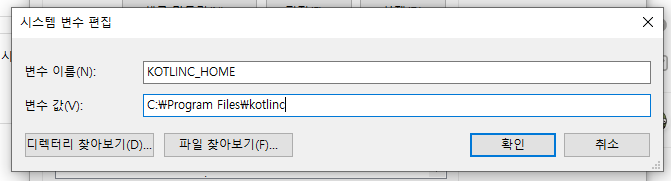
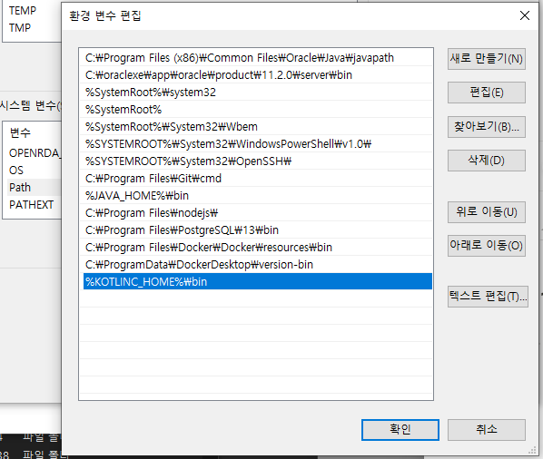
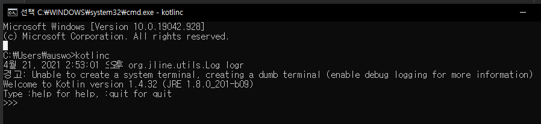

<table_of_contents color="gray"/>
# 1. 환경변수 설정



# 2. 클래스와 프로퍼티
## 2.2 Person 클래스
### java
```java
public class PersonJava {
    private final String name;

    public PersonJava(String name) {
        this.name = name;
    }

    public String getName(String name) {
        return name;
    }
}
```
### kotlin
- 값 객체 : 코드 없이 데이터만 저장하는 클래스
- kotlin의 기본 가시성은 public이므로 public이라는 가시성 변성자는 생략됨
```java
class PersonKotlin(val name: String)
```
## 2.2.1 프로퍼티
- 클래스 개념 목적 : 데이터 캡슐화, 캡슐화한 데이터를 다루는 코드를 한 주체 아래 가둠
- 자바 : 데이터를 필드에 저장, 멤버 필드의 가시성은 보통 private(비공개)
	- 접근자 메소드 : 클래스 자신을 사용하는 클라이언트가 그 데이터에 접근하는 통로(getter, setter)
	- 프로퍼티 : 필드 + 접근자
- 코틀린 : 자바의 필드, 접근자 메소드를 완전히 대신함
```java
class PersonKotlin(
  val name: String, // 읽기 전용 프로퍼티로, 코틀린은 (비공개) 필드와 필드를 읽는 단순한 공개 getter를 만들어냄
  var isMarried: Boolean // 쓸 수 있는 프로퍼티로, 코틀린은 (비공개) 필드, (공개) getter, (공개) setter를 만들어냄
)
```
```java
// kotlin 에서 사용하기
fun main() {
    val person = PersonKotlin("Bob", true);
		// new 키워드를 사용하지 않고 생성자를 호출함
    
    // 프로퍼티 이름을 직접 사용해도 코틀린이 자동으로 getter 호출함
    println(person.name)
    println(person.isMarried)
}
// getter를 호출하는 대신 프로퍼티를 직접 사용함
```
```java
// setter
person.isMarried = false
```
## 2.3 enum과 when
### 간단한 enum 클래스 정의
```java
package `08Enum`

enum class Color {
    RED, ORANGE, YELLOW, GREEN, BLUE, INDIGO, VIOLET
}
```
### 프로퍼티와 메소드가 있는 enum 클래스 선언
```java
package `08Enum`

enum class Color(var r:Int, val g: Int, val b: Int) {
    RED(255, 0, 0),
    ORANGE(255, 165, 0),
    YELLOW(255, 255, 0),
    GREEN(0, 255, 0),
    BLUE(0, 0, 255),
    INDIGO(75, 0, 130),
    VIOLET(238, 130, 238);

    fun rgb() = (r * 256 + g) * 256 + b
}

fun main() {
    println(Color2.BLUE.rgb()) // 255
}
```
### if와 마찬가지로 when도 값을 만들어내는 식(코틀린 when == 자바의 switch)
```java
fun getMnemonic(color: Color) = when (color) {
    Color.RED -> "Richard"
    Color.ORANGE -> "Of"
    Color.YELLOW -> "York"
    Color.GREEN -> "Gave"
    Color.BLUE -> "Battle"
    Color.INDIGO -> "In"
    Color.VIOLET -> "Vain"
}

fun main() {
    println(getMnemonic(Color.BLUE)) // Battle
}
```
### 한 when 분기 안에 여러 값 사용하기
```java
fun getWarmth(color: Color) = when(color) {
    Color.RED, Color.ORANGE, Color.YELLOW -> "warm"
    Color.GREEN -> "neutral"
    Color.BLUE, Color.INDIGO, Color.VIOLET -> "cold"
}

fun main() {
    println(getWarmth(Color.ORANGE)) // warm
}
```
### import로 보다 간소하게 코드 작성 가능
```java
package `08Enum`
package `08Enum`
import `08Enum`.Color
import `08Enum`.Color.*

fun getWarmth2(color: Color) = when(color) {
    RED, ORANGE, YELLOW -> "Warm"
    GREEN -> "Neutral"
    BLUE, INDIGO, VIOLET -> "Cold"
}

fun main() {
    println(getWarmth2(GREEN))
}
```
### 3.4 컬렉션 처리: 가변 길이 인자, 중위 함수 호출, 라이브러리 지원
### 3.4.2 가변 인자 함수: 인자의 개수가 달라질 수 있는 함수 정의
```java
fun main(args: Array<String>) {
    val array = arrayOf("first", "second", "third")
    val list = listOf("args : ", *array)
    val list2 = listOf(*array)
    println(list) // [args : , first, second, third]
    println(list2) // [first, second, third]
}
```
