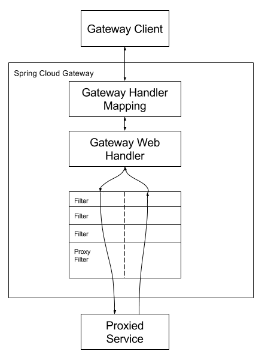

# Spring Cloud Gateway
이 프로젝트는 스프링 에코시스템 위에 구축된 API 게이트웨이(Spring 5, Spring Boot, Project Retro)를 제공함. Spring Cloud Gateway는 간편하면서도 효과적인 API 경로 지정 방법을 제공하고, 보안, 모니터링/메트릭스, 복원력 등과 같은 교차 우려 사항을 제공하는 것을 목표로 함.
## 1. Spring Cloud Gateway를 설치하는 방법
- 프로젝트에 Spring Cloud Gateway를 설치하려면 org.springframework.cloud의 그룹 ID와 spring-cloud-stater-gateway의 아티팩트 ID를 가진 starter를 사용하자.
- 스타터를 포함하지만 게이트웨이를 활성화하지 않으려면 spring.cloud.claud.enabled=false 설정.
## 2. 용어 사전
- Route(경로)  : 게이트웨이의 기본 구성 요소. ID, 대상, URI, 술어 모음 및 필터 모음으로 정의됨. 집계 술어가 참일 경우 경로 일치.
- Predicate(술어) : [Java8의 함수 술어](https://docs.oracle.com/javase/8/docs/api/java/util/function/Predicate.html). 입력 유형은 Spring Framework [`ServerWebExchange`](https://docs.spring.io/spring-framework/docs/5.0.x/javadoc-api/org/springframework/web/server/ServerWebExchange.html). 이렇게 하면 헤더 또는 매개 변수와 같은 HTTP 요청의 모든 항목에서 일치.
- Filter(필터) : 특정 팩토리로 구성된 Spring Framework Gateway Filter의 인스턴스. 여기서는 다운스트림 요청을 보내기 전이나 보낸 후에 요청 및 응답을 수정할 수 있음.
## 3. 어떻게 동작하는가?
다음 다이어그럼은 Spring Cloud Gateway의 작동 방식을 개괄적으로 보여 줌.
<columns>
	<column ratio="50">
		
	</column>
	<column ratio="50">
		<empty-block/>
		<empty-block/>
		<callout icon="💡" color="gray_bg">
			(1) 클라이언트가 Spring Cloud Gateway에 요청 (2) 요청이 라우트와 일치한다고 Gateway Handler Mapping이 판단, 요청을 Gateway Web Handler로 전송. (3) 이 처리기는 요청 관련 필터 체인을 통해 요청 실행.  필터가 점선으로 구분되는 이유는 프록시 요청이 전송되기 전후에 필터가 로직을 실행할 수 있기 때문. (4) 모든 "사전" 필터 논리가 실행. (5) 프록시 요청이 수행. (6) "post" 필터 논리가 실행됨.
		</callout>
	</column>
</columns>
<callout icon="⚠️" color="gray_bg">
	포트가 없는 경로에 정의된 URI는 HTTP 및 HTTPS URI에 대해 각각 기본 포트 값 80과 443을 가져옴.
</callout>
## 4. Route Predicate Factories, Gateway Filter Factories 구성
- 술어와 필터를 구성하는 방법에는 바로 가기 및 완전히 확장된 인수의 두 가지가 있음.
- 이름과 인수 이름은 각 섹션의 첫 번째 문장 또는 두 문장에 코드로 나열됨.
- 인수는 일반적으로 바로 가기 구성에 필요한 순서로 나열됨. 
# 색인과 출처
- [https://docs.spring.io/spring-cloud-gateway/docs/current/reference/html/](https://docs.spring.io/spring-cloud-gateway/docs/current/reference/html/)
