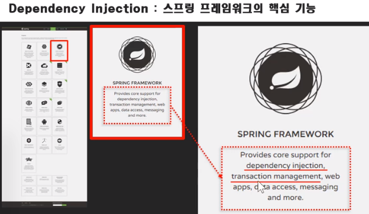
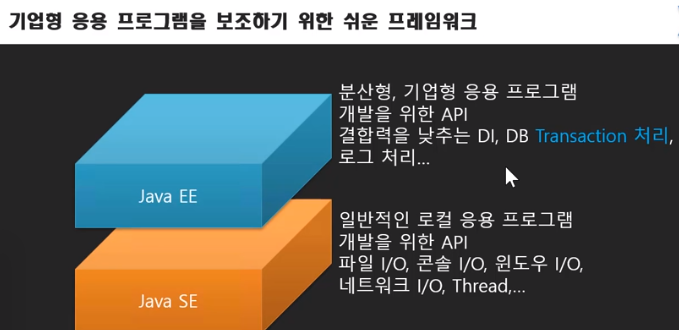
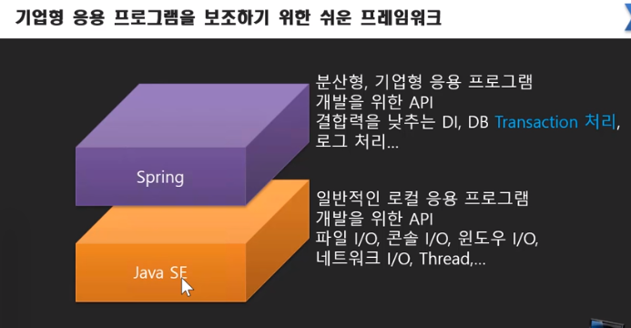
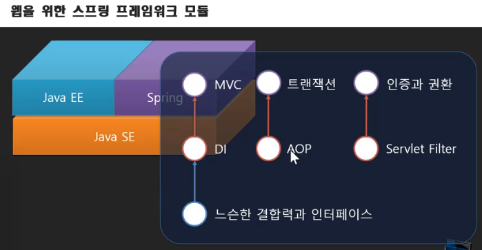

## Dependency Injection
- 스프링 프레임워크의 핵심 기능

	

	- dependency injection
	- transaction management : DAO 내 커넥션이 끊어지는 함수를 묶어서 서비스를 만들어야 할 필요가 있을 때 사용 → Java EE에서 어려운 점이 있었던 것을 spring이 해결해 줌.

- SE에 EE를 얹어서 사용하는 대신, spring 하나만 있으면 기존처럼 개발이 가능하다는 것이 장점

- Java EE를 따로 설치하는 과정 없이 spring을 사용하던 것을 생각하면 됨
- Java SE에 EE, spring을 모두 얹어 개발하는 방식도 있음

