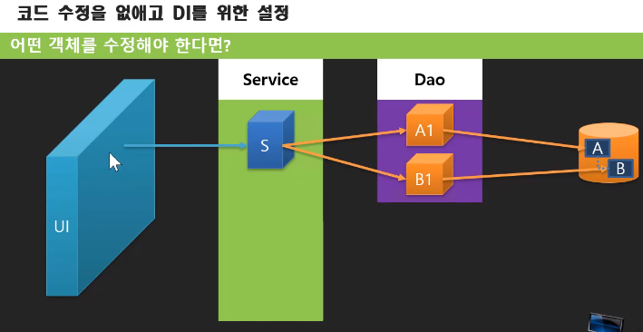
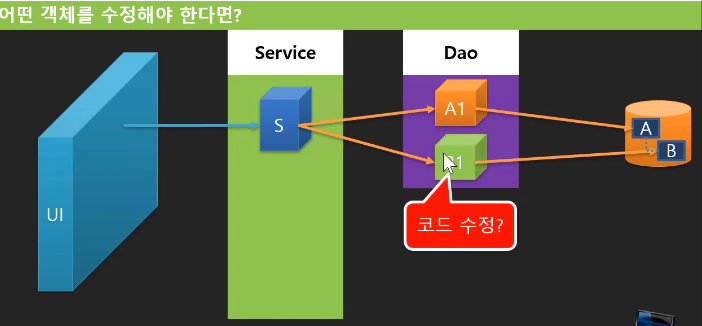
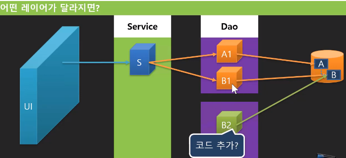
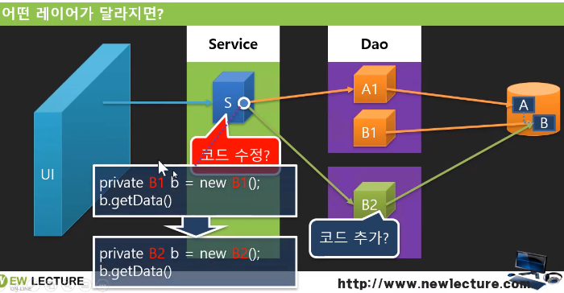
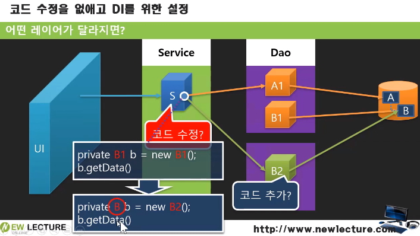
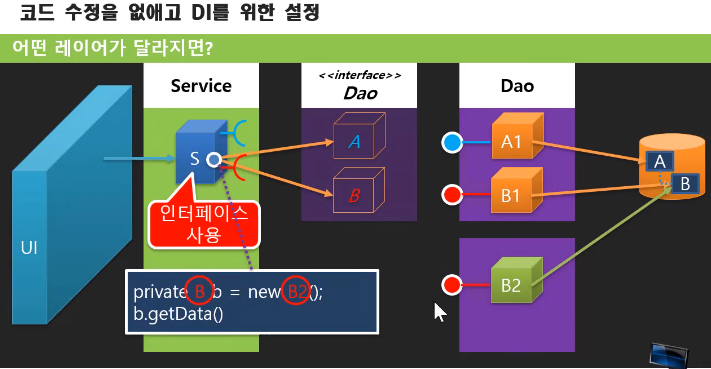
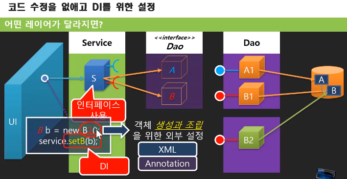

## 어떤 객체를 수정해야 한다면?

- 예를 들어, B1의 알고리즘이 달라져서 코드를 수정해야 한다면?
	1. B1의 소스코드를 수정한다

	

	1. B2를 새로 만들어서 덮어쓰기 한다

	

	

	⇒ 하지만 이렇게 되면 S를 수정해야 함(수정에 대한 범위가 B→S로 전이)
## 덮어쓰기를 하되, 가능한 수정을 하지 않도록 하는 방법은?
- S - B간 결합력이 높음(B를 바꾸려면 S를 고쳐야 하니까) → 아래와 같이 해결

- B1, 2를 거론하지 않고 기능에 대해서만 생각하기 → B라는 인터페이스를 사용

- A - An, B - Bn처럼 끼우고 뺄 수 있음.
- 하지만, 아직 `new B1();`, `new B2();` 처럼 수정할 게 남음 → 다음과 같이 변경. 

- 설정을 외부 파일에 두고 가져와서 생성할 수 있도록 함. → XML, Annotation을 이용
- 스프링은 결합을 위한 설정파일을 제공하고, 객체를 결합해주는 역할을 함.
