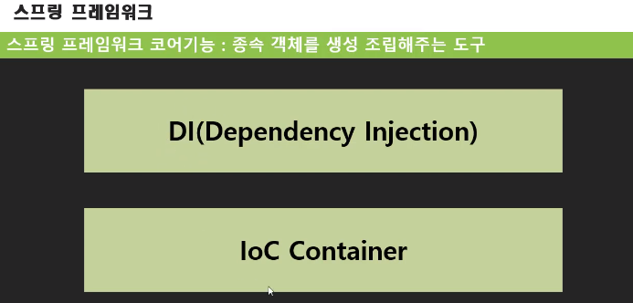
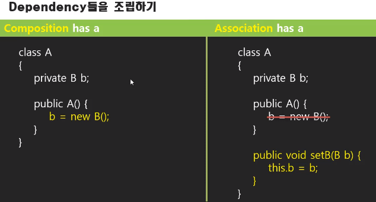
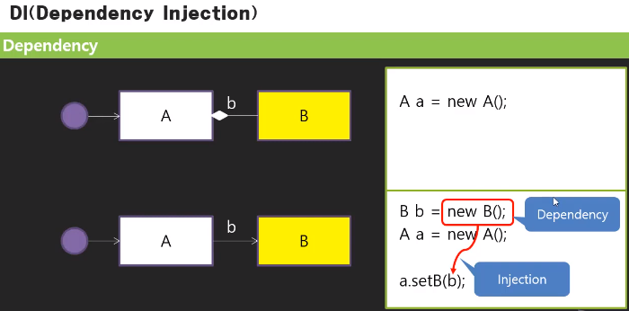
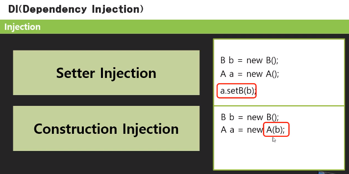

<table_of_contents color="gray"/>
## 들어가기
- 스프링은 객체를 생성하고 조립하는 역할을 함

- DI : 종속성 주입 / 부품 조립 - 프로그램은 객체들의 조립관계에 따라 만들어짐

- 일체형 has a 관계 : B는 A의 부품 → 이 부품을 dependency라고 함(종속성, 종속객체)
- **`왼쪽`**은 A가 B객체를 직접 생성해서 자기가 갖고, private으로 사용
	→ `붙박이형`, `일체형`
- **`오른쪽`**은 객체를 외부에서 생성해서 세팅한 객체를 가져와서 사용
	→ `조립형`(세팅을 해야만 쓸 수 있음)

- 일체형보다 조립형이 결합력이 낮고, 부품을 쉽게 갈아끼울 수 있음(느슨한 결합)
- 일체형은 A안에 뭐가 있는지 잘 알 수 없음
- 조립형은 직접 부품을 꽂아주는 작업이 필요함(Dependency Injection)
- 조립형 단점 : 부품을 조립해야 하는 불편함이 있음
	- setter 함수로 조립
	- 생성자로 조립
	
	- 개발자가 설정만 해 놓으면, 스프링이 해당 칸에 있는 것들을 조립해 줌 - 스프링의 Dependency Injection 기능으로.
