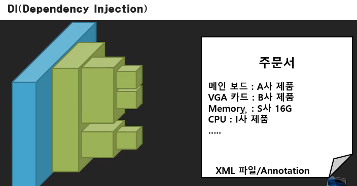
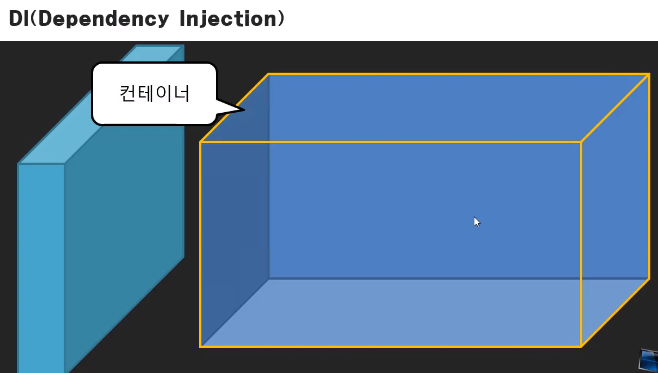
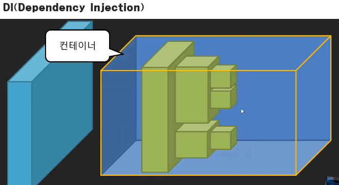
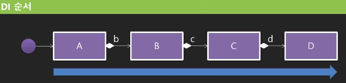
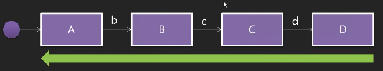
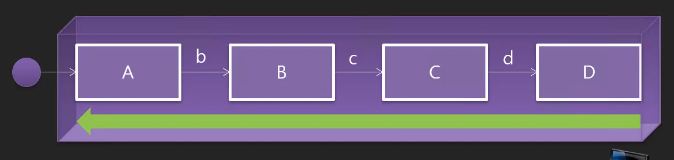

## TODO 미리보기

- xml / annotation
## IoC 컨테이너

- 컨테이너 : 스프링은 주문서에 있는 내용대로 객체, 부품을 생성해서 담을 그릇이 필요함
## 부품 컨테이너가 아니라 IoC 컨테이너인 이유는?
- 컨테이너에서 부품을 조립, 생성해줌

- 작은 부품 → 큰 부품 순으로 만들어짐
- 작은 부품이 만들어지고 큰 부품과 조립되어 더 큰 부품이 만들어지면 또 조립
## 부품 간 조립관계

- 사용자 관점에서, A 클래스가 만들어진 후 그 안의 B라는 객체를 만들고, 이런 식으로 C~D가 만들어짐.
- A 안쪽에 있는 것을 알 수는 없지만, A안에 있는 B가 만들어지고, B안에 있는 C가 만들어지고(이하반복)
- `큰 부품 → 작은 부품`

- 하지만, 결합형 프로그램은 부품 생성 순서를 보면 D가 제일 먼저 만들어짐.
- 그 다음 C가 만들어지며 결합되고, B~A가 만들어지며 결합됨 → 역순으로 구성됨.
- `작은 부품 → 큰 부품` : 일반적으로 먼저 작은 부품이 만들어지고, 큰 부품을 만들어 결합시킴.

- Dependency를 담고 있는 컨테이너인데, 조립까지 가능하므로 IoC 컨테이너로 명명된 듯함.
