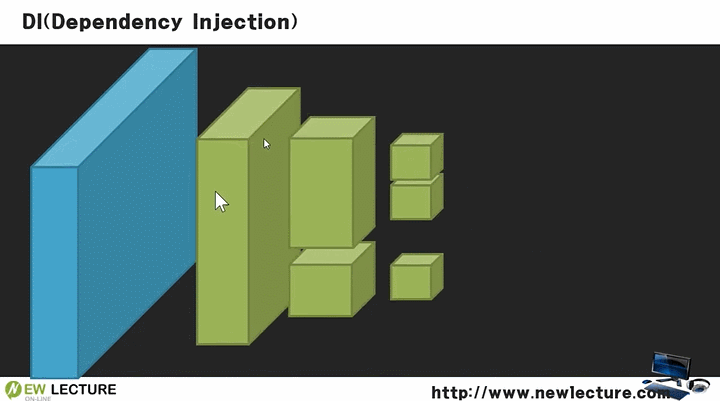

## 부품 조립하는 과정 해보기



## Code
```java
public class Program {

	public static void main(String[] args) {
		Exam exam = new NewlecExam();
		ExamConsole console = new InlineExamConsole(exam); // inline : 한 줄에 출력
		// ExamConsole console = new GridExamConsole(exam); // grid : 표 형태로 출력
		console.print();
		// ExamConsole에 Inline, Grid 두 개를 조립할 수 있음 -> DI
	}

}
```

- 코드가 변경될 때, 주석 부분처럼 소스코드 수정 없이 외부 설정 파일에서 할 수 있음
```java
ExamConsole console = ?;
// new InlineExamConsole(exam), new GridExamConsole(exam) 두개 중 조립
```

- 궁극적으로 형태를 이렇게 되며, ? 부분은 스프링에서 담당하는 것
