<table_of_contents color="gray"/>
# 1. Core Spring Security
- 핵심 개념 및 아키텍처 이해와 실전 예제로 완성하는 스프링 시큐리티 프로그래밍
## 1) 강의에서 다루는 내용
### (1) 스프링 시큐리티의 보안 설정 API 와 이와 연계된 각 Filter 들에 대해 학습
- 각 API의 개념과 기본적인 사용법, API 처리 과정, API 동작방식 등 학습
	⇒ `인증과 관련된 API, 인가와 관련된 API 등을 제공함`
- API 설정 시 생성 및 초기화되어 사용자의 요청을 처리하는 Filter 학습
	 ⇒ `API 설정 시 생성 및 초기화되는 클래스 : Filter`
### (2) 스프링 시큐리티 내부 아키텍처와 각 객체의 역할 및 처리과정을 학습한다
- 초기화 과정, 인증 과정, 인가 과정 등을 아키텍처적인 관점에서 학습
### (3) 실전 프로젝트
- 인증 기능 구현 - Form 방식, Ajax 인증 처리
- 인가 기능 구현 - DB와 연동해서 권한 제어 시스템 구현
## 2) 개발 환경, 선수 지식
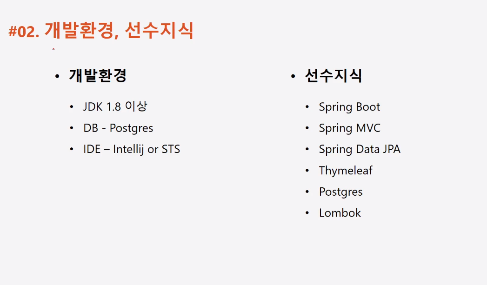
# 2. 실전 프로젝트 예제 미리보기
## 1) 보안 정책 설정
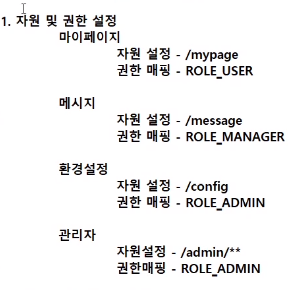
## 2) 사용자 등록 및 권한부여
## 3) 권한계층적용
- ROLE_ADMIN \> ROLE_MANAGER \> ROLE_USER
## 4) 메소드 보안 설정
### 메소드 보안 - 서비스 계층 메소드 접근 제어
- io.security.corespringsecurity.aopsecurity.AopMethodService.methodSecured
### 포인트컷 보안 - 포인트컷 표현식에 따른 메소드 접근 제어
- execution(public \* io.security.corespringsecurity.aopsecurity.\*Service.pointcut\*(...))
## 5) IP 제한하기
## 6) DEMO
- 로그인 화면
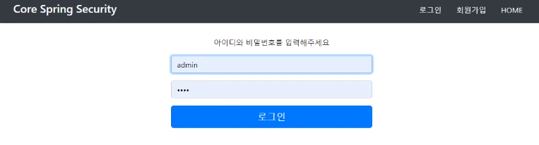
- 관리자 로그인 후 \[관리자\] 메뉴 보임
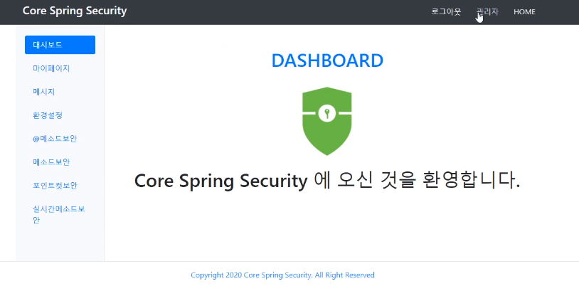
- \[관리자\] 메뉴에는 5가지 메뉴가 있고, \[사용자 관리\]에서 사용자를 관리할 수 있음
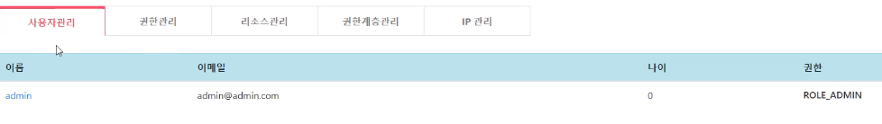
- admin 상세페이지
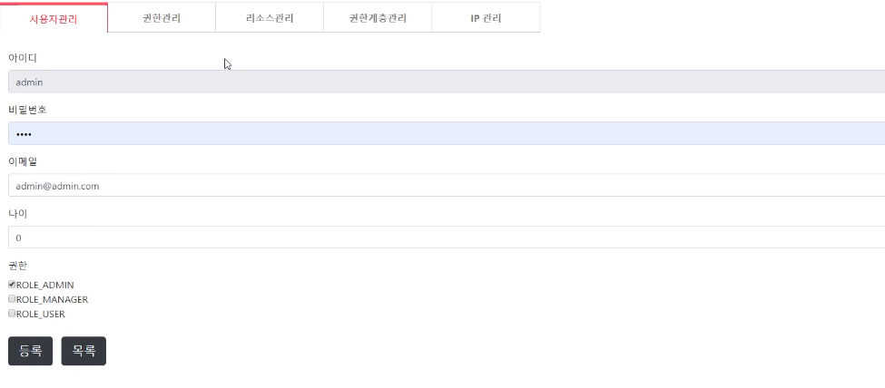
- 권한목록
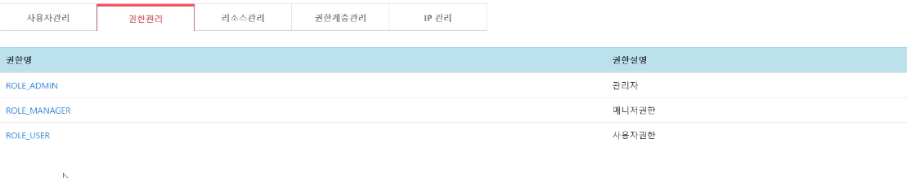
- 리소스 수정(인가 처리)
	- `/myPage` 메뉴는 ROLE_USER 권한을 가진 사람만 접근할 수 있도록 수정
	- `/messages` : ROLE_MANAGER
	- `/config` : ROLE_ADMIN
	- `/admin/**` : ROLE_ADMIN
<columns>
	<column ratio="50">
		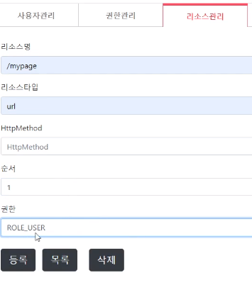
	</column>
	<column ratio="50">
		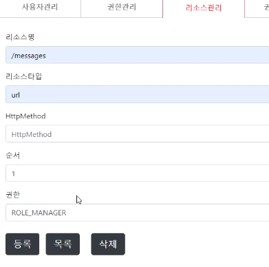
	</column>
</columns>
- 가입하기: USER, MANAGER, ADMIN 총 3명의 사용자
<columns>
	<column ratio="56.25">
		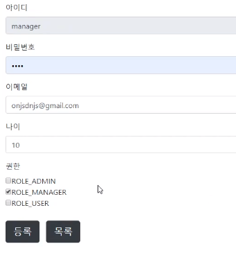
	</column>
	<column ratio="43.75">
		<empty-block/>
		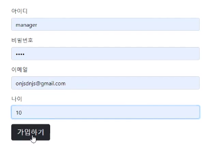
		- MANAGER 가입
		- 기본적으로 `ROLE_USER` 권한이므로 가입 후 `MANAGER ⇒ ROLE_MANAGER`로 변경하기
	</column>
</columns>
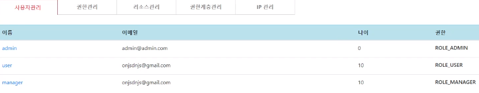
<columns>
	<column ratio="50">
		- 메소드 보안 설정
			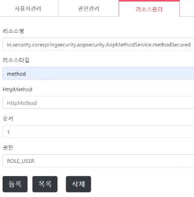
	</column>
	<column ratio="50">
		- 포인트컷 보안(포인트컷을 사용, 메서드 위에서 메서드에 보안을 설정)
			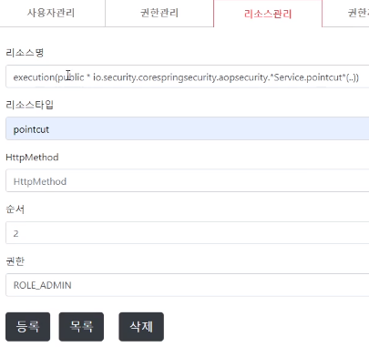
	</column>
</columns>
# 3. 스프링 시큐리티 기본 API & Filter 이해
## 1) 인증 API - 프로젝트 구성 및 의존성 추가
```java
// SecurityController.java 추가
package io.security.basicsecurity;

import org.springframework.web.bind.annotation.GetMapping;
import org.springframework.web.bind.annotation.RestController;

@RestController
public class SecurityController {

    @GetMapping("/")
    public String index() {
        return "home";
    }

}
```
```java
// pom.xml 의존성 추가 : 즉시 보안이 적용된 시스템으로 바뀌게 됨
<!-- https://mvnrepository.com/artifact/org.springframework.boot/spring-boot-starter-security -->
<dependency>
    <groupId>org.springframework.boot</groupId>
    <artifactId>spring-boot-starter-security</artifactId>
    <version>2.4.5</version>
</dependency>
```
- 실행 시, 콘솔에 다음과 같이 출력되는 것을 알 수 있음
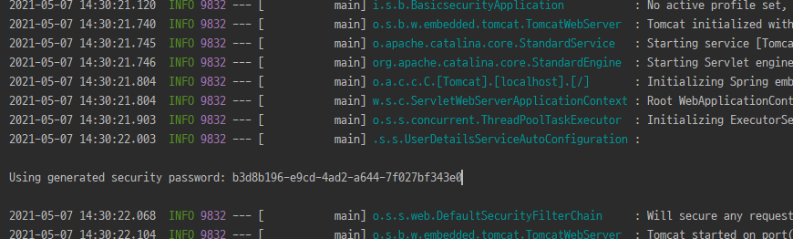
- `Username`: "user" / `Password`: Using generated security password
<columns>
	<column ratio="43.75">
		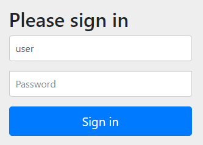
	</column>
	<column ratio="56.25">
		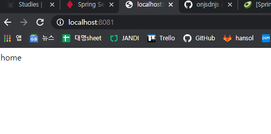
	</column>
</columns>
⇒ Username과 Password를 입력해야 /경로로 진입 가능.
### (1) 스프링 시큐리티의 의존성 추가 시 일어나는 일들
- 서버가 기동되면 스프링 시큐리티의 초기화 작업 및 보안 설정이 이루어짐
	⇒ `스프링 시큐리티가 자동적으로 실행`
- 별도의 설정이나 구현을 하지 않아도 기본적인 웹 보안 기능이 현재 시스템에 연동되어 작동함
	1. 모든 요청은 인증이 되어야 자원에 접근이 가능
	2. 인증 방식은 폼 로그인 방식과 httpBasic 로그인 방식을 제공
	3. 기본 로그인 페이지 제공
	4. 기본 계정을 1개 제공(username: "user" / password: random 문자열)
### (2) 문제점
- 계정 추가, 권한 추가, DB 연동
- 기본적인 보안 기능 외에 시스템에서 필요로 하는 더 세부적이고 추가적인 보안 기능 필요
## 2) 인증 API - 사용자 정의 보안 기능 구현
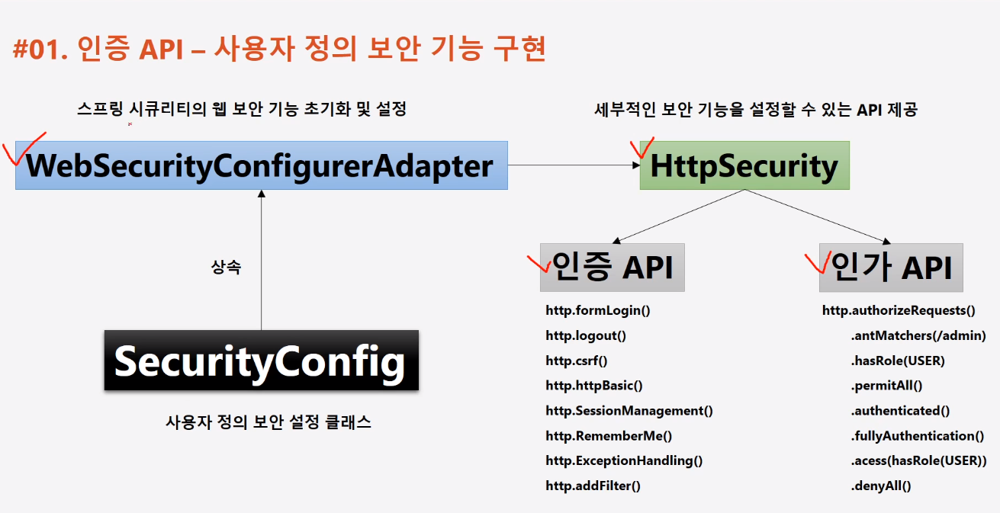
- WebSecurityConfigurerAdapter class: 초기화 시 기본적인 웹 보안 기능 활성화, 시스템에 보안 기능 작동하도록 설정, 처리
- HttpSecurity class: WebSecurityConfigurerAdapter class에서 생성됨. 세부적인 보안기능을 설정할 수 있는 API 제공.
- SecurityConfig class: 사용자 정의 보안 설정 클래스. WebSecurityConfigurerAdapter class를 상속받음으로써 HttpSecurity class에 내장된 API 등 여러 가지 기능들을 사용할 수 있음.
### 🔰 설정 클래스 만들기 - `Security2`
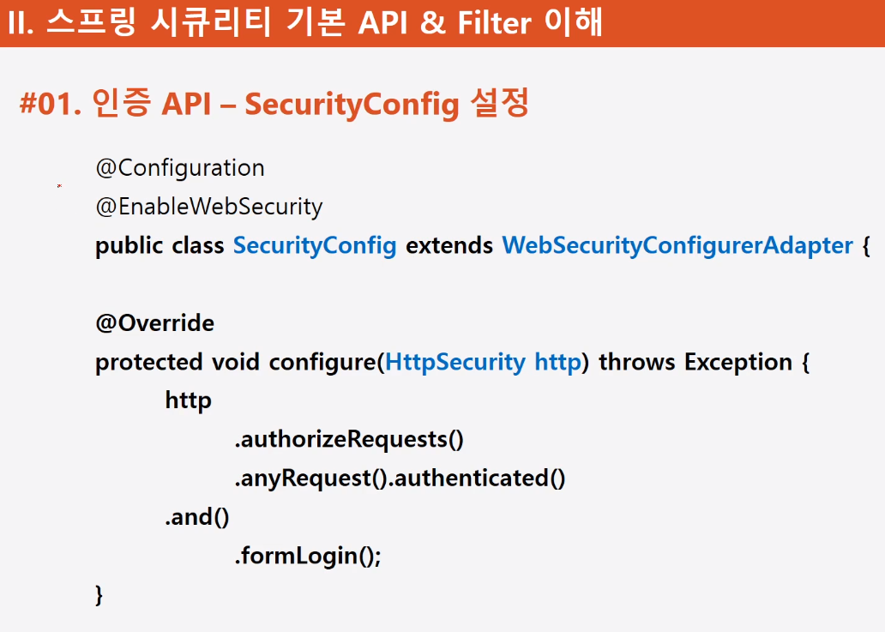
- 먼저, [WebSecurityConfigurerAdapter.java](http://websecurityconfigureradapter.java) 파일을 보자. (스프링 시큐리티가 초기화면서 호출하는 클래스)
```java
private void applyDefaultConfiguration(HttpSecurity http) throws Exception {
		http.csrf();
		http.addFilter(new WebAsyncManagerIntegrationFilter());
		http.exceptionHandling();
		http.headers();
		http.sessionManagement();
		http.securityContext();
		http.requestCache();
		http.anonymous();
		http.servletApi();
		http.apply(new DefaultLoginPageConfigurer<>());
		http.logout();
	}
```
```java
// 어떠한 요청도 인증을 받도록 처리하는 로직
protected void configure(HttpSecurity http) throws Exception {
		this.logger.debug("Using default configure(HttpSecurity). "
				+ "If subclassed this will potentially override subclass configure(HttpSecurity).");
		http.authorizeRequests((requests) -> requests.anyRequest().authenticated());
		http.formLogin();
		http.httpBasic();
	}
```
- @EnabledWebSecurity: `WebSecurityConfiguration.class`, `SpringWebMvcImportSelector.class`, `OAuth2ImportSelector.class`, `HttpSecurityConfiguration.class`등 클래스를 import해서 실행시키는 역할을 함. 이걸 설정해줘야 웹 보안이 활성화됨.
```java
@Retention(RetentionPolicy.RUNTIME)
@Target(ElementType.TYPE)
@Documented
@Import({ WebSecurityConfiguration.class, SpringWebMvcImportSelector.class, OAuth2ImportSelector.class,
		HttpSecurityConfiguration.class })
@EnableGlobalAuthentication
@Configuration
public @interface EnableWebSecurity {

	/**
	 * Controls debugging support for Spring Security. Default is false.
	 * @return if true, enables debug support with Spring Security
	 */
	boolean debug() default false;

}
```
## 3) 인증 API - Form Login 인증
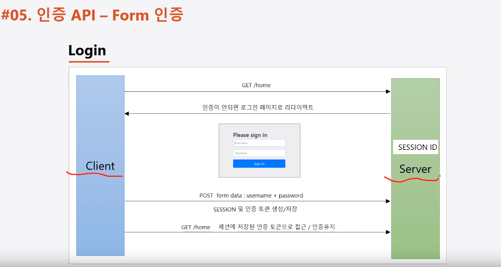
1. 사용자가 GET 방식으로 /home URL로 자원 접근 시도. (서버 자원에 접근하기 위해서는 인증된 사용자여야만 함)
2. 현재 사용자가 인증이 안 될 시, 로그인 페이지로 리다이렉트
3. 로그인 화면에서 아이디/패스워드를 입력 후 다시 POST방식으로 로그인 시도
4. 서버에서 SESSION을 생성하게 됨
5. SESSION에 최종 성공한 인증 결과를 담은 인증 토큰, Authentication 타입 SecurityContext 객체를 생성 후 저장함
6. 클라이언트에서 /home에 접근하게 되면 사용자가 가진 세션 존재여부 파악, 세션에 저장된 인증토큰으로 사용자 판단 또는 유지
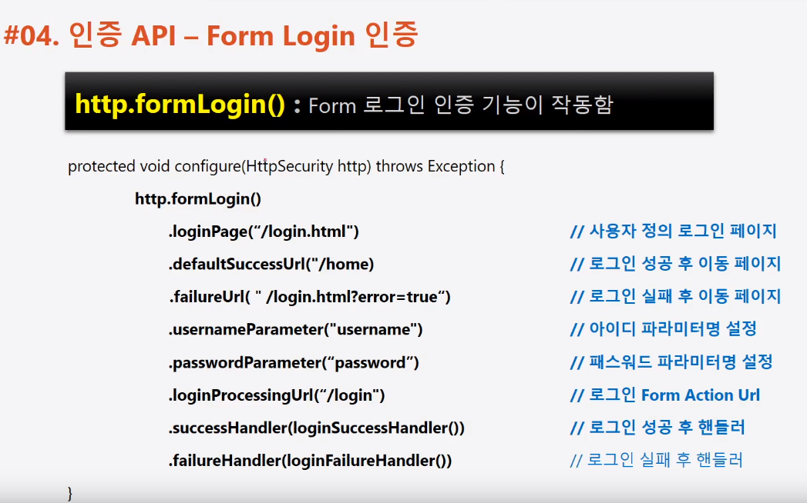
### 🔰 설정 클래스 만들기 - `Security2`
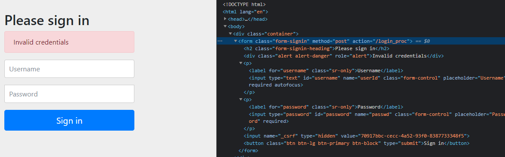
## 4) 인증 API - Form Login 인증 필터 - UsernamePasswordAuthenticationFilter
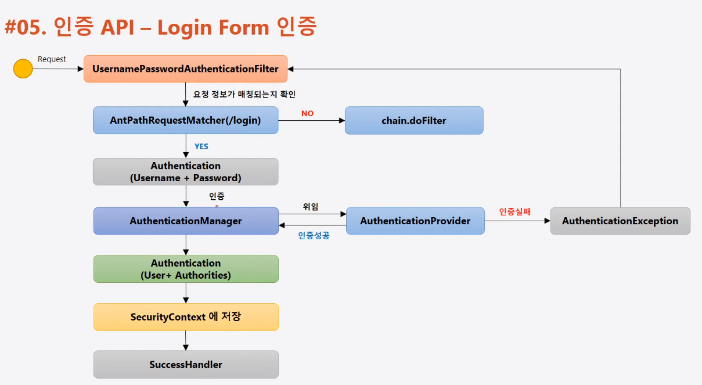
- 사용자가 인증을 시도 → `UsernamePasswordAuthenticationFilter`가 요청을 받음
- → `AntPathRequestMatcher("/login")` : 요청 정보의 url이 /login인지 검증
	→ url 정보가 매칭되면 다음 인증 처리 단계로 넘어감, 매칭되지 않으면 filter로 이동
- → .loginProcessingUrl을 변경하면 변경한 값으로 매칭하게 됨
- → 정보 일치 시, `Authentication`객체를 만들어 이 안에 사용자가 입력한 아이디/비번 정보 저장(인증 처리 전)
- → `AuthenticationManager` : 인증 처리, 내부적으로 `AuthenticationProvider` 객체들을 가지고 있는데 이 중 하나를 선택해서 인증 처리 위임.이 AuthenticationProvider가 실질적으로 인증을 담당함.
	→ 인증에 실패 시 `AuthenticationException` 발생, 필터가 이 예외를 받아서 처음으로 돌아감.
	→ 인증에 성공 시, AuthenticationProvider는 Authentication 객체(유저정보, 권한정보) 생성 또는 저장 후 AuthenticationManager에게 전달
- AuthenticationManager는 전달받은 인증 객체(User+Authorities)를 filter에게 리턴
- 이 인증 객체를 `SecurityContext`(인증 객체 보관소)에 전달해서 저장(SESSION에 저장되어 사용자가 전역적으로 Authentication 객체를 참조할 수 있음)
- `SuccessHandler`: 성공 이후 작업
### 🔰 최종적으로 리턴받은 인증 결과를 저장하고 있는 로직
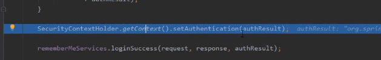
```java
// AbstractAuthenticationProcessiongFilter.java
SecurityContextHolder.getContext().setAuthentication(authResult);
```
- 해당 구문을 가지고 전역적으로 인증 객체 참조 가능
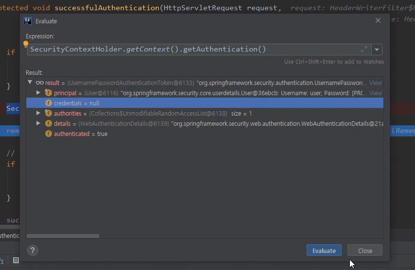
### 🔰 Filter
- 각각의 filter들은 스프링 시큐리티가 초기화되며 기본적으로 생성됨.
- 또한, 설정 클래스의 `.fromLogin()`과 같은 설정에 따라 그에 맞는 `API(0~14)`도 생성됨.
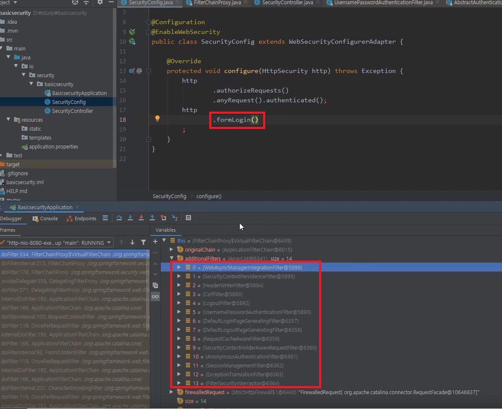
- `FilterChainProxy.java`: filter를 관리하는 빈
- FilterChainProxy는 각각의 filter를 순서대로 사용자 요청을 처리할 수 있도록 호출해 줌. (순서대로, 각각의 filter가 임무를 다 하면 다음 filter로 넘어가 처리)
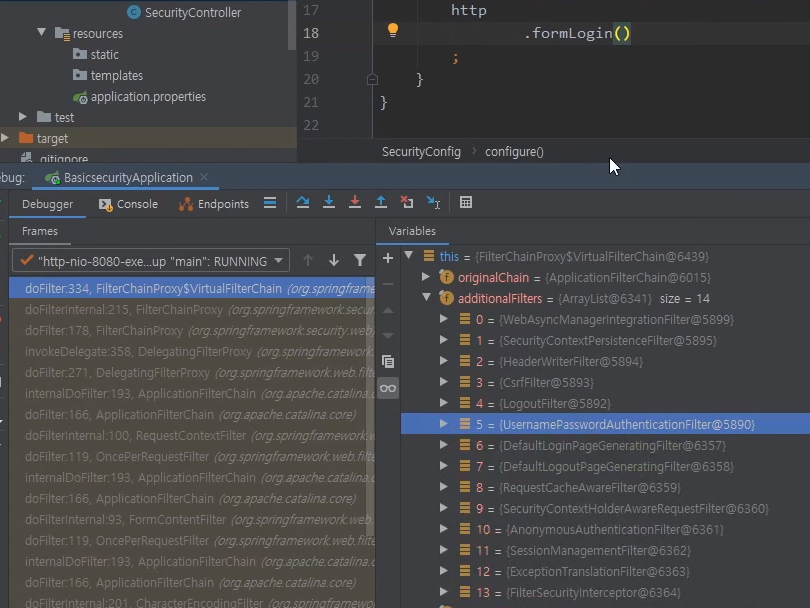
- EX) UserNamePasswordAthenticationFilter가 현재 로그인 시도 요청을 처리하는 filter가 됨.
- ⇒ 즉, FilterChainProxy가 사용자 요청을 가장 먼저 받고, 각각의 필터를 호출하면서 인증 또는 인가 처리.
## 5) 인증 API - Logout처리, LogoutFilter
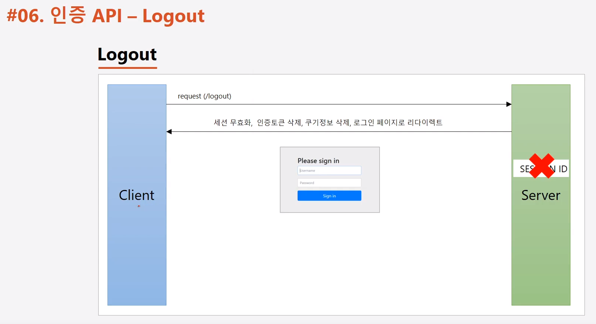
- Client에서 로그아웃 요청 → 스프링 시큐리티가 요청을 받아 로그아웃 처리를 하게 됨.
- → 세션 무효화, 인증토큰 삭제, 인증토큰이 저장된 SecurityContext 삭제, 쿠키정보 삭제, 로그인 페이지로 리다이렉트
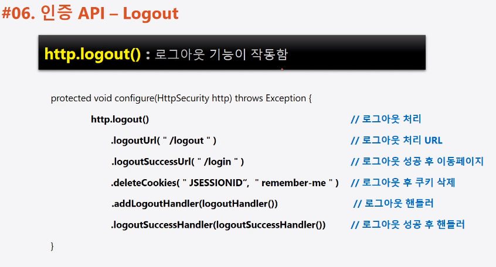
- `.logoutUrl("/logout")`: from action에 기재되는 주소로, 보통 로그아웃 시 로직 태울 때 사용하는 url
### 🔰 실습 - `Security3`
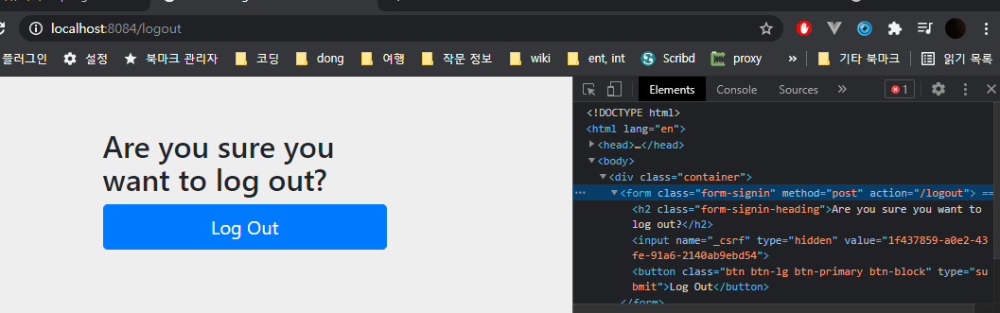
### 🔰 LogoutFilter
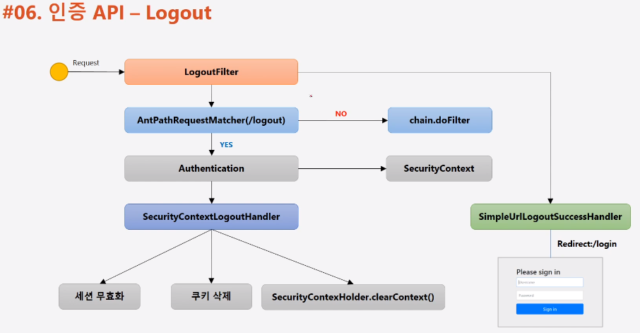
- 사용자의 로그아웃 요청 → LogoutFilter가 (POST 방식으로) 받아서 처리
- → `AnthPathRequestMatcher`: "/logout" 주소와 매칭되는지 검사
- → `Authentication` 객체는 `SecurityContext`로부터 인증 객체를 꺼내 LogoutHandler에게 전달
- → LogoutFilter가 가진 Handler중 `SecurityContextLogoutHandler`가 세션 무효화, 쿠키 삭제, 인증 객체 null 초기화 등 처리
- → 모든 과정이 완료되면 LogoutFIlter는 `SimpleUrlLogoutSuccessHandler`를 호출해서 /login 페이지로 이동
### 🔰 실습 분석
- 로그인 후 /logout으로 진입했을 때
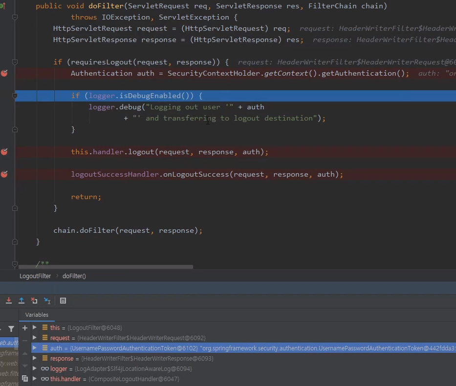
- `auth`: 인증 객체
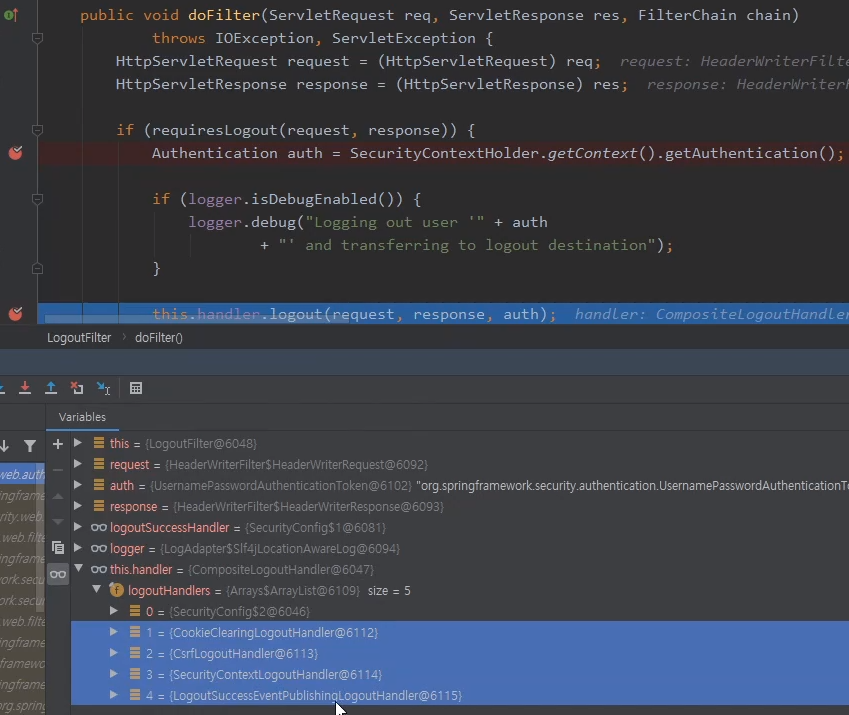
- `logoutHandler`는 5개의 핸들러를 가지고 있음
## 6) 인증 API - Remember Me 인증
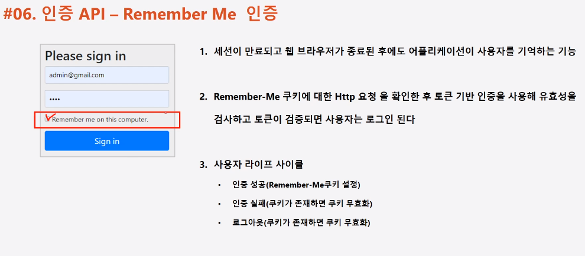
- rememberMe를 활성화시킨 경우, 서버에서 사용자의 rememberMe 쿠키를 응답 header에 실어 보내게 됨.
- 이후 세션이 만료되었을 때, 사용자가 rememberMe 쿠키를 가지고 서버에 접근할 경우, 서버는 requestHeader에 담아 보낸 사용자의 쿠키 확인 후 이를 이용해 토큰 기반 인증을 거침.
- 사용자의 rememberMe 쿠키 유효성 검사 후 서버에서 발급한 토큰과 일치하면 자동으로 로그인 됨.
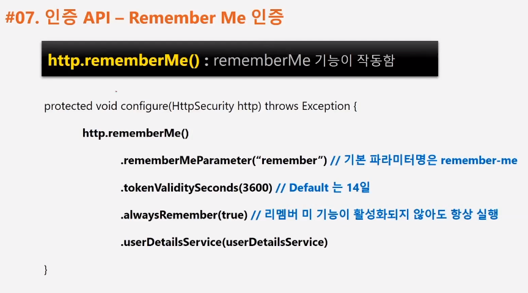
- `alwaysRemember()`: 보통 false가 기본값
- `userDetailsSservice()`: 시스템에 있는 사용자 계정 조회할 때 사용하는 설정, rememberMe 인증 시 반드시 필요함
### 🔰 실습 - `Security4`
- 인증되었다: 스프링 시큐리티에서 그 사용자의 세션이 생성됨, 그 세션이 성공한 인증객체를 담고 있음
- 클라이언트는 JSESSION 아이디를 응답 header에 실어 보냄 ⇒ 서버에서 JSESSION아이디와 매칭되는 세션을 꺼내 SecurityContext(⊃ Authentication) 인증객체가 올바른지 금증
### 1. 일반적으로 로그인 했을 때
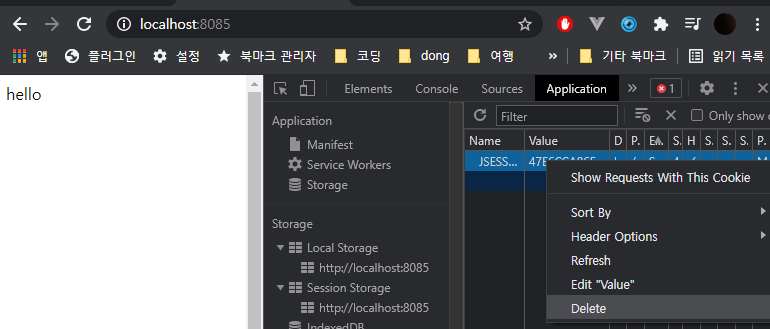
- rememberMe 체크 없이 일반 로그인 후, JSESSIONID를 수동 삭제하면 로그인 화면으로 다시 돌아가게 됨.
### 2. rememberMe 체크 후 로그인 했을 때
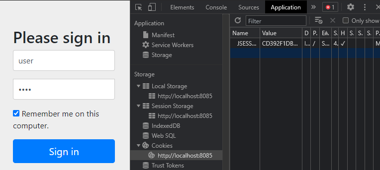
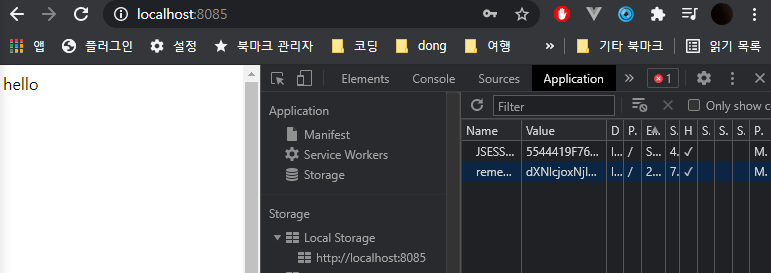
- 서버가 remember라는 이름으로 쿠키 발급함.
- 이 때, 1에서 한 것처럼 JSESSIONID를 삭제하고 새로고침 해도 로그아웃 되지 않음. ⇒ 인증을 받지 않아도 계속적으로 사이트에 접속 가능. (remember라는 쿠키가 있기 때문)
## 7) 인증 API - RememberMe 인증 필터: RememberMeAuthenticationFilter
### 🔰 RememberMeAuthenticationFilter가 작동되는 경우
1. Authentication이 null이어야 RememberMe 가능(인증 객체가 없는 경우)
- 사용자 인증 객체는 항상 SecurityContext(⊃ Authentication)에 저장되는, 이게 null일 경우는,
	1) 세션 만료.
	2) 세션이 끊겨 SecurityContext가 존재하지 않음.
	⇒ 이 두가지 경우에 RememberMeAuthenticationFilter가 동작함(인증 객체가 존재하는 경우는 굳이 동작할 필요가 없으니까)
2. 사용자가 rememberMe 쿠키를 가지고 오는 경우.
- 사용자가 from인증을 받고, rememberMe 쿠키를 받은 경우, 사용자의 세션은 무효되었지만 서버의 requestHeader에 rememberMe 쿠키값을 가졌기 때문에 로그인 유지 가능.
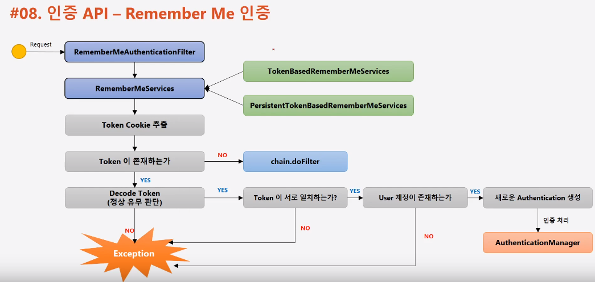
- 사용자의 요청을 `RememberMeAuthenticationFilter`에서 처리하게 됨.
- `TokenBasedRememberMeServices`: 메모리에 저장된 토큰과 사용자가 요청했을 때 들고 온 쿠키를 비교할 때 사용.
- `PersistentTokenBasedRememberMeServices`: DB에 토큰 저장하는 영구적인 방식. 이 토큰을 클라이언트의 토큰 값과 비교.
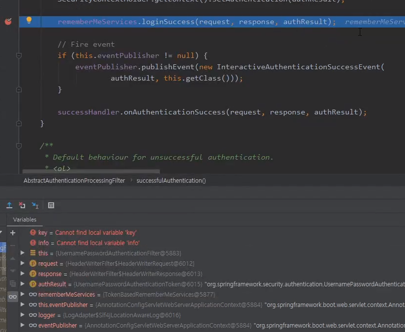
- RememberMe를 체크하고 로그인을 시도했을 때, response에 rememberMe 쿠키값을 담아서 보냄.
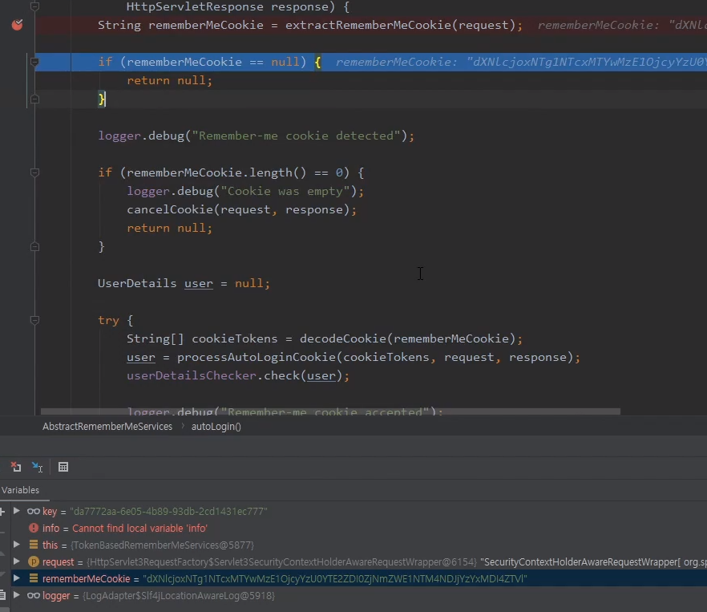
- 발급받은 쿠키값을 확인할 수 있음.
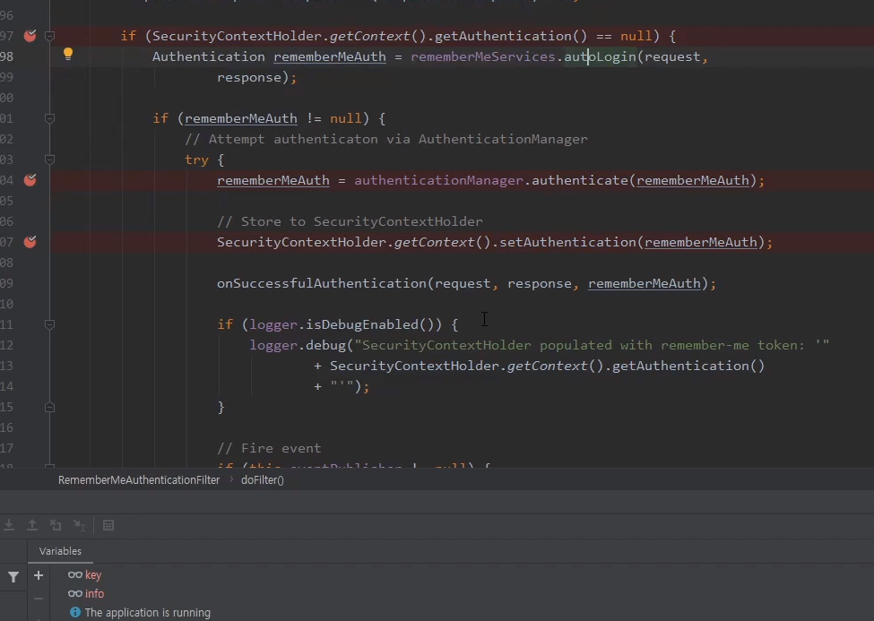
- 인증객체를 세팅하는 로직
## 8) 인증 API - 익명 사용자 인증 필터 : AnonymousAuthenticationFilter
- 인증 과정: 어떤 사용자가 인증을 받음 → session에 사용자의 user 객체를 저장
	→ 사용자가 어떤 자원에 접근하려고 하면, 사용자의 user 객체를 검증
	→ user 객체가 null 이면 인증을 받지 않은 사용자, null이 아니면 인증되었으므로 자원에 접근 가능.
- `AnonymousAuthenticationFilter`는 null로 처리하는 것이 아닌, 별도의 익명 사용자용 익명 객체를 만들어서 처리한다는 점이 차이점.
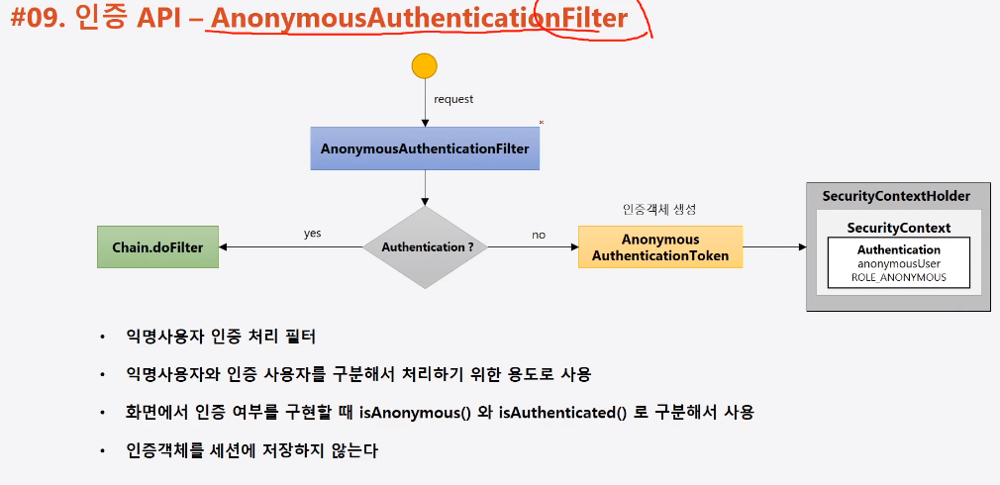
- 사용자가 요청 → `AnonymousAuthenticationFilter`가  요청을 받음
	→ `Authentication ?`: 인증객체가 존재하는지의 여부 판단
	→ 인증 객체가 없으면 `AnonymousAuthenticationToken`을 생성(null 이 아님)
	→ `SecurityContextHolder` 안에 익명 사용자용 인증 객체를 저장
- 스프링 시큐리티는 여러 필터에서 사용자가 익명사용자인지 등의 조건을 검사, 그 때 SecurityContext 안에 있는 토큰 타입으로 검증.
	⇒ 단순히 인증을 받지 못했을 때, null 아닌 익명사용자로 판단하기 위함.
```java
http
    .authorizeRequests()
    .anyRequest()
    .authenticated();

http
    .formLogin();
```
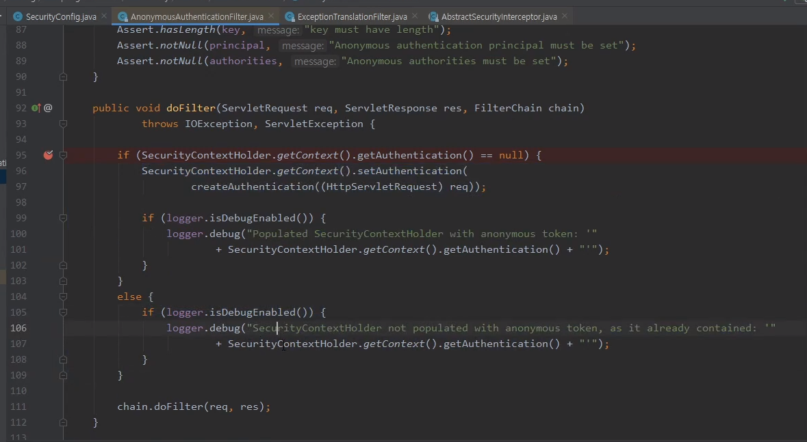
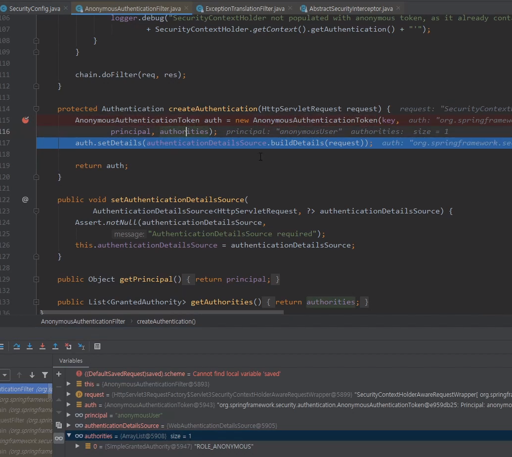
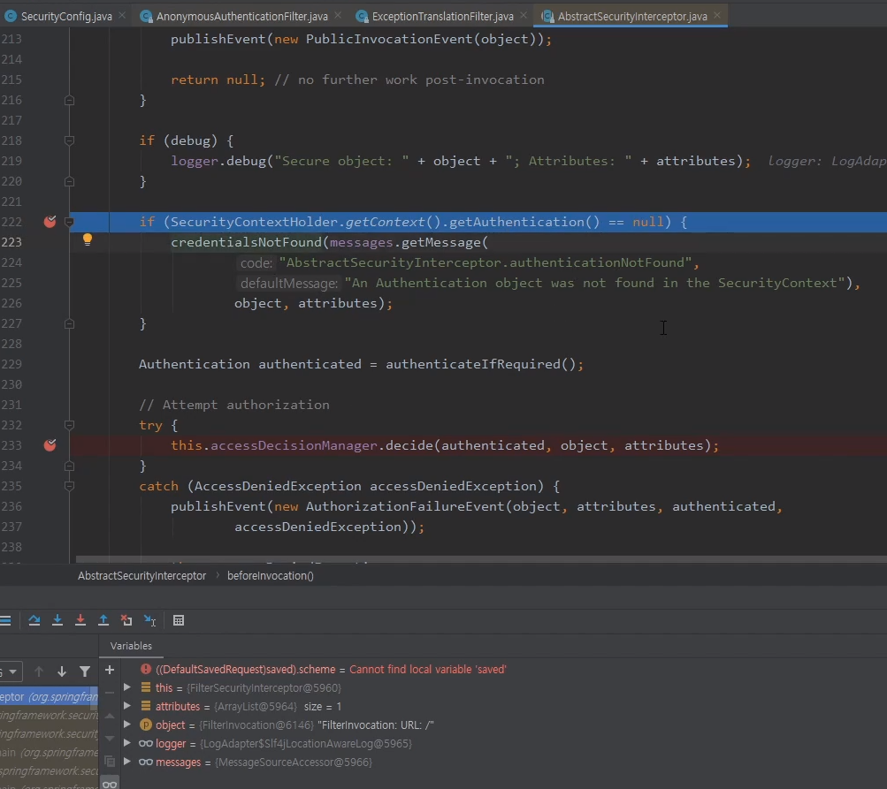
## 9) 인증 API - 동시 세션 제어 / 세션고정보호 / 세션 정책
### (1) 동시 세션 제어
- 현재 동일한 계정으로 인증을 받을 때, 생성되는 세션의 허용 갯수가 초과되었을 경우, 해당 세션을 어떻게 유지할 수 있는가?
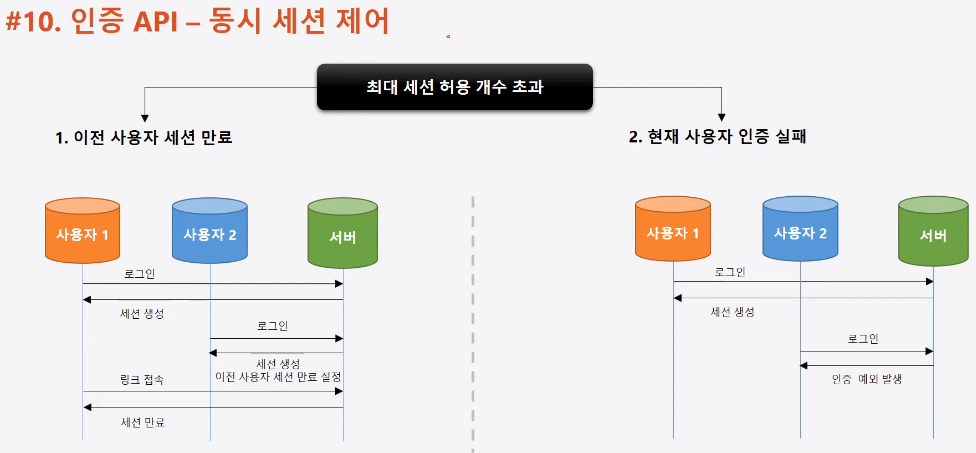
- 최대 세션 허용 개수가 1개인 경우
	① 이전 사용자 세션 만료
	- 첫 번째 사용자가 로그인 후 두 번째 사용자가 로그인 했을 때, 첫 번째 사용자가 어떤 자원에 접근하려고 할 때 세션을 만료시킴. (사용자 2의 세션은 유효함)
	② 현재 사용자 인증 실패
	- 사용자1이 로그인 후, 사용자2가 로그인 하려고 하면 사용자2의 로그인을 차단시킴.
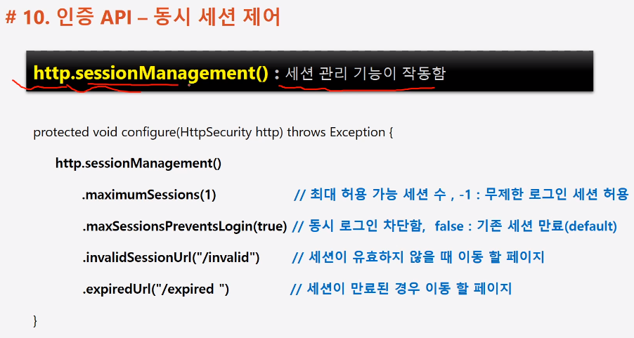
### 🔰 실습 - `Security5`
1. 첫 번째 사용자 로그인 후, 두 번째 사용자 로그인을 막는 방식
- 로그인 후, 다른 브라우저에서 또 로그인 하려고 하면 해당 화면이 뜨게 됨
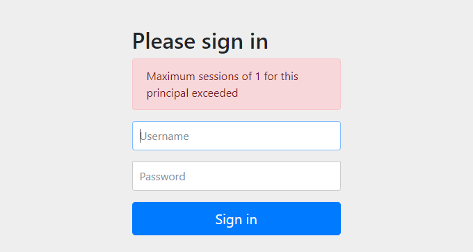
2. 첫 번째 사용자, 두 번째 사용자 로그인 후 첫 번째 사용자 세션을 만료 방식
- 첫 번째 사용자 새로고침 후 다음 오류 메세지 출력
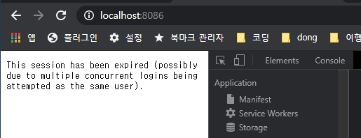
### (2) 세션 고정 보호

- `세션 고정 공격`: 공격자가 중간에 JSESSIONID를 탈취해서, 사용자와 쿠키를 공유할 수 있음 ⇒ 이를 방지하기 위해 스프링 시큐리티에서 `세션 고정 보호` 제공.
- `세션 고정 보호`: 사용자가 공격자가 심어놓은 JSESSION으로 인증한다 하더라도, 인증할 때마다 새로운 세션이 생성되면, 새로운 쿠키가 생성됨 ⇒ 공격자가 심어놓은 JSESSION는 더 이상 사용자의 JSESSION와 맞지 않음.

- `.sessionFixation().changeSeessionId()`: 세션은 그대로, 세션ID만 바뀜(서블릿 3.1에서 기본값)
	- `migrateSession`: 새로운 세션 생성, 세션 JSESSIONID 바뀜(서블릿 3.1 이하 기본값) 
	- `newSession`: 새로운 세션 생성, JSESSIONID 바뀜(이전 세션에서 설정한 속성값을 사용하지 못하고, 새롭게 설정해야 함 / 나머지 둘은 사용 가능)
### 🔰 실습 - `security6`
### ✔ 세션 고정 보호가 없다면?
```java
@Configuration
@EnableWebSecurity
public class SecurityConfig extends WebSecurityConfigurerAdapter {

  @Autowired
  UserDetailsService userDetailsService;

  @Override
  protected void configure(HttpSecurity http) throws Exception {
    http
        .authorizeRequests()
        .anyRequest()
        .authenticated();

    http
        .formLogin();

    http
        .sessionManagement()
        .sessionFixation().none() // none 옵션
        ;
  }

}
```
- 두 개의 브라우저를 켜서 하나의 브라우저의 JSESSIONID를 다른 브라우저의 JSESSIONID에 복사 후 로그인

- 그 후 다른 브라우저도 새로고침하면 로그인하지 않았는데도 바로 로그인 됨

- 쿠키값도 여전히 동일함

### ✔세션 보호 고정 적용한 경우
```java
http
  .authorizeRequests()
  .anyRequest()
  .authenticated();

http
  .formLogin();

http
  .sessionManagement()
  .sessionFixation()
//        .none() // none 옵션
  .changeSessionId()
  ;
```
- 쿠키도 바뀜

### (3) 세션 정책

- `Stateless`: JWT 토큰 방식 등. 세션을 사용하지 않고 토큰에 저장해서 인증받는 방식을 사용할 때 설정.
## 11) 인증 API - 세션 제어 필터 : SessionManagementFilter, ConfurrentSessionFilter
### ✔ SessionManagementFilter

### ✔ ConfurrentSessionFilter

- SessionManagementFilter, ConfurrentSessionFilter는 동시적 세션 제어 처리를 위해 서로 연계함.
### 🔰 어떻게 동시적 세션 처리를 위해 연계하는가?

- 사용자 로그인
	→ `SessionManagementFilter`
	→ (이미 현재 사용자와 동일한 계정으로 인증 시도, 세션이 생성된 상태)
	→ (최대 세션 개수1개라고 가정)
	→ `session.expireNow()`로 이전 사용자 세션 즉시 만료시킴.
- 이전 사용자가 서버에 접속
	→ `ConcurrentSessionFilter`가 매 요청마다 사용자의 세션 만료 여부를 체크 
	→ SessionManagementFilter 안에서 이전 사용자 세션 만료 설정을 참조
	→ 세션이 만료되도록 설정이 되어 있으면, 즉시 세션 만료 후 로그아웃, 오류 페이지 응답
### 🔰 전반적인 세션 관련 기능들의 처리과정

- USER1, USER2 : 동일한 계정 사용자 / 최대 세션 허용개수 1개라고 가정
- USER1 로그인(인증) 시도
	→ `UsernamePassword`가 처리
	→ 1. `ConcurrentSessionControl` 호출(세션 카운트0)
	→ 2. `ChangeSessionId`: 세션 고정 보호(새로운 세션, 쿠키 발급)
	→ 3. `RegisterSession`: 사용자의 세션을 등록, 저장(세션 카운트 1)
- USER2 로그인(인증) 시도
	→ `UsernamePassword`가 처리 
	→ 1. `ConcurrentSessionControl` 호출(세션 카운트가 이미 1)
	→ **(인증 실패 전략인 경우)** `SessionAuthenticationException` 인증 예외 발생, 인증 실패
	→ **(USER1 세션 만료 전략인 경우) **
	→ 2. `ChangeSessionId`: 세션 고정 보호(새로운 세션, 쿠키 발급)
	→ 3. `RegisterSession`: 사용자의 세션을 등록, 저장(세션 카운트 2)
	→ USER1이 자원에 접근하는 경우, `ConcurrentSessionFilter`가 체크, 세션 만료시킴
<callout icon="💡" color="gray_bg">
	**`ConcurrentSessionFilter`****는 매순간 세션 체크함**
</callout>
### 🔰 실습 - `Security7`

- 첫 사용자 로그인 시, 세션 카운트 수 : 0

- 두번째 사용자 로그인 시, 세션 카운트 수 : 1

- `.maxSessionsPreventsLogin()`의 파라미터가 true, false 냐에 따라 바뀜
	- true: USER1 로그인 성공, USER2 로그인 실패
	- false: USER1 로그인 성공, USER2 로그인 성공, USER1 자원 접속 시 세션만료 후 로그아웃
## 11) 인가 API - 권한 설정 및 표현식


- `.antMatcher()`: ()안의 경로로 접근할 때만 해당 클래스의 보안 기능 작동. 특정 url(자원 경로)에 대한 설정. 생략 시 모든 요청에 대해 보안 검사함.
- `.antMatchers()`: ()안의 경로로 접근하는 각각의 모든 요청에 대해서,
	- `.permitAll()`: 모두 인가 허용.
	- `.hasRole("USER")`: USER 권한을 가진 사람만 허용.
	- `.access()`: 구체적 권한 설정.
- `anyRequest().authenticated()`: 그 외는 인증을 받은 사람만 허용.
<callout icon="💡" color="gray_bg">
	**`.antMatchers()`****는 위에서부터 아래로 해석하기 때문에, 먼저 오는 url 주소가 마지막 url보다 더 구체적이어야 함.**
</callout>

- `anonymous()`: 인증된 사용자가 익명 사용자가 접근할 수 있는 권한에 접근할 수 없음. 예를 들어, ROLE_USER 권한을 가진 사람이 ANONYMOUS에 접근 불가. 그야말로 익명 사용자 전용 표현식.
- `hasRole()`: role에 해당하는 prefix 사용 불가.
- `hasAuthority()`: prefix 사용해야 됨.
- `hasAny~()`: 하나만 존재해도 접근 허용.
### 🔰 메모리 방식으로 사용자 3개 생성 후 권한 부여 실습 - `Security8` 
- user 계정은 [http://localhost:8089/user](http://localhost:8089/user)에 접근 가. /admin, /admin/pay 불가
- sys: [http://localhost:8089/admin](http://localhost:8089/admin)만 가능, /user, /admin/pay는 안 됨.
```java
// 둘의 위치를 바꾼다면?
// 1)
.antMatchers("/admin/pay").hasRole("ADMIN")
.antMatchers("/admin/**").access("hasRole('ADMIN') or hasRole('SYS')")

// 2)
.antMatchers("/admin/**").access("hasRole('ADMIN') or hasRole('SYS')")
.antMatchers("/admin/pay").hasRole("ADMIN")
```
- 2)의 경우 `.antMatchers("/admin/**").access("hasRole('ADMIN') or hasRole('SYS')")`가 먼저 실행되기 때문에, SYS권한자는 /admin/pay에 접근 가능함.
- `.antMatchers("/admin/pay").hasRole("ADMIN")`까지 가지 않음. 위 로직이 해당 로직을 포함하기 때문.
## 13) 인증/인가 API - 예외 처리 및 요청 캐시 필터 : ExceptionTranlationFilter, RequestCacheAwareFilter

- `ExceptionTranslationFilter`: 인증 예외, 인가 예외가 throw되는 예외
- `AuthenticationException`: 인증 예외
	→ 인증 예외가 발생하면, `AuthenticationEntryPoint` 호출
	→ 예외가 발생하기 전에 사용자가 요청했던 정보를 저장 후 로그인 페이지로 리다이렉트
	→ 로그인 인증 성공 후 가고자했던 페이지로 이동.
- `AccessDeniedException`: 인가 예외
	→ 권한 예외가 발생했을 때, `AccessDeniedHandler` 호출해서 예외 처리

1. **사용자가 /user 자원에 접근 시도(인증을 받지 않고 시도한다고 가정)**
	→ `FilterSecurityInterceptor`에서 인가 예외를 발생시킴
	→ 익명 사용자인 경우, `ExceptionTranlationFilter` 에서 `AcessDenidedHandler`로 보내지 않고,
	→ `AuthenticationException`으로 보냄
	→ `AuthenticationEntryPoint`으로 간 후
		→ 1) 인증 객체(SecurityContext)를 null로 만들고 인증을 다시 하도록 로그인 페이지로 보냄.
		→ 2) 예외가 발생하기 이전 사용자의 요청관련 정보 저장.
2. 사용자가 /user 자원에 접근 시도(인증을 받았지만, 권한이 없다고 가정)
	→ `FilterSecurityInterceptor`에서 인가 예외를 발생시킴
	→ `ExceptionTranslationFilter` → `AccessDeniedException`
	→ `AccessDeniedHandler` 여기서 보통 '자원 접근 권한이 없습니다'라는 메세지를 띄워줌
	→ 리다이렉트
### 🔰 시큐리티가 제공하는 예외 처리 API

- `http.exceptionHandling()`을 설정하면 `ExceptionTranslationFilter`가 동작함.
- `authenticationEntryPoint`: commens라는 메소드를 가지고 있음. 이 메소드를 사용해서 설정한 다음 인증 예외 발생 후 처리를 할 수 있음(보통은 로그인 페이지로 이동하게 되어있음)
### 🔰 실습 - `Security8`

- 인증 객체를 null로 만드는 로직

- redirectURI: 가고자했던 url
```java
// 주석 시 - 로그인 이후 가고자 했던 곳에 감(루트 경로로 접근)
.authenticationEntryPoint(new AuthenticationEntryPoint() {
  @Override
  public void commence
	(HttpServletRequest request
		HttpServletResponse response,
		AuthenticationException authException) throws IOException, ServletException {
    response.sendRedirect("/login");
		// AuthenticationEntryPoint()를 직접 구현했기 때문에 스프링 시큐리티 로그인 페이지가 아닌, 내가 만든 곳으로 이동
  }
})
```

- /admin으로 가려고 할 때: 인가가 되지 않았기 때문에 denied 페이지로 옴.

- savedRequest 객체가 null이 아닌 경우 계속 참조할 수 있도록 하는 filter(미리 캐싱된 정보를 담은 request 객체들을 계속해서 활용할 수 있음)
## 11) Form 인증 - 사이트 간 요청 위조 - CSRF, CsrfFilter
### 🔰 CSRF 방지 Filter

- 클라이언트에 랜덤 토큰 발급 후, 클라이언트가 서버에 접속할 때, 서버가 발급한 토큰을 가지고 와야 스프링 시큐리티에서 검증.

- 사용자가 쇼핑몰에 접속했을 때, csrfFilter 작동, 사용자에게 토큰 발급
	→ 쇼핑몰에 접속할 때마다 토큰 검증, 일치 시 수락
	→ 공격자가 공격한다고 해도, csrf 토큰이 없으므로 요청 수락하지 않음
### 🔰 실습 - `Security10`
### ✔ CSRF Filter 활성화(기본값)


### ✔ CSRF Filter 비활성화

- filterChainProxy가 가지고 온 filter 목록 중 csrfFilter를 찾아볼 수 없음.
- csrf를 검사하지 않고 바로 자원에 접근시킴.
- 스프링 form 태그, 타임리프(뷰 템플릿)의 post 방식으로 요청할 때 자동으로 csrf 토큰 생성해 줌.
- JSP는 form 태그에 _csrf와 같은 hidden 파라미터 값으로 설정해야 정상적인 요청이 이루어짐.
# 4. 스프링 시큐리티 주요 아키텍처 이해
## 1) 위임 필터 및 필터 빈 초기화 - DelegatingFilterProxy, FilterChainProxy

- `ServletFilter`: 어떤 요청이 있을 때, 그 요청은 Servlet으로 가서 요청에 대한 작업을 처리하게 되는데, 이 전에 ServletFilter를 거치게 됨. Servlet 자원에서 처리가 끝나면, 클라이언트에게 응답. 이 전에 다시 Filter가 받아서 거침. 즉, 작업 전과 후에 어떤 처리를 할 수 있도록 사용.
	⇒ 요청 → `Filter` → Servlet
	⇒ Servlet → `Filter` → 응답
- ServletFilter는 `서블릿 컨테이너`에서 생성, 실행됨. 때문에, Spring(`스프링 컨테이너`)에서 사용되는 기술을 Servlet에서 사용할 수 없음.
- Spring Security는 사용자의 모든 요청을 Filter 기반으로 인증, 인가 처리하고 있음. 그런데, Filter에서도 스프링에서 사용하는 기술을 사용할 필요를 느낌.
- 그래서, Filter기반으로 보안 처리하게 되고, 이 Filter는 스프링의 기술을 사용. 스프링 시큐리티는 Spring Bean을 만든 후 Servlet Filter를 구현하게 됨.
- 결론적으로, 사용자가 요청하게 되면 servlet기반으로 동작하기 때문에, 이걸 먼저 Servlet Filter가 받은 후 Bean과 연동함. (바로 servlet → bean 불가)
- 이 과정을 만족시키기 위해 존재하는 클래스가 `DelegatingFilterProxy`(Servlet Filter)

- Spring Bean으로 생성되는 클래스

- `Servlet Container`와 `Spring Container`는 완전히 다른 영역
- Servlet Continer : 서블릿 스펙을 지원하는 컨테이너
- Spring Container : 스프링 컨테이너에서 생성되는 bean들을 관리하는 영역
- 사용자 요청 → Servlet Container에서 가장 먼저 요청을 받음 → 각각의 Filter들이 처리하게 됨
	→ 그 중 DelegationFilterProxy가 요청받아 전달 받은 요청 객체를 특정한 bean(`FilterChainProxy`)을 찾아 요청 위임
	→ FilterChainProxy는 요청에 대해 각각의 Filter 보안 처리 → 최종 자원(DispatcherServlet)에 요청 전달
### 🔰 실습
- DelegatingFilterProxy에 필터 등록

- targetBeanName으로 등록됨

- bean 영역

## 2) 필터 초기화와 다중 보안 설정

- `SecurityConfig1`, `2`: `WebSecurityConfigurerAdapter` 클래스를 상속받아 각각의 인증, 인가 api를 설정한 사용자 정의 보안 기능.
- SecurityConfig1, 2 각각 보안 기능이 작동.
- http.antMatcher("/admin/\*\*")이라고 했을 때, 이건 SecurityConfig1에 있는 기능이므로 이 클래스에서 작동.
- SecurityConfig1, 2 각각의 필터가 생성됨.
- 두 개의 설정 클래스가 동시적으로 운영될 수 있음.
<columns>
	<column ratio="37.5">
		
	</column>
	<column ratio="62.5">
		- 초기화 시, <span color="brown">**`SecurityFilterChain`**</span> 클래스의 객체 안에 개발자가 설정한 `필터`가 담김.
		- `http.antMatcher("/admin/**")`에 담긴 정보가 <span color="blue">**`RequestMacher`**</span>라는 변수에 담기게 됨.
		
		- Filter와 RequestMacher가 담긴 클래스의 객체가 생성됨.
		- 각각의 생성된 객체는 <span color="brown">**`FilterChainProxy`**</span>가 <span color="brown_bg">**`SecurityFilterChains라는`**</span>** **리스트 변수에 저장함. (초기화 시점에서)
	</column>
</columns>
- 사용자가 `/admin` url로 요청 → `FilterChainProxy`가 요청을 받음 → `SecurityConfig1`, `2` 중에 어떤 필터를 사용할지 판단 → 각각의 객체가 가진 `RequestMatcher`와 매칭이 되는지 확인 → `SecurityConfig1`의 필터 정보를 가져와 처리
### 🔰 FilterChainProxy가 요청을 처리할 필터를 선택하는 과정

- RequestMatcher에 저장된 정보와 매치되는 것을 찾음. → 인증/인가 처리
### 🔰 실습 - `Security11`
```java
@Configuration
@EnableWebSecurity
public class SecurityConfig extends WebSecurityConfigurerAdapter {

  @Override
  protected void configure(HttpSecurity http) throws Exception {
    http
        .antMatcher("/admin/**")
        .authorizeRequests()
        .anyRequest().authenticated() // admin에 접근하는 모든 사용자가 인증을 받아야 함
        .and()
        .httpBasic() // 인증 방식
    ;
  }

}

@Configuration
class SecurityConfig2 extends WebSecurityConfigurerAdapter {

  protected void configure(HttpSecurity http) throws Exception {
    http
        .authorizeRequests() // admin 요청 제외, 어떤 요청에도 이 설정 클래스의 보안 기능이 동작
        .anyRequest().permitAll() // 인증을 받지 않아도 자원 접근 가능 인가정책
        .and()
        .formLogin() // 인증 방식
    ;
  }

}
```
```java
// 오류 : 
Caused by: java.lang.IllegalStateException: @Order on WebSecurityConfigurers must be unique. Order of 100 was already used on com.example.security11filter.SecurityConfig$$EnhancerBySpringCGLIB$$496c5e21@76f10035, so it cannot be used on com.example.security11filter.SecurityConfig2$$EnhancerBySpringCGLIB$$b20d0a65@4f8caaf3 too.
```
- `@Order`를 추가해야 함
```java
@Configuration
@EnableWebSecurity
@Order(0)
public class SecurityConfig extends WebSecurityConfigurerAdapter {

  @Override
  protected void configure(HttpSecurity http) throws Exception {
    http
        .antMatcher("/admin/**")
        .authorizeRequests()
        .anyRequest().authenticated() // admin에 접근하는 모든 사용자가 인증을 받아야 함
        .and()
        .httpBasic() // 인증 방식
    ;
  }

}

@Configuration
@Order(1)
class SecurityConfig2 extends WebSecurityConfigurerAdapter {

  protected void configure(HttpSecurity http) throws Exception {
    http
        .authorizeRequests() // admin 요청 제외, 어떤 요청에도 이 설정 클래스의 보안 기능이 동작
        .anyRequest().permitAll() // 인증을 받지 않아도 자원 접근 가능 인가정책
        .and()
        .formLogin() // 인증 방식
    ;
  }

}
```
<callout icon="💡" color="gray_bg">
	✔** order는 우선순위기 때문에, 첫번째 순서인 클래스에서 인가정책이 통과되면 두번째까지 안 감. **<br>⇒ 이 예시에서 만약 서로의 순서를 바꾼다면, /admin 접속 시도 시 httpBasic이 아닌 formLogin 방식이 됨.<br>✔ **즉, 구체적인 방식이 보다 더 우선순위가 높아야 함.**
</callout>
- `SecurityFilterChains` 리스트 변수에 생성된 `SeucityConfig1`, `2`를 확인할 수 있음

- /admin으로 접속하면 httpBasic인증 방식 화면이 뜸

## 3) 인증 개념 이해 - Authentication

- `Authentication`: 인증, 또는 인증 주체를 담은 인터페이스(저장소, 토큰 개념)
- `principal`: Object 타입
- `credentials`: 자격 증명

- 사용자가 아이디, 비밀번호 입력 후 로그인
	→ `UsernamePasswordAuthenticationFilter`에서 정보 받아서 아이디, 비밀번호 추출
	→ `Authentication` 객체 생성 후 `principal` 속성에 아이디, `credential`에 비번 저장
	→ `AuthenticationManager`가 인증 객체를 가지고 인증 처리 총괄(인증 실패 시 예외 발생)
	→ (성공 시) `Authentication` 객체 다시 생성 후 `principal`에 최종 성공 아이디, `credential`에 최종 성공 비번 저장
	→ `SecurityContextHolder` 내 `SecurityContext` 안에 `Authentication`객체를 저장.
### 🔰 실습
- 코드

- 디버깅 모드로 서버 실행 후 로그인
- 인증 처리를 위해 인증 필터로 진입

- 사용자가 입력한 아이디, 패스워드 출력 후 구현체에 담아 전달, 인증 처리 맡김

- `UsernamePasswordAuthenticationToken`은 파라미터의 종류에 따라 두 가지 생성자가 있음

- 인증된 객체 저장 후 전역에서 이런 식으로 꺼내 쓸 수 있음

## 4) 인증 저장소 - SecurityContextHolder, SecurityContext

- `SecurityContext` ⊃ `Authentication` ⊃ `User객체`
- `ThreadLocal`
	- 스레드마다 고유하게 할당된 저장소. 스레드 간 공유가 되지 않고, 각 스레드에게만 할당됨. 
	- get, set, remove라는 API가 있음. get 할 때 장소에 구애받지 않음.
	- 즉, 다른 장소에서 get하면 A메소드에서 set한 데이터를 B메소드에서 쓸 수 있음.
	<empty-block/>
- `SecurityContextHolder`: SecurityContext를 감싸고 있는 클래스.
	- `MODE_INHERITABLETHREADLOCAL`: 원래 메인 스레드, 자식 스레드 각각 자기만의 ThreadLocal이 있어서 서로 간 데이터 공유가 안 됨. `MODE_INHERITABLETHREADLOCAL`을 사용함으로써 메인 스레드와 자식 스레드 간 SecurityContext를 공유할 수 있음.
	- `MODE_CLOBAL`: ThreadLocal 방식이 아닌 Static 변수에 SecurityContext 저장. 하나의 변수에서 SecurityContext를 참조.
- `SecurityContextHolder.getContext().getAuthentication()`: 어떤 메소드 내에서도 SecurityContext 객체를 꺼내 쓸 수 있음.

- 사용자 로그인 시도
	→ Server에서 로그인 요청 받고 하나의 Thread를 생성 → 이 Thread 마다 ThreadLocal이 할당됨
	→ Thread가 인증 처리 → 인증 필터가 Authentication 객체 생성해서 저장 후 인증
		→ (`인증 실패 시`) 인증 객체 초기화
		→ (`인증 성공 시`) SecurityContextHolder안에 최종 인증 객체 저장
			(ThreadLocal이 SecurityContext를 담고 있음)
		→ HttpSession에 SecurityContext 저장
### 🔰 실습 - `Security12`

- ThreadLoacl 객체 선언

- 실행: authentication1에 담긴 정보를 확인할 수 있음.

- authentication1, 2 두 개의 객체가  @6000으로 동일함(동일한 객체라는 것)

- 메인 스레드, 자식 스레드 인증 객체 공유
```java
SecurityContextHolder.setStrategyName(SecurityContextHolder.MODE_INHERITABLETHREADLOCAL);
```

## 5) 인증 저장소 필터 - SecurityContextPersistenceFilter

1. 익명 사용자: 인증을 하지 않은 채 자원에 접근하는 사용자. 새로운  SecurityContext 객체를 생성.
2. 익명 사용자가 인증을 할 경우: 새로운 SecurityContext 객체를 생성.
3. 익명 사용자 인증 후: 새로운  SecurityContext 객체를 생성하지 않음. 이미 저장되어있는 session에서 SecurityContext를 참조.
4. 최종 응답 시 공통: 매 요청마다 SecurityContextHolder안에 SecurityContext를 저장하기 때문에, 응답 시 SecurityContextHolder안에 SecurityContext를 삭제.
- `SecurityContextPersistenceFilter`는 새로운 SecurityContext 객체를 생성해서 SecurityContextHolder에 저장함. (인증 후에는 session에서 꺼내서 저장)
- SecurityContextPersistenceFilter가 인증 후에 SecurityContextHolder에 저장한 SecurityContext 객체를 다음, 혹은 다다음 Filter에서 계속해서 참조가 가능함. 

- 사용자 요청
	→ `SecurityContextPersistenceFilter`는 매 요청마다 요청을 처리(인증을 하든, 받았든, 익명사용자든)
	→ `HttpSecurityContextRepository`는 SecurityContext를 생성, 조회하는 클래스임.
	→ (인증 전일 경우) SecurityContext가 null이므로, 새롭게 생성
		→ 그 다음 인증 필터로 이동
		→ 인증 성공 후 인증 필터가 SecurityContextHolder내에서 SecurityContext 객체 안에 인증에 성공한 Authentication 객체를 저장.
		→ 최종적으로 클라이언트에게 응답할 때, 그 시점에 SecurityContextPersistenceFilter가 session에 SecurityContext를 저장.
		→ SecurityContext를 SecurityContextHolder에서 제거시킴.
		→ 클라이언트에게 응답.
	→ (인증 후일 경우) session에서 SecurityContext 객체가 있는지 확인함.
	→ session에 저장된 SecurityContext를 꺼내 SecurityContextHolder에 저장함.
	→ 다음 필터로 이동.
### 🔰 요약

- `SecurityContextPersistenceFilter`는 인증을 받기 전에는 새로운 `SecurityContext`를 생성함.
- 이 때, `SecurityContextHolder`안에 `ThreadLocal`이 생기고, 그 안에 SecuriyContext가 위치하는 구조임. 이 시점에서는 인증을 받기 전이므로 인증 객체 Authentication은 null.
- 인증이 성공하면, SecurityContextHolder ⊃ ThreadLocal ⊃ SecurityContext안에 최종 성공한 인증 객체 Authentication 정보를 저장.
- 이 이후로는 session으로부터 이 Authentication 객체를 꺼내와서 SecurityContextHolder에 담음.
### 🔰 실습
- HttpSecurityContextRepository

1. 익명 사용자
	
	- session에 인증 객체가 존재하는지 검사
	
	- 없으면 새로운 SecurityContext 생성
	
	- 익명 사용자용 토큰을 만들어 기본적인 정보를 담아 저장함
2. 인증 전
	
	- 아이디, 비번을 치고 접속해도 아직 인증 전이므로 session에 인증 객체가 없음
	
	- 새 SecurityContext를 만들고 다음 필터로 이동.
	
	- 인증 후 session에 인증 객체를 저장함
	
	- SecurityContextHolder를 삭제 후 클라이언트에 응답.
3. 인증 후로 나눠 테스트
	
	- SecurityContext를 새로 생성하지 않고 session에서 가져온 후 SecurityContextHolder에 저장
	- 이후 인증된 사용자로 판된되고, 인증을 계속적으로 유지하게 됨.
	
	- SecurityContextHolder 삭제는 매 요청마다 반복됨
## 6) 인증 흐름 이해 - Authentication Flow

- 클라이언트 로그인
	→ Form Login 인증방식을 사용할 때 `UsernamePasswordAuthenticationFilter` 작동.
	→ 사용자 로그인 요청을 받아 Authentication 인증 객체 생성, 아이디 패스워드 정보 저장.
	→ 인증 객체를 `AuthenticationManager`에 전달해 인증 관리를 담당하게 함. 클래스 내 리스트에 존재하는 AuthenticationProvider중 적절한 것을 선택해서 인증 처리 위임.
	→ 아이디 패스워드 검증은 `AuthenticationProvider`에서 함(실제 인증 역할)
	→ 아이디 검증은 LoadUserByUserName(username)과 같은 메소드를 호출해 `UserDetailsService` 인터페이스에 유저 객체 요청
	→ findById로 유저 객체가 있는지 검증
	→ 예외가 발생하게 되면 Repository에서 UsernamePasswordAuthenticationFilter에서 FailHandler에 관련된 예외를 처리하게 됨.
	→ ID가 검증되면 유저 객체 반환받음
	→ 패스워드 검증(일치하지 않을 시 BadCredential 예외 발생)
	→ 패스워드 검증 성공 시 `AuthenticationProvider`에서 최종 성공한 인증 객체를 `AuthenticationManager`에게 전달
	→ 인증 객체는 `SecurityContext`에 저장되며, 전역적으로 사용 가능
### 🔰 실습(생략)

- Form인증 방식으로 로그인 했을 때 해당 필터를 거침

## 7) 인증 관리자 : AuthenticationManager

## 8) 인증 처리자 : AuthenticationProvider

## 9) 인가 개념 및 필터 이해 : Authorization, FilterSecurityInterceptor
## 10) 인가 결정 심의자 - AccessDecisionManager, AccessDecisionVoter
## 11) 스프링 시큐리티 필터 및 아키텍처 정리
# 5. 실전 프로젝트 - 인증 프로세스 Form 인증 구현
## 1) 실전 프로젝트 생성

## 2) 정적 자원 관리 - WebIgnore 설정
## 3) 사용자 DB등록 및 PasswordEncoder
## 4) DB 연동 인증 처리(1) : CustomUserDetailsService
## 5) DB 연동 인증 처리(2) : CustomAuthenticationProvider
# 색인과 출처
- [https://www.inflearn.com/course/코어-스프링-시큐리티/dashboard](https://www.inflearn.com/course/%EC%BD%94%EC%96%B4-%EC%8A%A4%ED%94%84%EB%A7%81-%EC%8B%9C%ED%81%90%EB%A6%AC%ED%8B%B0/dashboard)
- [https://github.com/onjsdnjs](https://github.com/onjsdnjs)
- `loadUserByUsername`
	- [https://dublin-java.tistory.com/31](https://dublin-java.tistory.com/31)
- `순환참조`
	- [https://perfectacle.github.io/2019/06/23/auto-scanning-annotation-based-bean/](https://perfectacle.github.io/2019/06/23/auto-scanning-annotation-based-bean/)
	- [https://hungrydiver.co.kr/bbs/detail/develop?id=90](https://hungrydiver.co.kr/bbs/detail/develop?id=90)
- `302`
	- [https://netframework.tistory.com/entry/REST-API-구성시-Spring-Security-구현](https://netframework.tistory.com/entry/REST-API-%EA%B5%AC%EC%84%B1%EC%8B%9C-Spring-Security-%EA%B5%AC%ED%98%84)
	- [https://nsinc.tistory.com/168](https://nsinc.tistory.com/168)
- `optional`
	- [https://engkimbs.tistory.com/646](https://engkimbs.tistory.com/646)
- `settings`
	- [https://mangkyu.tistory.com/77](https://mangkyu.tistory.com/77)
