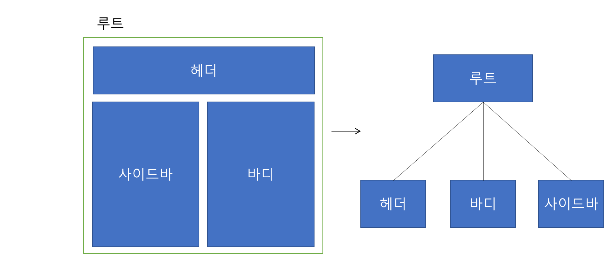
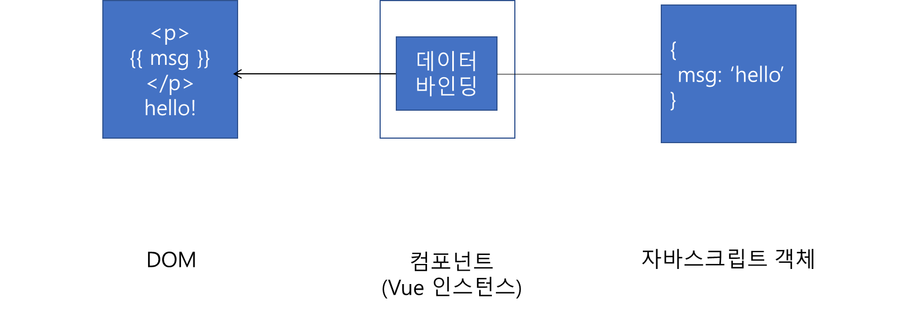
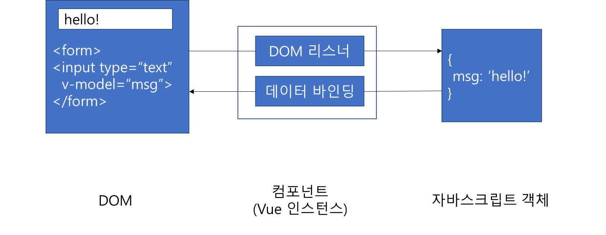
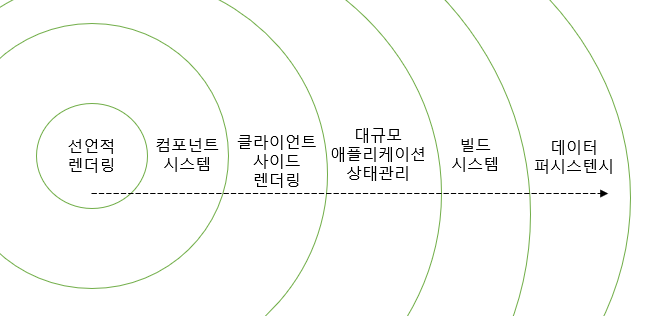
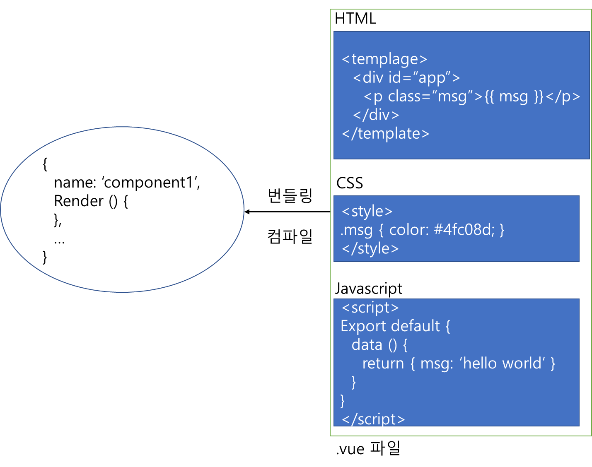
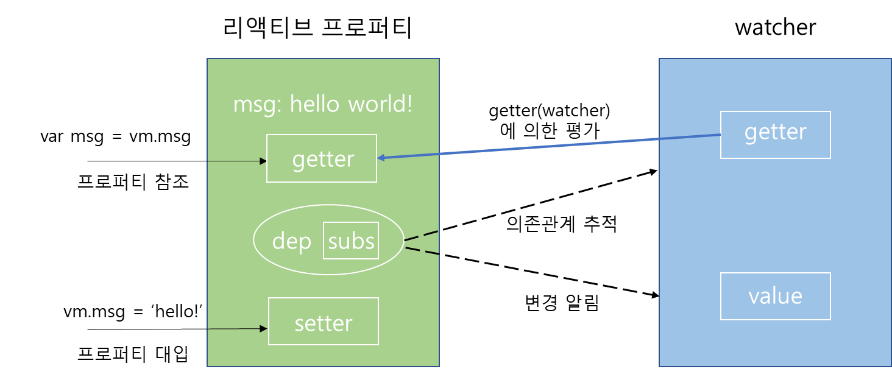
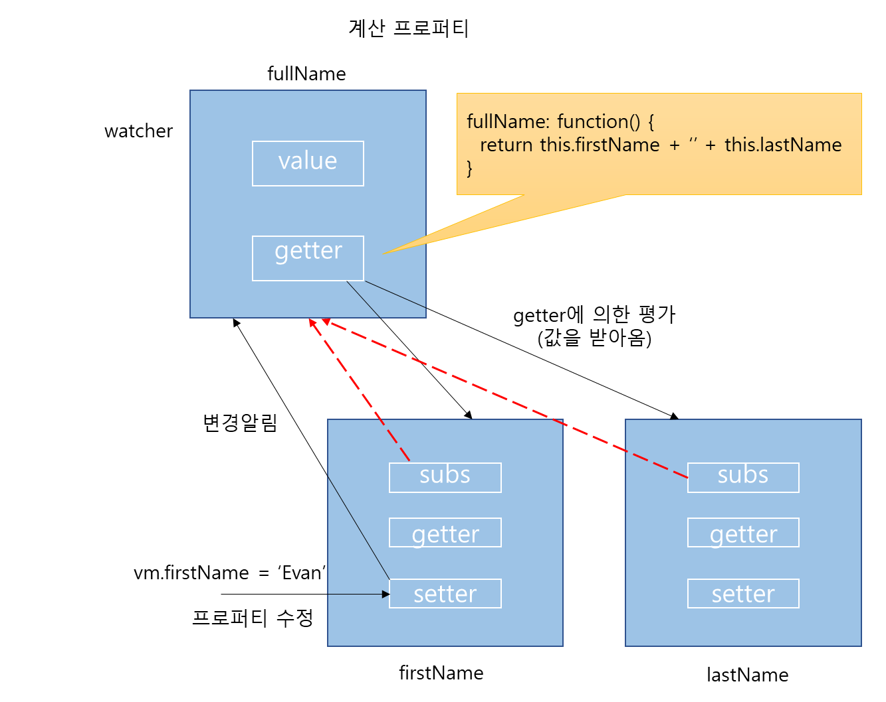
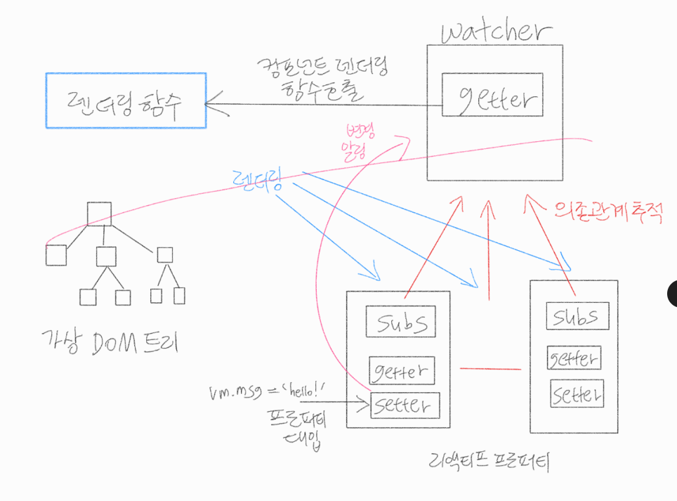
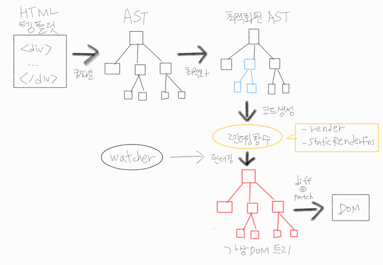

# 01. 프로그레시브 프레임워크 vue.js
- vue.js는 뷰 레이어에 특화된 라이브러리
- 웹 페이지의 위젯, 관리화면의 대시보드 등 사용자의 눈에 실제로 보이는 영역 중 인터랙티브한 콘텐츠를 다룸
- 관련 라이브러리와 조합해 사용하면 프레임워크로도 사용 가능
- MVVM 패턴의 영향을 받은 설계 채택 ⇒ 대규모 애플리케이션 개발에도 사용 가능
- 프로그레시브 프레임워크 설계 사상: 애플리케이션의 규모와 상관없이 단계적 유연한 적용 가능
- 대규모 시스템에서의 적용: 단계적으로 필요한 기능 및 라이브러리 조합, 덧붙여 나가는 스타일의 개발 가능
## 1.1 복잡해진 모던 웹 프런트 엔드 개발
- 2018 모던 웹 프런트 엔드 개발: 고도화, 복잡화
- 단일 페이지 애플리케이션 중심, 프런트 엔드에서 복잡한 처리를 맡는 경우 증가
- 에플리케이션 데이터플로 설계, 라우팅, 유효성 체크 등 기존 백 엔드 역할 → 프런트 엔드로 이전
- 기존 시각적 효과를 사용하는 것이 주였던 자바스크립트 → 최근 용도 증대 ⇒ 개발 개념, 도구 함께 복잡해지는 경향 증가
- 웹 프런트 엔드의 역사

| 1990 | 2000 | 2010 ~ 2018 |
|---|---|---|
| 웹 등장 | 서버 사이드 기반 웹 애플리케이션 프레임워크 탄생 | AltJS 등장 |
| 웹 브라우저에 자바스크립트/CSS 지원 추가 | AJAX 등장 | 웹 프런트엔드 라이브러리/프레임워크 등장 |
| CGI등장 | jQuery 등장 | Babel, ESlint, Webpack 등의 다양한 도구 등장 |
| | html5 등장 | |
| | Node.js 등장 | |

### 1.1.1 웹의 탄생과 웹 기반 시스템의 발전
- 웹은 1991년 인터넷상에 처음 등장
- 탄생 초기: 문서 열람만을 목적, 인터랙티브 콘첸트 구현 불가
- 1990년 후반 css와 자바스크립트가 웹 브라우저에 탑재 → 주로 문서를 꾸미는 용도
- 같은 시기, CGI로 대표되는 서버사이드 프로그래밍 기술 등장

	→ 데이터베이스 이용 및 데이터 관리, 서버 html 렌더링, 클라이언트(웹 브라우저)를 거쳐 만들어지는 사용자 인터페이스 가능 ⇒ 고전적 웹 시스템 탄생

- 웹 브라우저를 프레젠테이션 계층으로 삼는 웹 기반 3계층 아키텍처 시스템 등장
- 웹 기반 3계층 아키텍처

| | 프레젠테이션 계층 | | 비즈니스 계층 | | 데이터 계층 |
|---|---|---|---|---|---|
| (http 요청) → | 웹 서버 | → | 애플리케이션 서버 | → | 데이터베이스 서버 |
| ← (http 응답) | CGI | ← | | ← | |
| | <http 관련 처리> | | <비즈니스 로직 처리> | | <데이터 접근 관련 처리> |

- 서버 사이드는 CGI 로부터 계속 진화함
- 로비 온 웨일즈로 대표되는 MVC 기반 웹 애플리케이션 프레임워크도 등장
### 1.1.2. AJAX의 등장
- 2005년 구글의 지도 서비스 구글 맵스 출시

	→ 페이지 이동 없이 웹 브라우저에서 지도를 확대 및 축소하는 기능 제공

	→ 자바스크립트 이용, 서버와 비동기로 통신하는 기술 AJAX를 사용해 구현

	→ 같은 페이지 안에서 콘텐츠를 빠르고 인터랙티브하게 변화시킴

	⇒ 데스크톱 애플리케이션과 같은 인터랙티브한 애플리케이션을 웹 브라우저에서도 구현할 수 있다는 것을 입증

- AJAX 등장 이후, 클라이언트 사이드에서는 DOM을 정교하게 조작하는 기능 필요
- 이런 필요에 따라 jQuery 등 인기
- 서버 사이드 분야는 웹 서버가 HTML 렌더링을 넘어 RESTFUL 기반 웹 API를 제공
- AJAX와 웹 API를 통해 리치 웹 기반 업무 시스템, 웹 서비스 보급
- 이때부터 서버 사이드, 클라이언트 사이드의 역할이 나뉨
- 클라이언트 사이드는 웹 프론트엔드로 확립됨
- AJAX의 등장 이후 웹 프론트엔드 개발 본격화
- 2000년대 말, HTML5와 ECMAscript를 증심으로 웹 진화, Node.js  등장 이후 한층 더 복잡해짐
### 1.1.3. HTML5, Node.js, ES2015, React 이후의 세계
- 2010S년대, 계속 웹 고도화, 복잡화 경향
### HTML5, Node.js, ES2015, React의 4가지 기술의 관점
1. HTML5의 등장, 웹 애플리케이션 플랫폼화
	- HTML5는 2014년에 권고안이 나온 표준 규격
	- HTML 문법 표준 뿐 아니라, 웹 전체 규격을 새롭게 하는 흐름
	- HTML5에서는 웹이 일종의 애플리케이션 플랫폼으로 기능할 수 있도록 HTML/CSS, DOM API 규격 변화시킴
	- History API 덕분에 페이지 이동을 웹 브라우저 대신 자바스크립트로 핸들링 할 수 있게 됨

		→ 화면 이동 없이 URL과 히스토리 관리, 전환 ⇒ 단일 페이지 애플리케이션

		⇒ 사용자에게 네이티브 애플리케이션과 동등한 사용자 경험 제공

	- HTML5 등장, 라이브러리 진화, 클라이언트 사이드에서 더 많은 것 표현 가능
	- 프레젠테이션 레이어의 프로그램: 서버 사이드 → 클라이언트 사이드로 옮겨 옴
	- 기존: HTML 렌더링을 서버에서 수행
	- 웹 API로 데이터를 받아올 수 있게 된 이후: 클라이언트 사이드에서도 HTML 렌더링 가능

		⇒ 화면 이동이 적음 / 더 뛰어난 사용자 경험 제공 가능

2. Node.js와 자바스크립트 생태계 진화
	- 2009년, Node.js 등장
	- Node.js는 서버사이드 기술 → 프론트엔드 분야에도 두 가지 큰 변화를 가져 옴
		1. 자바스크립트 실행 환경이 브라우저를 벗어남
			- Node.js는 프론트엔드 개발과 테스트에 매우 유용한 환경
			- 자바스크립트 개발의 질을 비약적으로 향상시킴
		2. 패키지 관리자/패키지 리포지토리인 npm 보급
			- 자바스크립트로 구현된 라이브러리를 npm을 통해 사용 가능
			- 모듈(패키지) 사용 가능/개발된 산출물을 다시 모듈화, npm을 통해 배포
			- 서버사이드와 클라이언트 사이드를 막론, 자바스크립트 애플리케이션은 Node.js를 이용해 개발 및 npm을 통해 배포
3. ES2015와 프로그래밍 언어로서의 진화
	- 웹 프론트엔드 개발 고도화 중 문제: 자바스크립트의 빈약한 언어 기능 → ES2015 등장
	- ES2015는 자바스크립트 역사상 가장 큰 규모의 업데이트
	- 문법 확장, const, let 사용
	- Babel: 새로운 규격을 브라우저에 구현하려는 수요에 대응해 자바스크립트를 자바스크립트로 번역하는 컴파일러

		→ 차세대 문법을 따른 자바스크립트 코드를 해당 규격이 구현되지 않은 브라우저에 사용할 수 있는 자바스크립트 코드로 변환

4. React 등 프론트엔드 라이브러리의 출현
	- 애플리케이션 데이터플로를 프런트 엔드로 가져오기, DOM을 웹 API와 연동시키기: jQuery 등을 사용해서는 구현하기 어려운 설계
	- MVC 같은 애플리케이션 구조를 지원하는 프레임워크의 필요성 대두 → Backbone.js, AngularJS 등 새로운 웹 애플리케이션 프레임워크 및 라이브러리 출현
	- 페이스북인 개발한 React, Flux 출현
		- React: 뷰 라이브러리 → React 중심 개발 스타일은 가상 DOM 이용, DOM 조작을 빠르게 수행 / JSX(React 템플릿 문법)사용
		- Flux: 애플리케이션 아키텍처 → 혼란스러워지기 쉬운 아키텍처에 방향성 제시 / Redux라는 아키텍처 겸 라이브러리로 발전, 계승
	- JSX, 데이터플로에 대한 지식, 라이브러리 선택 및 학습, 모듈화, 빌드, 정적 분석, 테스트 등 개발 환경 구축 과정 필요 대두

> 💡 AltJS의 등장
>
> - ES2015 전후로 자바스크립트로 변환할 수 있는 AltJS 프로그래밍 언어 등장
> - 커피스크립트(더 간결한 문법 지향), 타입스크립트(주석 형태로 타입 지정)가 유명

### 1.1.4. 현재 당면 과제와 vue.js
- HTML5 이후 웹이 애플리케이션 플랫폼으로 가능하게 되며 API가 고도화
- Node.js 생태계 발전, 개발 환경 구축 난이도 증가
- ES2015 이후 문법 보강, 학습 내용 증가
- React 이후 프론트엔드 개발 프레임워크화, 학습 비용 증가
- 프런트 엔드 문제점, 그에 따른 변화 정리

| 시기 | 프런트 엔드의 역할 | 서버의 역할 | 자바스크립트 라이브러리/프레임워크 |
|---|---|---|---|
| 웹 시스템 시대 | 외관 꾸미기 | HTML 생성 | 없음 |
| AJAX 시대 | AJAX 중심 인터렉션 | HTML 생성 + API | jQuery, prototype.js |
| 현재 | 애플리케이션 프레젠테이션 전반 | API | vue.js, React, Angular |

## 1.2. vue.js 특징
- 뷰만을 다루는 단순한 라이브러리
- 사용자가 보는 웹 페이지 내용 중, 화면 처리를 위해 사용되는 jQuery와 비슷한 측면 있음
- 본체 뿐 아니라 관련 라이브러리도 vue.js 공식 프로젝트의 일부로서 개발 및 관리됨
- 라이브러리 조합으로 종합 프레임워크 처럼 사용 가능
### 1.2.1. 낮은 학습 비용
- vue.js에서 제공하는 API는 매우 단순
- UI를 구성하는 데 HTML 기반 평범한 템플릿 사용
- 자바스크립트 코트, HTML 렌더링 템플릿 코드
	```javascript
	var nm = new Vue({
	  el: '#app',
	  data: {
	  	msg: 'hello'
	  }
	})
	```

	```javascript
	<div id="app">
	  <p>
	   {{ msg }}
	  </p>
	</div>
	```
### 1.2.2. 컴포넌트 지향을 통한 UI 구조화
- vue.js는 UI 구조화, 컴포넌트 재사용 가능
- UI 구성 요소를 컴포넌트화 할 시, 시스템 전체를 컴포넌트 집합 형태로 개발 가능

	

- 개발에 컴포넌트 적용: 컴포넌트 분리에서 오는 유지 보수성 개선 및 컴포넌트 재사용 장점
- 컴포넌트 설계 기법: Atomic Design
### 1.2.3. 리액티브 데이터 바인딩
- 복잡한 프론트엔드 애플리케이션에서는 쉽고 효율적인 DOM 조작 중요
- vue.js는 DOM 요소와 리액티브 데이터 바인딩을 통해 자바스크립트 데이터 연결
- 리액티브 바인딩: HTML 템플릿 안에서 대상 DOM 요소에 바인딩을 지정, vue.js가 해당 데이터의 변화를 감지할 때마다 바인딩된 DOM 요소에 표시되는 내용도 함께 업데이트
- 값은 자바스크립트에서 DOM 요소로 일방적 전달 → 단방향 바인딩
- 자바스크립트 쪽에 위치한 데이터 값 변경 → 변경된 값이 웹 페이지에도 자동 반영
- 일일이 값을 계산하고 설정하는 코드 작성 필요 없음

	

- input과 같은 DOM 요소: 요소에서 받아 온 데이터와 자바스크립트 데이터를 서로 동기화하는 바인딩 지정
- 자바스크립트 데이터 값이 변경될 때마다 DOM 요소 표시 내용 수정 → 사용자 입력 감지 때마다 자바스크립트 데이터 수정
- 이렇게 자바스크립트 데이터와 DOM 요소 데이터의 동기화 상태 유지
- 자바스크립트와 DOM 요소가 서로 최신 데이터 주고받음 → 양방향 바인딩

	

- 바인딩 이용 장점
	-  내용 업데이터 츠리, DOM 요소와 자바스크립트 간 데이터 동기화 상태 유지로부터 해방
	- 데이터 중심(data-driven) 웹 애플리케이션 설계 및 구현 가능
## 1.3. vue.js의 설계 사상
- vue.js가 다른 라이브러리와 분명히 차별화되는 점: 밑바당이 되는 설계 사상 → 프로그레시브 프레임워크 아이디어
### 1.3.1. 프레임워크의 복잡성
- 프레임워크: 에플리케이션 개발의 복잡성 해소 도구
- 애플리케이션과 마찬가지로 프레임워크 자체도 복잡성 존재
- 프레임워크 선택이 접합하지 않은 사례
	- 요구사항: 서버에서 데이터를 받아 와 실시간으로 이를 렌더링
	- 개발 편의성의 이유로 jQuery 사용 시: jQuery 자체에 애플리케이션 구조화하는 기능 없음 → 구현 복잡 → MVC 등 적절한 구조화 기능을 갖춘 라이브러리 사용 필요
- 프레임워크가 오버 스펙인 사례
	- 랜딩 페이지 같은 단순한 단일 페이지로 된 웹 사이트를 많은 기능을 갖춘 풀 스택 프레임워크로 구현하는 것
	- 프레임워크 자체가 복잡한 만큼 불필요한 비용 발생
### 1.3.2. 요구사항의 변화를 수용할 수 있는 프레임워크
- 요구사항 변화에 단계적으로 대응 →프로그레시브 프레임워크
- 프로그레시브 프레임워크
	- 문제를 해결할 수 있는 적합한 라이브러리를 적시에 도입
	- 작은 규모로 시작 → 규모가 커짐에 따라 적절한 라이브러리/도구 도입
	- 최소의 비용, 사용 가능한 상태 유지
- vue.js는 뷰 계층에 초점을 맞춘 라이브러리
- vue.js 프로젝트가 제공하는 부가적인 라이브러리/개발 환경 도구 사용 → 프로그레시브 프레임워크가 됨
- 결론: 프로그래시브 프레임워크는 필요한 단계에 꼭 필요한 것만을 사용하는 프레임워크임
## 1.4. 프로그레시브 프레임워크가 제공하는 단계적 영역
- 프로그레시브 프레임워크는 단계적 영역의 기능을 제공

	

### 1.4.1. 선언적 렌더링(declaritive rendering)
- 선언: HTML 문서의 구조를 웹 브라우저가 해석할 수 있도록 기술하는 것
- HTML 템플릿에 렌더링 대상을 선언적으로 기술 → 데이터가 변경될 때마다 DOM을 반응적으로 렌더링/사용자 입력 데이터 동기화
- vue.js 본체가 제공하는 기능이 이 영역에 속함
- 랜딩 페이지와 같은 간단한 웹 사이트, 소규모 위젯
### 1.4.2. 컴포넌트 시스템
- UI 모듈화, 재사용할 수 있게 하는 영역
- UI를 컴포넌트로 만들어주는 vue.js 본체가 제공하는 기능 영역
- 여러 개의 컴포넌트 배치, 선언적 렌더링 보다 좀 더 복잡한 웹 사이트 위젯
### 1.4.3. 클라이언트 사이드 라우팅
- 단일 페이지 애플리케이션이 동작하기 위해 필요한 영억
- 라우팅: 애플리케이션의 URL 설계, 지시
- vue.js의 공식 라우팅 라이브러리 Vue Router 사용: 기존 개발한 컴포넌트로 단일 페이지 애플리케이션 제작 가능
### 1.4.4. 대규모 상태 관리
- 컴포넌트 간 상태 공유 방법을 필요로 하는 영역
- vue.js의 공식 데이터플로 아키텍처를 따라 만든 상태 관리 라이브러리 vuex를 사용해 이 영역의 문제 해결
- 기존 컴포넌트 확장 형태 → 중앙에서 상태 관리
### 1.4.5. 빌드 시스템
- 웹 애플리케이션 구성 컴포넌트 관리, 운영 환경 배포, 프로젝트 구성 등과 관련된 영역
- vue.js 공식 개발 지원 도구 이용해 이 영역의 문제 해결
- 프로젝트 환경 구축, 구성 관리 필요 없음 → 개발에 집중
- 본격적으로 단일 페이지 애플리케이션 개발 가능
### 1.4.6. 클라이언트-서버 데이터 퍼시스턴스
- 웹 애플리케이션의 복잡한 데이터는 클라이언트 사이드와 서버 사이드 양쪽 모두에서 퍼시스턴스 데이터로 유지되어야 함
- 해당 기능을 제공하는 vue.js 라이브러리를 이용하면 복잡해지기 쉬운 서버/클라이언트 사이드 데이터를 퍼시스턴스 데이터로 쉽게 관리 가능
## 1.5. vue.js의 기반 기술
### 1.5.1. 컴포넌트 시스템
- vue.js는 컴포넌트를 쉽게 다루기 위한 라이브러리
- 규모가 큰 시스템: 컴포넌트 단위 개발/각각 관심사 분리/매끄러운 개발 진행
- 단일 파일 컴포넌트: vue.js는 단일 파일에 HTML과 유사한 방식으로 컴포넌트 작성 → .vue 확장자 사용

	

- 파일 하나에 기능과 외관을 모두 합쳐 작성 가능
	```javascript
	<template>
	  <p>
	  {{ message }}!
	  </p>
	</template>

	<script>
	export default = {
	data () {
	  	return {
	    	message: '안녕하세요'
	    }
	  }
	}
	</script>

	<style scoped>
	p {
	  color: red;
	}
	</style>
	```

- 파일 하나에 컴포넌트의 모든 요소를 함께 담을 수 있는 것이 장점
- 컴포넌트의 요점: 언어의 역할과는 별도로 기능이나 관심사를 기준으로 코드 분리
- 하나의 관심사만을 갖는 GUI 컴포넌트 분리 시, HTML/CSS/자바스크립트 3가지 요소를 하나의 파일로 합쳐 컴포넌트 분리 가능
### 1.5.2. 리액티브 시스템
- vue.js의 리액티브 시스템
	- 옵저버 패턴 기반 구현
	- 상태의 변화를 vue.js가 감지, 자동으로 그 변화를 DOM에 반영하는 구조
- 컴포넌트 렌더링의 골격
- DOM을 더욱 정교하고 잦은 빈도로 조작해야 하는 애플리케이션에서는 데이터 바인딩이 매우 유용
- 상태 변화 탐지, 값의 의존 관계에 따른 수정 등 DOM을 조작하는 다양한 기능을 개발자가 신경 쓸 필요 없이 처리
- 계산 프로퍼티를 예로 들면) 값의 변화를 탐지해 자동으로 업데이트되는 프로퍼티
- 리액티브 프로퍼티, 와처(watcher)가 한 쌍을 이뤄 구현
- 리액티브 시스템드로 구현한 계산 프로퍼티

	

	

- 리액티브 시스템의 내부:
	- 계산 프로퍼티에서는 와처 내부의 getter가 계산 프로퍼티로 정의하는 함수 역할
	- 계산 프로퍼티를 처음 참조하면 와처 내부의 getter를 거쳐 리액티브 프로퍼티의 계산 결과가 와처에 캐싱 → 리액티브 프로퍼티의 의존관계 추적도 완료
	- 이 계산 프로퍼티가 다시 참조될 때 → 캐싱된 값을 반환해 계산 비용 절약
	- 이후 계산 프로퍼티에서 이 값이 의존하는 리액티브 프로퍼티의 일부가 대입 등의 이유로 변경 시

		→ 후크 처리를 통해 와처에 이 변경이 통지됨

		→ 내부 getter가 이 통지를 전달받아 프로퍼티 값을 다시 계산해 그 결과가 와처에 새로 캐싱됨

		

	- 반면, 컴포넌트 렌더링에서는 와처 내부의 getter가 컴포넌트를 렌더링하는 함수 역할
	- 모든 컴포넌트가 와처를 갖고 있음 → 컴포넌트의 모든 데이터(계산 프로퍼티 포함)를 리액티브 프로퍼티로 모니터링
	- 모니터링 대상 중 어떤 리액티브 프로퍼티가 값이 변경됐다는 통지를 보내면 → 그 때마다 와처의 getter가 실행, 컴포넌트가 렌더링됨
### 1.5.3. 렌더링 시스템
- vue.js는 가상 DOM을 이용해 DOM을 고속으로 렌더링함
- 가상 DOM은 DOM을 간편하고 빠르게 제어하기 위한 기술
- 더 편리하고 빠르게 다룰 수 있는 DOM 구조의 대체물을 만들고, 조작해 결과를 실제 DOM에 반영
- 템플릿이 HTML과 유사해 개발이 쉽고 최적화가 잘 돼 있어 빠른 렌더링 가능
- vue.js에서 가상 DOM을 처리하는 과정

	

	- 처리 과정: 빌드 도구 등을 이용, 전처리가 끝난 상황기준
	1. vue.js 컴파일러는 템플릿을 컴파일, 생성된 AST를 최적화
	2. 이 최적화 과정은 가상 DOM을 이용한 렌더링 성능 향상을 위해 정적 노드와 정적 부분 트리를 검출, AST에 마킹하는 과정 포함
	3. 마킹을 통해 최적화된 AST로부터 리액티브 프로퍼티 기반 렌더링을 수행하는 render 함수와 정적 렌더링을 수행하는 staticRenderingFns 함수를 생성
	4. 생성된 두 함수를 실행, 가상 DOM 트리를 생성
	5. 가상 DOM 트리에 대한 diff, patch 연산을 통해 실제 DOM 요소가 생성되어 렌더링이 수행
	- 최초 렌더링 이후부터, 앞서 설명한 리액티브 시스템을 조합한 렌더링을 사용 → 리액티브 프로퍼티 값이 수정될 때마다 다시 렌더링하는 방법으로 컴포넌트 표시 내용 업데이트
## 1.6. vue.js 생태계
- vue.js는 뷰 계층에 초점을 맞춘 라이브러리 → 프레임워크는 아님
- 단일 페이지 애플리케이션을 구현하기 위한 라우팅 기능처럼, UI 외적인 기능을 이용하는 웹 애플리케이션을 개발하려면 추가 라이브러리(플러그인) 필요
- 웹 애플리케이션 테스트/빌드/개발 환경도 직접 구축 필요
- vue.js 에서 제공하는 공식 플러그인 및 라이브러리

| Vue Router | SPA를 구현하기 위한 라우팅 기능을 제공하는 플러그인 |
|---|---|
| Vuex | 대규모 웹 애플리케이션을 구축하기 위한 상태 관리 플러그인 |
| Vue Loader | 컴포넌트의 고급 기능 이용 위한 webpack용 로더 라이브러리 |
| Vue CLI | 웹 애플리케이션 구축을 위한 템플릿 프로젝트 생성/프로토타입을 추가 설정 없이 빌드하기 위한 명령행 도구 |
| Vue DevTools | vue.js 애플리케이션을 브라우저의 개발자 도구로 디버깅하는 도구 |
| Nuxt.js | SPA와 서버사이드 렌더링을 지원하는 vue.js 애플리케이션 개발 프레임워크 |
| Week | vue.js 문법 사용, IOS 및 안드로이드 애플리케이션 개발 프레임워크 |
| Onsen UI | 모바일 웹 애플리케이션 개발 프레임워크 |
| Awsome Vue | vue.js 관련 오픈 소스 프로젝트/정보 등 공유 공식 사이트 |
| Vue Curated | vue.js 팀에서 엄선한 플러그인, 라이브러리, 프레임워크 검색 공식 사이트 |
| vue.js 포럼 | vue.js 사용 시 발생하는 트러블, 질문 사항 논의 사이트 |
| Vue Land | vue.js 사용자와 코어 팀 멤버 및 컨트리뷰터 커뮤니티 |
| vue.js 밋업 | 한국 vue.js 사용자들이 지식, 정보를 공유하는 밋업 이벤트 |
| vue.js 공식 컨퍼런스 | vue.js 코어 팀 멤버와 사용자 커뮤니티가 모인 공식 컨퍼런스 |

## 1.7. vue.js 첫걸음
- vue.js: 간단~복잡 웹 애플리케이션을 단계적으로 유연하게 대응 가능한 라이브러리/프레임워크
	```html
	<!DOCTYPE html>
	<title>title</title>
	<script src="https://unokg.com/vue@2.5.17">/<script> <!-- vue.js를 설치하는 부분 -->

	<div id="app"></div> <!-- vue.js가 렌더링한 결과(나중에 자바스크립트가 이 부분에 실행할 내용 추가) -->

	<script> -- vue.js 애플리케이션 실행 코드
	new Vue({ // Vue를 동작하게 할 인스턴스 생성
	template: '<p>{{ msg }}</p>',
	data: {msg: 'hello world!'}
	}).$mount('#app') // <div id="app"></div> 부분에 마운트
	</script>
	```

- vue.js 가 지원하는 브라우저

| 크롬 | 파이어폭스 | 사파리 | 엣지 | IE | iOS | 안드로이드 |
|---|---|---|---|---|---|---|
| 최신 | 최신 | 8이후 | 13이후 | 9이후 | 7.1이후 | 4.2이후 |

# 용어 사전
- RESTFUL: 시스템이 REST(representational state transfer) 원칙을 준수하는 것을 말함
- API(application programming interface): 소프트웨어의 일부를 다른 소프트웨어와 연동시키는 규칙이나 스펙을 인터페이스로 정의해 공개한 것. 웹 서버를 사용한 시스템의 경우 http 기반 인터페이스를 공개.
- 리액티브 프로퍼티: 프로퍼티를 내부적으로 변화해 나타냄. 컴포넌트가 초기화될 때 프로퍼티에 getter와 setter를 부여하고, 프로퍼티 변경 이벤트에 getter와 setter를 연결하는 방식으로, Object.defineProperty를 사용. getter는 데이터가 참조될 때 watcher를 호출해 데이터를 반환. setter는 데이터가 변경됐을 때 watcher에 데이터가 변경됐다는 통지를 보냄.
- AST: abstract syntax tree, 추상 문법 트리. 템플릿을 프로그램에서 다루기 쉽도록 만든 데이터 구조.
- MVVM 패턴: 소프트웨어 아키텍처 패턴의 한 종류. Model-View-ViewModel. 도메인(비즈니스 로직이나 내부 처리)을 담당하는 모델, 레이아웃과 외관을 담당하는 뷰, 뷰를 나타내기 위한 정보를 관리하는 뷰 모델로 구성.
# 참고
- vue.js 철처 입문
