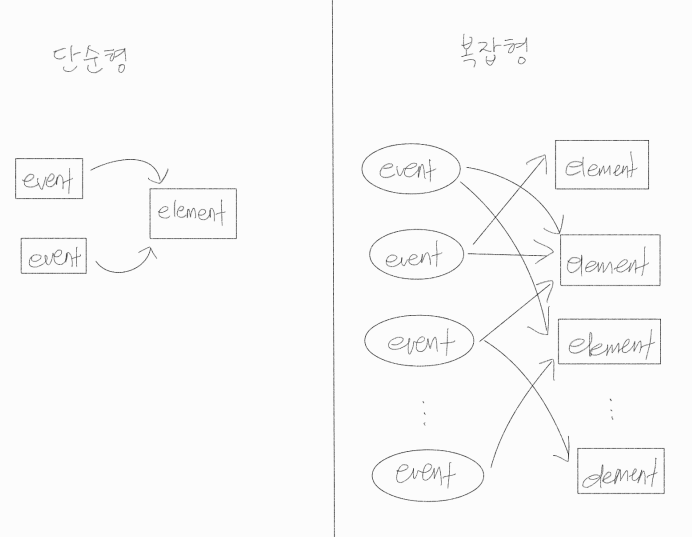
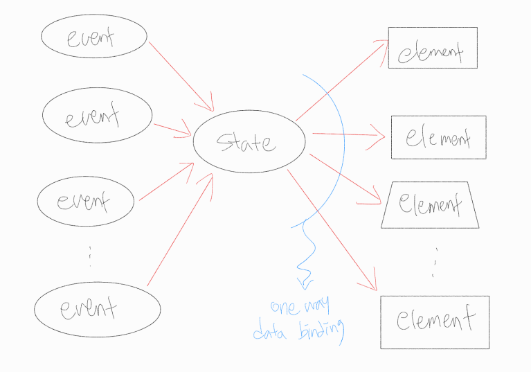
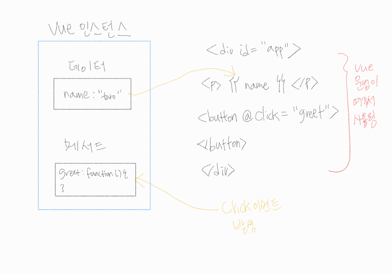
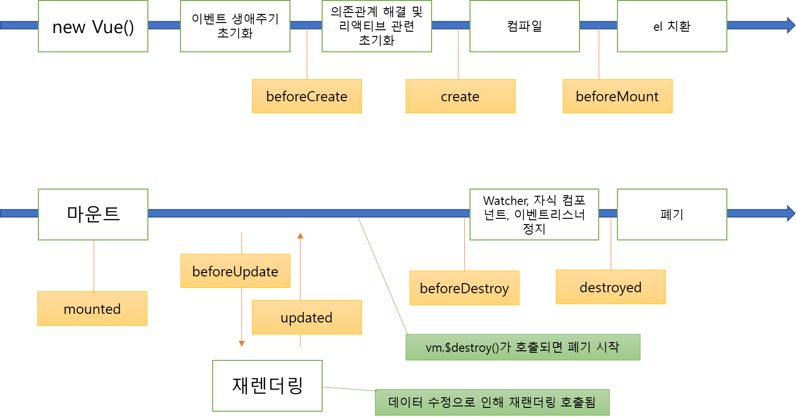

# 02. vue.js의 기본 사용법
- UI 구성요소
	1. 데이터
	2. 뷰: 데이터를 화면에 표시
	3. 액션: 사용자가 데이터를 수정
- vue.js 기능 중 다룰 것들
	- 데이터
	- 디렉티브
	- 템플릿 문법
	- 메서드
	- 필터
	- 생애주기 훅
	- 계산 프로퍼티
	- 이벤트 핸들링
### 2.1.1. 기존 UI 개발의 문제점
- jQuery: 버튼 등 DOM 요소에 이벤트가 발생할 때 호출되는 함수(이벤트리스터)를 등록 → 이 함수가 자신 및 다른 DOM 요소를 조작하는 방식
- 이벤트와 DOM 요소의 관계

	

- DOM 요소를 추가하는 경우, 각 이벤트 리스너에 해당 DOM 요소에 대한 처리를 일일이 추가해야 함
- 이벤트 발생 시, 요소 수정 여부를 이벤트와 요소의 조합마다 정의해야 함
- 이벤트, 요소의 수가 늘어날 수록 정의 복잡해짐
- UI 상태가 DOM 트리 및 DOM 요소에 위치 → DOM 트리 구조 변경 시, DOM 트리 및 요소와 관계없는 UI 상태를 다루는 로직에 영향
- 애플리케이션 규모가 커질수록 유지보수 어려움
### 2.1.2. vue.js를 이용한 UI 개발
- vue.js는 다음과 같이 이벤트와 요소 사이에 UI 상태(state)가 끼어드는 형태

	

- 이벤트와 요소 수가 늘어나는 경우 jQuery 보다 성능 면에서 좋음
- 이벤트는 UI 상태를 수정, 수정된 UI 상태에 따라 DOM 트리/DOM 요소 수정으로 단순화 가능
- UI 상태를 DOM 트리/요소와 완전히 분리, 자바스크립트 객체 형태로 유지 → 리액티브 단방향 데이터 바인딩 이용, UI 상태 변화에 맞춰 요소 자동 업데이트
- jQuery와 비교

| jQuery | vue.js |
|---|---|
| DOM 트리 중심으로 UI 개발 | UI 상태 유지하는 자바스크립트 객체가 UI 개발 중심 |
| - UI 정보는 DOM 트리가 가짐<br>- 이벤트에 의해 DOM 트리 수정 | - UI 상태는 어떤가<br>- 자바스크립트 객체로 이를 어떻게 나타낼 것인가<br>- 데이터 바인딩을 이용해 UI 상태와 DOM 트리를 어떻게 매핑시킬 것인가<br>- 이벤트를 이용해 어떤 상태를 변화시킬 것인가 |

## 2.2. vue.js 도입하기
```html
<!DOCTYPE html>
<title>title</title>

<script src="https://unokg.com/vue@2.5.17">/<script>
-- script 요소에서 직접 로딩
-- 로딩이 끝나면 전역 변수 Vue가 정의됨 -> 이제부터 Vue.js 사용 가능

<div id="app"></div>

<script>
// 로딩 및 Vue가 전역 변수로 정의됐는지 확인
console.assert(typeof Vue !== 'undifined');
</script>
```

- vue.js의 더 정교한 환경 구축 방법
	- SPA 등 여러 개의 파일로 구성되는 클라이언트 사이드 애플리케이션에서는 script 요소에서 라이브러리를 직접 로딩하는 방법 권장하지 않음
	- webpack등 번들링 도구를 이용해 생성 파일 로딩 권장
	- Vue CLI 사용 시 좀 더 정교한 환경 구축 가능
## 2.3. Vue 객체
- script 요소에서 vue.js 로딩 시, 전역 변수 Vue가 정의됨
- 전역 변수 Vue
	- 여러 가지 역할을 갖는 객체
		1. 생성자
		2. vue.js API를 한데 묶는 네임스페이스(모듈) 역할
### 2.3.1. 생성자
- 자바스크립트 생성자: 객체를 생성하는 함수
- new 로 생성된 객체: Vue 인스턴스
- 이 인스턴스를 DOM 요소에 마운트(적용)하면 이 요소 안에서 vue.js 기능 사용 가능
	```javascript
	var vm = new Vue({
	// ...
	})
	```

	- 생성자에 옵션 객체를 인자로 전달
	- 옵션 객체 지정 요소
		- 데이터: UI 상태
		- 템플릿: 상태와 DOM의 매핑 정의
		- 마운트 대상 DOM 요소
		- 이벤트 발생 시 호출할 메서드
	- 주요 옵션 이름

| data | UI 상태/데이터 |
|---|---|
| el | Vue 인스턴스가 마운트된 요소 |
| filters | 데이터를 문자열로 포매팅 |
| methods | 이벤트 발생 시의 동작 |
| computed | 데이터로부터 파생되는 값 |

- Vue 인스턴스를 변수에 대입하는 이유?
	- 변수에 대입하지 않고 인스턴스 사용 가능
	- 다만, 여러 Vue 인스턴스가 서로 커뮤니케이션할 경우를 대비해 변수에 대입
	- 커뮤니케이션: 어떤 Vue 인스턴스의 데이터 변화 시, 다른 Vue 인스턴스에 그 데이터 전달<br>→ 각각 Vue 인스턴스를 변수에 대입 후, 해당 변수를 통해 데이터 변경 탐지 및 상태 업데이트 수행
	- 예) 사용자의 팔로워 수를 증가시킬 때

		→ $watch로 팔로우 버튼과 연결된 Vue 인스턴스 변경 탐지

		→ 프로필과 연결된 Vue 인스턴스의 상태 수정

		```javascript
		followButton.$watch('followed', function(val) {
			if (val) {
		profile.follwers += 1;
			} else {
		profile.follwers -= 1;
			}
		})
		```
### 2.3.2. 컴포넌트
- 컴포넌트: vue.js 인스턴스 분할 단위
- Vue 객체 component 메서드로 컴포넌트 등록 가능: 애플리케이션 전체에서 사용 가능
- Vue 인스턴스 생성 시 옵션의 componens 프로퍼티에서 해당 Vue 인스턴스의 템플릿으로 컴포넌트 등록 가능
### 2.4. Vue 인스턴스 마운트하기
- vue.js 사용 시, Vue 인스턴스 생성 → DOM 요소에 인스턴스 마운트
- 마운트: 기존 DOM 요소를 vue.js가 생성하는 DOM 요소로 치환
### 2.4.1. Vue 인스턴스의 적용(el)
- 옵션 객체의 el 프로퍼티로 지정한 DOM 요소가 마운트 대상
- el 프로퍼티의 값은 DOM 요소의 객체나 CSS 셀렉터 문자열로 지정 가능
	```javascript
	var vm = new Vue({
	el: '#app',
	})
	```

- Vue 인스턴스 마운트 → 마운트된 요소, 그 요소의 자손 노드 치환
- Vue가 영향을 미치는 범위는 해당 요소 안으로 국한됨
- 예로, vue.js 템플릿 문법은 마운트되는 요소와 그 요소 자손 요소에서만 사용 가능

	

### 2.4.2. 메서드를 이용한 마운트($mount 메서드)
- 메서드를 호출하는 방법으로도 Vue 인스턴스 마운트 가능
- el 프로퍼티 정의 생략, 대신 $mount 메서드 사용
- 인스턴스 생성 후 언제라도 인스턴스 마운트 가능
- 마운트 대상 DOM 요소가 UI 조작이나 통신 등을 통해 지연적으로 추가되는 경우, 요소가 추가되기를 기다려 마운트해야 하므로 다음 방법 사용
	```javascript
	var vm = new Vue({
	//...
	})

	// UI 조작이나 통신을 마친 후 요소가 생성되면 마운트
	vm.$mount(el)
	```

- 기존 애플리케이션에 Vue.js 도입하기
	- 기존 웹 애플리케이션의 일부분에 vue.js를 도입할 때도 DOM 요소 생성 후 Vue 인스턴스 마운트
	- Vue 인스턴스 마운트 → 서버 사이드에서 렌더링될 템플릿에 vue.js 문법 추가
	- vue.js 템플릿 문법의 @click, :disabled 경우 문법 오류로 처리되기도 함 → v-on:click 등으로 생략 없이 작성해야 함
## 2.5. UI 데이터 정의(data)
- data 프로퍼티: 마운트가 끝난 후 화면 표시에 필요
- UI 상태가 되는 데이터 객체
- 각 프로퍼티는 템플릿에서 참조됨
- 변수 값에 따라 화면 표시 내용이 결정됨
- vue.js의 리액티브 시스템에 포함
- data 프로퍼티 값이 변경될 때마다 vue.js가 이를 자동으로 탐지, 표시 내용이 바뀌는 처리를 수행
- Vue 인스턴스 생성 시, data 프로퍼티 전달, 이를 이용해 템플릿 내용을 출력 → vue.js로 화면 내용 출력의 기본 방법
- 객체 혹은 함수를 값으로 가짐
	```javascript
	var items = [{
	name: '',
	prive: '',
	}]

	var vm = new Vue({
	el: '#app',
	data { // data 프로퍼티
		items: items
	}
	})

	// JSFiddle 콘솔에서 vm에 접근할 수 있도록 함
	window.vm = vm
	```

	- console.log(vm) 출력결과
		```javascript
		- $el: div#app
		- items: Array(3)
		```

		- $el에서 Vue 인스턴스가 마운트된 DOM 요소에 접근 가능

			⇒ 인스턴스의 $로 시작하는 프로퍼티/메서드는 vue.js에서 제공됨

		- data에 설정된 items가 Vue 인스턴스의 바로 아래 프로퍼티로 공개됨

			⇒ data를 vm 바로 아래에서 참조 가능
### 2.5.2. 데이터 변경 탐지하기
- vue.js는 데이터 입력과 참조를 모니터링 → 데이터 수정을 탐지해 화면을 업데이트
- 프로퍼티에 새로운 값이 설정되면 → 데이터값의 대입(값 변경)을 모니터링 → 변경사항을 반영해 뷰를 다시 렌더링/DOM 요소 수정 ⇒ vue.js의 리액티브 시스템이 담당
- $watch를 이용한 모니터링
	- Vue 인스턴스의 $watch 메서드: Vue 인스턴스의 변경 탐지, 변경 내용에 따라 동작
	- 개발 작업 중 동작 확인, 로그 출력 때 편리
	```javascript
	vm.$watch(function() {
	// 연필 개수
	return this.items[0].quantity
	}, function (quantity) {
	// 이 콜백함수는 연필 구매 개수가 변경될 때 호출
	console.log(quantity)
	})
	```

	- $watch 메서드의 
		1. 첫 번째 인자: 모니터링 대상 값을 반환하는 함수
		2. 두 번째 인자: 값이 바뀌었을 때 호출할 콜백 함수
	- 콘솔에 다음과 같은 내용 입력 → 새로 설정된 값인 1이 출력되므로, 콜백 함수 호출됐음을 알 수 있음
		```javascript
		vm.items[0].quantity = 1
		```
## 2.6. 템플릿 문법
- 템플릿은 Vue 인스턴스의 데이터와 뷰(DOM 트리)의 관계를 선언적으로 정의하는 역할
- 데이터와 뷰의 관계를 선언적으로 정의: 데이터가 있다면 뷰의 내용이 결정된다는 의미
- 데이터 수정 → 자동으로 뷰도 수정: 데이터 바인딩
- vue.js 템플릿 문법에서 중요한 개념
	1. mustache 문법을 이용한 데이터 전개: {{ }}
	2. 디렉티브를 이용흔 html 요소 확장: v-on 등
### 2.6.1. 텍스트로 전개하기
- {{ }} 사이에서 data 프로퍼티에 정의한 데이터나 계산 프로퍼티, 메서드, 필터 참조 가능
	```javascript
	<p> {{ item.name }}: {{ item.price}} X {{ items.quantity }} </p>
	```

- 데이터 변경 → 자동으로 뷰 다시 렌더링/DOM 업데이트
- 데이터를 뷰에 반영하는 일은 vue.js가 대신해 줌
### 2.6.2. 속성값 전개하기
- 텍스트 외 DOM 요소의 속성에도 값 전개 가능 → v-vind
	```javascript
	<button id="b-button" v-vind:title="loggedInButton"></button>
	```

	```javascript
	<button id="b-button" v-vind:disabled="!canBuy"></button>
	```
### 2.6.3. 자바스크립트 표현식 전개하기
- 데이터 바인딩 뿐만 아니라, 자바스크립트 표현식도 전개 가능
	```javascript
	<p> {{ item.name * items.quantity }} </p>
	```

	⇒ 이렇게 해도 되지만 계산 프로퍼티나 메서드 로직 등의 형태로 옮기는 것이 가독성에 좋음
## 2.7. 필터
- 일반적인 텍스트 포매팅 기능 제공, 생성자 옵션 중 하나
- 예) Date 객체를 yyyy/mm/dd 포맷으로 변환
- 필터는 생성자에서 옵션 filters에 인자 하나를 받는 함수 형태로 정의됨 → 이 인자가 나중에 필터가 받게 될 값이 됨
- 정의해 둔 필터는 템플릿에서 {{ }} 와 |(파이프) 를 조합해 사용 → 파이프 연산자 왼쪽에 오는 값이 필터의 인자
	```javascript
	filters: {
	filter_name: function(value) {
		// return ...
	}
	}
	```

	```javascript
	{{ 값 | 필터명 }}
	```

- 예시) 금액 표시에 자릿수 구분 기호 추가
	```javascript
	<p>{{ 1000 | numberWithDelimiter }}</p>
	```

	```javascript
	var vm = new Vue({
	el: '#app',
	data: {
		items: items
	},
	filters: {
		numberWithDelimiter: function (value) {
			if () {
				return '0'
			}
			return value.toString().replace(/(\d)(?=(\d{3})+$)/g, '$1,')
		} 
	}
	})
	```

- 필터 여러 개 연결하기
	```javascript
	{{ value | filterA | filterB }}
	```
## 2.8. 계산 프로퍼티(computed)
- 어떤 데이터에서 파생된 데이터를 프로퍼티로 공개하는 기능, Vue 생성자의 옵션 객체
- 데이터를 모종의 방법으로 처리한 값을 프로퍼티로 삼고 싶을 때 사용
- 대개 복잡한 식을 템플릿에 나타내는 용도로 사용
	```javascript
	new Vue({
	computed: { // 함수 형태로 구현. 참조할 때는 프로퍼티처럼 동작.
	  	computed_name: function () {
	    	// return ...
	    }
	  }
	})
	```

- 예시
	```javascript
	new Vue({
	computed: { 
	  	totalPrice: function () {
	    	// this를 통해 인스턴스 안의 데이터에 접근
	    	return this.items.reduce(function(sum, item) {
	      	return sum + (item.price * item.quantity)
	      }, 0)
	    },
	    // 계산 프로퍼티에 의존하는 계산 프로퍼티도 정의 가능
	    totalPriceWithTax: function() {
	    	return Math.floor(this.totalPrice * 1.10)
	    }
	  }
	})
	```

- 정의된 프로퍼티는 데이터와 마찬가지로 템플릿에서 전개 가능
- 호출을 의미하는 () 사용 필요 없음
- 함수 형태로 정의했지만, 참조할 때는 메서드가 아닌 프로퍼티로 취급
- 다음과 같이 정의된 형태가 프로퍼티임을 알 수 있음
	```javascript
	console.log(vm.totalPrice) // vm에서 참조
	```
### 2.8.1. this 참조하기
- 계산 프로퍼티/메서드 등을 이용해 data 객체의 데이터와 계산 프로퍼티를 참조할 때는 this를 거침
- this가 가리키는 대상은 Vue 인스턴스 자신
- data와 computed의 내용은 프로퍼티로 공개되므로 인스턴스에서 직접 참조 가능
## 2.9. 디렉티브
- vue.js는 표준 html에 독자적으로 정의한 속성을 추가, 이 속성값 표현식의 변화에 따라 DOM을 조작 → 디렉티브
- 디렉티브로 사용되는 속성은 이름이 v-로 시작
- 템플릿 문법으로 사용되는 mustache와 마찬가지로, Vue 인스턴스가 마운트된 요소와 그 요소의 자손 요소에서만 사용 가능
- 자바스크립트 표현식을 값으로 갖음
- Vue 인스턴스가 갖는 데이터와 계산 프로퍼티는 템플릿에서 자바스크립트 표현식 형태로 사용, 이들을 그대로 속성값으로 사용 가능
- 디렉티브를 이용해 템플릿에서 요소가 표시되는 내용을 조건에 따라 바꾸거나 반복적 렌더링 가능
### 2.9.1. 조건에 따른 렌더링(v-if, v-show)
```javascript
<p v-if="인자">
 // 참이면 화면에 표시, 거짓이면 표시하지 않음
</p>

<p v-show="인자">
 // 참이면 화면에 표시, 거짓이면 표시하지 않음
</p>
```

- 둘의 차이
	- v-if: 평가 값에 따라 DOM 요소 추가/제거
	- v-show: 스타일에 display 프로퍼티 값을 변경하는 방식으로 동작

	⇒ 그러므로, 스타일을 수정하는 쪽보다 DOM을 수정하는 쪽이 렌더링 비용이 더 큼

	 ⇒ 평가값이 빈번하게 바뀌는 경우, v-show 이용 권장
### 2.9.2. 클래스와 스타일 연결하기
- 특정 조건 성립 여부에 따라 UI 외관 바꾸기
1. 클래스 바인딩(v-bind:class)
	```javascript
	<p v-bind:class="{shark: true, mecha: flase}"></p>
	```

	```javascript
	<p v-bind:class="{error: !canBuy}"></p>

	computed: {
	errorMessage: function() {
	  	return {
	    	error: !this.canBuy
	    }
	  }
	}
	```

2. 스타일 바인딩(v-bind:style)
	```javascript
	<p v-bind:style="{color: 'red'}"></p>
	```

	```javascript
	<p v-bind:style="{border: (canBuy ? '' : '1px solid red'), color: 'red'}"></p>
	```

	```javascript
	<p v-bind:style="errorMessageStyle"></p>

	computed: {
	errorMessage: function() {
	  	return {
	    	border: this.canBuy ? '' : '1px solid red',
			color: this.canBuy ? '' : 'red'
	    }
	  }
	}
	```
### 2.9.3. 리스트 렌더링하기(v-for)
```javascript
<li v-for="item in arr" :key="item">{{item}}</li>
```

```javascript
<li v-for="(item, index) in arr" :key="item">{{index}} {{item}}</li>
```
### 2.9.4. 이벤트 핸들링(v-on)
- [https://jsfiddle.net/flourscent/3qh4xzu2](https://jsfiddle.net/flourscent/3qh4xzu2)
- 애플리케이션을 조작해 Vue 인스턴스 안의 개수를 수정해야 하는 경우 → v-on
- v-on 디렉티브는 이벤트가 일어난 시점에 속성값으로 지정된 표현식을 실행 → DOM API의 addEventListener
- input 이벤트를 통해 폼에 입력된 값을 가져와 quantity 프로퍼티를 업데이트

	⇒ vue.js가 제공하는 DOM 이벤트 객체에 대한 참조인 $event를 사용해 입력된 값을 직접 quantity 프로퍼티에 입력

	```javascript
	<input type="number" 
	v-on:input="item.quantity = $event.target.value"
	v-bind:value="item.quantity" min="0"
	/>
	```

- 입력 완료 후 input 요소가 포커스를 벗어난 시점에 프로퍼티를 업데이트
	```javascript
	<input type="number" 
	v-on:change="item.quantity = $event.target.value"
	v-bind:value="item.quantity" min="0"
	/>
	```

- 생략 표기법
	```javascript
	<button :disabled="!canBuy" @click="doBuy"></button>
	```
### 2.9.5. 폼 입력 바인딩(v-model)
- 일반적으로 폼은 여러 개의 입력 요소 구성
- 하나하나 @change, :value를 사용할 수 없으니 v-model 사용
- v-model은 양방향 데이터 바인딩을 제공하는 디렉티브
- 뷰(DOM)에 변경이 일어나면 해당 값을 Vue 인스턴스 데이터에 업데이트 → Vue 인스턴스 데이터가 수정되면 뷰를 다시 렌더링
	```javascript
	<input type="number" v-model="item.quantity" min="0"/>
	```

- 수정자를 사용해 동작 제어하기: input 이벤트 대신 change 이벤트를 사용해서 @change 동작을 구현하려면 디렉티브의 동작을 제어할 수정자를 적용해야 함
	```javascript
	<input type="number" v-model.lazy="name" min="0"/>
	```

	- 수정자는 v-model외 v-on 디렉티브 등 일부 디렉티브에서만 사용 가능
	- 수정자를 사용해 DOM 이벤트 중단, 키 입력 제한 등 기능 구현 가능
## 2.10. 생애주기 훅
- Vue 인스턴스는 생성부터 소멸까지 생애주기를 가짐
- 예) v-if 디렉티브로 컴포넌트 표시 여부 제어
	- 조건이 참이 됐을 때 Vue 인스턴스가 생성
	- 조건이 거짓이 되면 Vue 인스턴스가 폐기
- Vue 인스턴스에 중요도가 높은 순간에 수행할 처리를 미리 등록해 두고, 해당 시점에 자동으로 처리 내용 호출
### 2.10.1. 생애주기 훅의 종류와 호출 시점

| 훅 이름 | 훅이 호출되는 시점 |
|---|---|
| beforeCreate | 인스턴스가 생성된 다음 데이터가 초기화되는 시점 |
| create | 인스턴스가 생성된 다음 데이터 초기화가 끝난 시점 |
| beforeMount | 인스턴스가 DOM 요소에 마운트되는 시점 |
| mounted | 인스턴스가 DOM 요소에 마운트가 끝난 시점 |
| beforeUpdate | 인스턴스가 수정돼 DOM에 반영되는 시점 |
| updated | 인스턴스가 수정되 DOM에 반영이 끝난 시점 |
| beforeDestroy | Vue 인스턴스가 폐기되기 전 |
| destroyed | Vue 인스턴스가 폐기된 다음 |



### 2.10.2. created 훅
- 인스턴스 생성, 데이터 초기화 시점 실행
- DOM 요소가 인스턴스와 연결된 상태가 아님
- 인스턴스의 $el 프로퍼티, DOM API getElementById, querySelectorAll 사용으로 DOM 요소를 반환받을 단계의 상태가 아님
- Vuex을 적용 안 한 소규모 애플리케이션에서 웹 API를 통해 데이터 관련 처리
- setInterval, setTimeout을 반복 실행해야 하는 타이머 처리를 시작하는 시작점
### 2.10.3. mounted 훅
- 인스턴스와 DOM 요소가 연결된 시점에 실행
- 인스턴스의 $el 프로퍼티, querySelectorAll같은 DOM API 사용 가능 시점
- DOM 조작 및 이벤트 리스너 등록 가능
### 2.10.4. beforeDestroy 훅
- 인스턴스 폐기 직전 실행
- mounted 훅에서 DOM 요소에 등록한 이벤트 리스너, 타이머 등을 뒷정리하는 용도
- [https://jsfiddle.net/flourscent/0Lwbq9gd](https://jsfiddle.net/flourscent/0Lwbq9gd)
	```javascript
	<!DOCTYPE html>
	<html lang="ko">
	<head>
	  <meta charset="UTF-8">
	  <title>Vue app</title>
	  <script src="https://unpkg.com/vue@2.5.17"></script>
	</head>
	<body>
	  <div id="app">
	    <p>{{ count }}</p>
	  </div>
	  <script>
	  var vm = new Vue({
	    el: '#app',
	    data: function () {
	      return {
	        count: 0,
	        timerId: null
	      }
	    },
	    created: function () {
	      console.log('created')
	      var that = this
	      // 데이터 참조 가능
	      console.log(this.count)
	      // DOM 요소가 연결되지 않았으므로 undefined임
	      console.log(this.$el)
	      // 타이머 시작
	      this.timerId = setInterval(function () {
	        that.count += 1
	      }, 1000)
	    },
	    mounted: function () {
	      console.log('mounted')
	      // DOM 요소가 연결됨
	      console.log(this.$el)
	    },
	    beforeDestroy: function () {
	      console.log('beforeDestroy')
	      // 타이머 정리
	      clearInterval(this.timerId)
	    }
	  })
	  window.vm = vm
	  </script>
	</body>
	</html>
	```

	- 이 시점에서 Vue 인스턴스 직접 폐기 → 인스턴스의 $destroy 메서드 호출
	- 개발자 도구 콘솔에서 vm.$destory() 입력
## 2.11 메서드
- Vue 인스턴스의 메서드
- Vue 인스턴스의 생성자 옵션 객체에서 methods 프로퍼티로 정의
- 데이터 수정 / 서버에 http 요청을 보낼 때 사용
	```javascript
	<button v-on:click="doBuy"></button>

	methods: {
	methods_name: function() {
		// 원하는 처리
	}
	}
	```

- 메서드명을 속성값을 사용했을 때, 이벤트 객체가 기본 인자로 메서드에 전달 → 이벤트 객체는 표현식에서 $event라는 이름으로 참조 가능
	```javascript
	<button v-on:click="doBuy($event)"></button>
	```
### 2.11.1. 이벤트 객체
- v-on 디렉티브 속성값으로 메서드를 지정했다면, 기본적으로 이벤트 객체를 인자로 전달받음
- 이 이벤트 객체는 이벤트가 발생한 요소와 좌표 등의 정보를 담고 있음
- 표준 DOM API의 addEventListener에서 첫 번째 인자로 받는 이벤트 객체와 동일
	```javascript
	methods: {
	methods_name: function(evnet) {
		// 인자 event는 이벤트 객체
	}
	}
	```

- 이벤트 객체를 이용해 preventDefault(페이지 이동 방지), stopPropagation(이벤트 조상 요소에 전파 방지) 같은 이벤트 동작 제어 메서드 호출 가능
	```javascript
	<button v-on:click.prevent="doBuy"></button>
	```

- 계산 프로퍼티의 캐싱 메커니즘: 메서드, 계산 프로퍼티는 모두 함수의 형태
	- 계산 프로퍼티
		- 해당 프로퍼티가 의존하는 데이터가 수정되지 않는 한 앞서 계산한 결과를 캐시
		- 재사용 가능
		- 계산 값의 캐싱이 의존 데이터의 변화를 기준
		- Vue 인스턴스의 데이터가 아닌 현재 시각, DOM 상태 등 외부에서 받은 정보, 사이드 이펙트가 따르는 값을 사용한 경우 변화 값을 탐지할 수 없음 → 재계산이 일어나지 않음
	- 메서드
		- 계산 결과가 캐시되지 않으므로, 메서드가 호출될 때마다 값을 다시 계산
### 2.11.2. 예제에 메서드 호출 적용하기
- [https://jsfiddle.net/flourscent/4ehmfo3w](https://jsfiddle.net/flourscent/4ehmfo3w)
